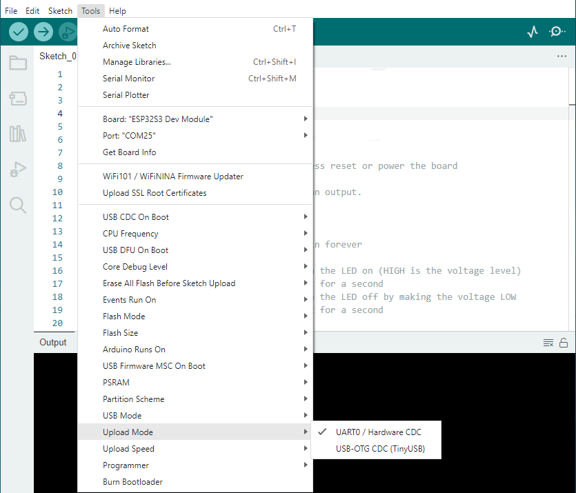
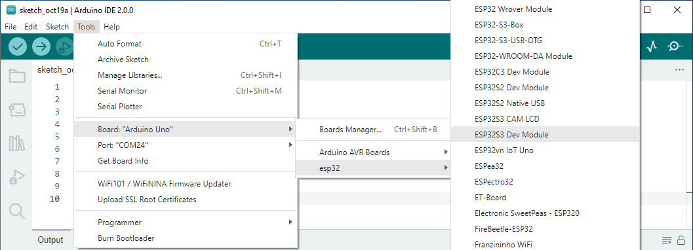
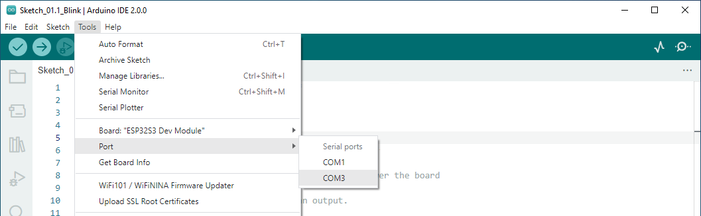
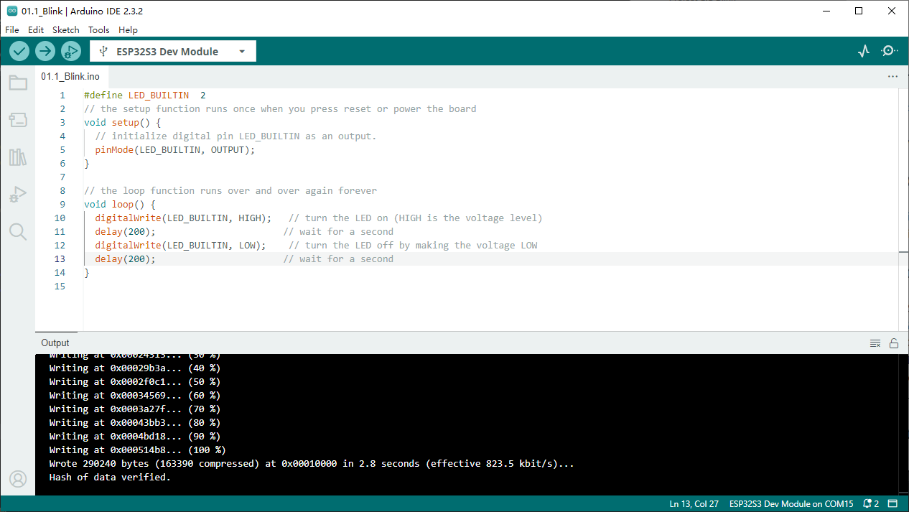
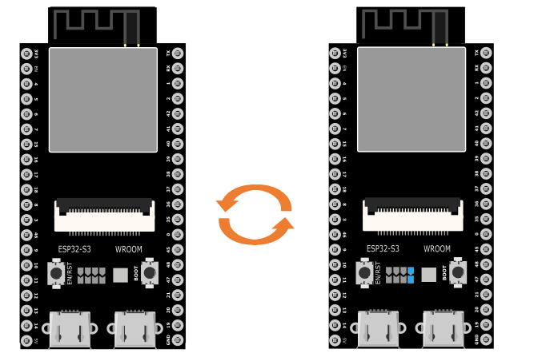
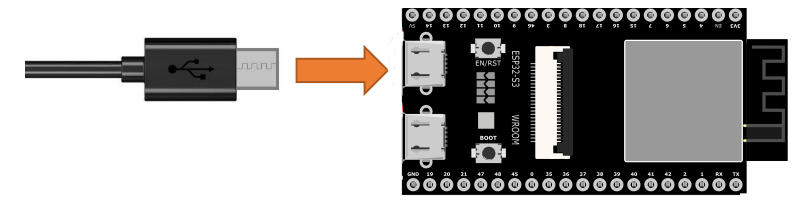
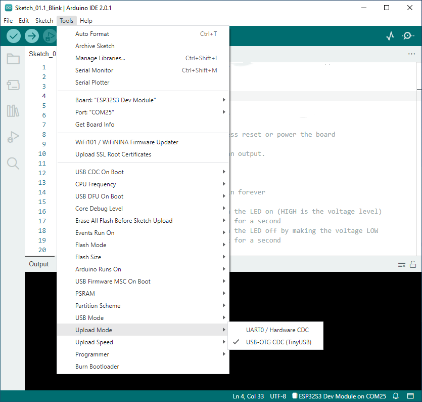
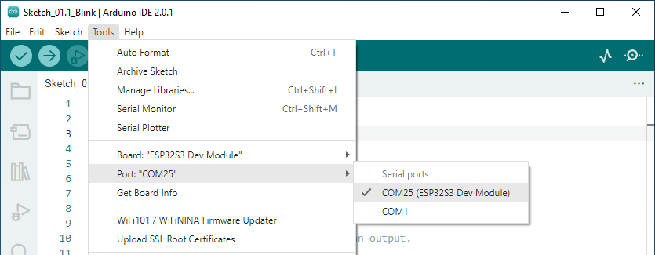

.. _c_tutorial_0_led:

Chapter 0 LED
=================

**Description**

This chapter is the Start Point in the journey to build and explore ESP32-S3 
WROOM electronic projects. We will start with simple “Blink” project.

Project 0.1 Blink
------------------
In this project, we will use ESP32-S3 WROOM to control blinking a common LED

Component List
^^^^^^^^^^^^^^^^
- ESP32-S3-WROOM x1
- Type C USB Cable x1

Power
^^^^^^^
ESP32-S3 WROOM needs 5v power supply. In this tutorial, we need connect ESP32-S3 
WROOM to computer via USB cable to power it and program it. We can also use other 
5v power source to power it.

.. image:: img/0/connect1.png

Sketch
^^^^^^^^^^^
According to the circuit, when the GPIO2 of ESP32-S3 WROOM output level is high, 
the LED turns ON. Conversely, when the GPIO2 ESP32-S3 WROOM output level is low, 
the LED turns OFF. Therefore, we can let GPIO2 circularly output high and low level 
to make the LED blink. 
Upload the following Sketch: 
:guilabel:`LAFVIN_Super_Starter_Kit_For_Esp32_S3\Sketches\Sketch_01.1_Blink.`

Next we will introduce two ways to upload code to ESP32-S3 WROOM.

Option 1：
Connect ESP32-S3 WROOM to computer.

.. image:: img/0/connect1.png

Open Arduino IDE 2.0.0. Click Tools->Upload Mode. Select UART0 / Hardware CDC.

Before uploading the code, click "Tools", "Board" and select "ESP32S3 Dev Module".

Select the serial port. Note that the computer port number of each user may be 
different. Please select the correct serial port according to your computer. Taking 
the window system as an example, my computer recognizes that the communication 
interface of the ESP32-S3-WROOM is COM3, so I select COM3.

.. note:: 
    Note: For macOS users, if the uploading fails, please set the baud rate to 
    115200 before clicking “Upload Using Programmer”.

    .. image:: img/0/speed.png

Click the Upload button and it will compile and upload the Sketch to the ESP32-S3-WROOM.

Wait for the Sketch upload to complete, and observe the ESP32-S3-WROOM. You can 
see that the blue LED (IO2) on the board flashes cyclically.

Option 2: 
Connect ESP32-S3 WROOM to computer.

Open Arduino IDE 2.0.0. Click Tools->Upload Mode. Select USB-OTG CDC(TinyUSB).

Select the serial port. Note that the computer port number of each user may be 
different. Please select the correct serial port according to your computer. 
Taking the window system as an example, my computer recognizes that the 
communication interface of the ESP32-S3-WROOM is COM25, so I select COM25.

Click the Upload button and it will compile and upload the Sketch to the ESP32-S3-WROOM.

Wait for the Sketch upload to complete, and observe the ESP32-S3-WROOM. You can 
see that the blue LED (IO2) on the board flashes cyclically.

Code
^^^^^^
The following is the program code:

.. code-block:: C

    #define LED_BUILTIN  2
    // the setup function runs once when you press reset or power the board
    void setup() {
    // initialize digital pin LED_BUILTIN as an output.
    pinMode(LED_BUILTIN, OUTPUT);
    }

    // the loop function runs over and over again forever
    void loop() {
    digitalWrite(LED_BUILTIN, HIGH);   // turn the LED on (HIGH is the voltage level)
    delay(1000);                       // wait for a second
    digitalWrite(LED_BUILTIN, LOW);    // turn the LED off by making the voltage LOW
    delay(1000);                       // wait for a second
    }

