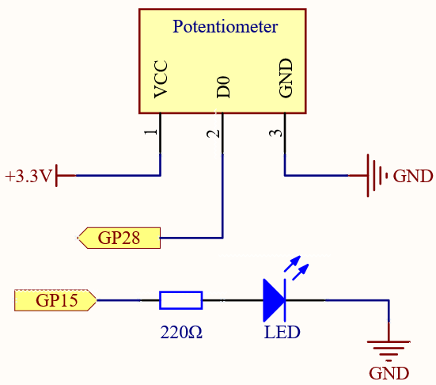
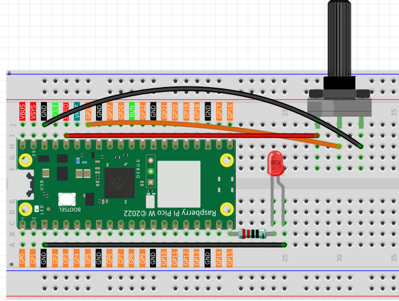
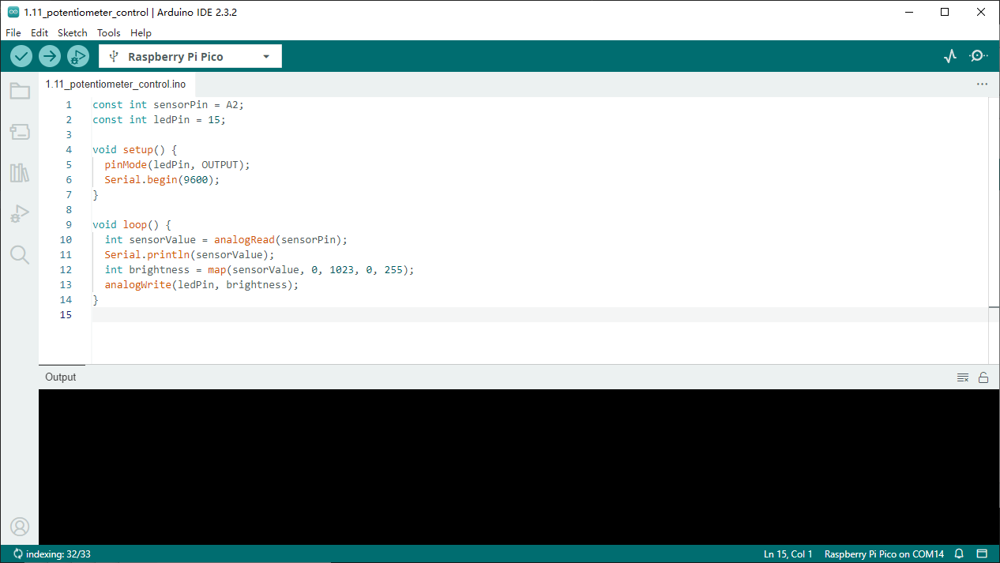

1.11 Potentiometer Control
===========================
In the previous projects, we have used the digital input on the Pico W. For 
example, a button can change the pin from low level (off) to high level (on). 
This is a binary working state.

However, Pico W can receive another type of input signal: analog input. It can 
be in any state from fully closed to fully open, and has a range of possible 
values. The analog input allows the microcontroller to sense the light intensity, 
sound intensity, temperature, humidity, etc. of the physical world.

Usually, a microcontroller needs an additional hardware to implement analog 
input-the analogue-to-digital converter (ADC). But Pico W itself has a built-in 
ADC for us to use directly.

.. 介绍pico的adc部分

.. image:: 

Pico W has three GPIO pins that can use analog input, GP26, GP27, GP28. That is, 
analog channels 0, 1, and 2. In addition, there is a fourth analog channel, which 
is connected to the built-in temperature sensor and will not be introduced here.

In this project, we try to read the analog value of potentiometer.
    
Component List
^^^^^^^^^^^^^^^
- Raspberry Pi Pico W x1
- MicroUSB cable x1
- 830 Tie-Points Breadboard x1
- Jumper Wire Several
- Resistor 220Ω x1
- LED x1
- Potentiometer x1

Component knowledge
^^^^^^^^^^^^^^^^^^^^
:ref:`RGB-LED <cpn_rgb_led>`
"""""""""""""""""""""""""""""""

Schematic
^^^^^^^^^^

The potentiometer is an analog device and when you turn it in 2 different directions.

Connect the middle pin of the potentiometer to the analog pin GP28. The Raspberry 
Pi Pico W wcontains a multi-channel, 16-bit analog-to-digital converter. This means 
that it maps the input voltage between 0 and the operating voltage (3.3V) to an 
integer value between 0 and 65535, so the GP28 value ranges from 0 to 65535.

The calculation formula is shown below.

(Vp/3.3V) x 65535 = Ap

Then program the value of GP28 (potentiometer) as the PWM value of GP15 (LED). 
This way you will find that by rotating the potentiometer, the brightness of the 
LED will change at the same time.

Connect
^^^^^^^^^

Code
^^^^^^^
.. note::

    * Open the ``1.11_potentiometer_control.ino`` file under the path of ``Super-Starter-Kit-for-Pico\Arduino\1.Project`` or copy this code into Thonny, then click "Run Current Script" or simply press F5 to run it.

    * Or copy this code into Arduino IDE.

    * Don’t forget to select the board(Raspberry Pi Pico) and the correct port before clicking the Upload button. 

Click “Run current script”, we can see the analog value currently read by the GP28 
pin in the shell. Turn the knob, and the value will change from 0 to 65535. At 
the same time, the brightness of the LED will increase as the analog value increases.

The following is the program code:

.. code-block:: python

    import machine
    import utime

    potentiometer = machine.ADC(28)
    led = machine.PWM(machine.Pin(15)) 
    led.freq(1000)

    while True:
        value=potentiometer.read_u16()
        print(value)
        led.duty_u16(value)
        utime.sleep_ms(200)

Phenomenon
^^^^^^^^^^^
.. video:: img/5.phenomenon/1.11.mp4
    :width: 100%