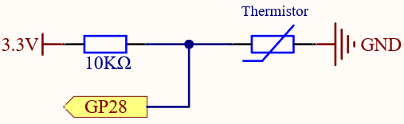

1.13 Thermometer
=========================
A thermometer is a device that measures temperature or a temperature gradient 
(the degree of hotness or coldness of an object). A thermometer has two important 
elements: (1) a temperature sensor (e.g. the bulb of a mercury-in-glass thermometer 
or the pyrometric sensor in an infrared thermometer) in which some change occurs 
with a change in temperature; and (2) some means of converting this change into a 
numerical value (e.g. the visible scale that is marked on a mercury-in-glass 
thermometer or the digital readout on an infrared model). Thermometers are widely 
used in technology and industry to monitor processes, in meteorology, in medicine, 
and in scientific research.

A thermistor is a type of temperature sensor whose resistance is strongly dependent 
on temperature, and it has two types: Negative Temperature Coefficient (NTC) and 
Positive Temperature Coefficient (PTC), also known as NTC and PTC. The resistance 
of PTC thermistor increases with temperature, while the condition of NTC is opposite 
to the former.

In this experiment we use an NTC thermistor to make a thermometer.

Component List
^^^^^^^^^^^^^^^
- Raspberry Pi Pico W x1
- MicroUSB cable x1
- 830 Tie-Points Breadboard x1
- Jumper Wire Several
- Resistor 10KΩ x1
- Thermistor x1

Component knowledge
^^^^^^^^^^^^^^^^^^^^
:ref:`RGB-LED <cpn_rgb_led>`
"""""""""""""""""""""""""""""""

Schematic
^^^^^^^^^^

In this circuit, the 10K resistor and the thermistor are connected in series, and 
the current passing through them is the same. The 10K resistor acts as a protection, 
and the GP28 reads the value after the voltage conversion of the thermistor.

When the temperature increases, the resistance value of NTC thermistor decreases, 
then its voltage decreases, so the value from GP28 will decrease; If the temperature 
is high enough, the resistance of the thermistor will be close to 0, and the value 
of GP28 will be close to 0. At this time, the 10K resistor plays a protective role, 
so that 3.3V and GND are not connected together, resulting in a short circuit.

When the temperature drops, the value of GP28 will increase. When the temperature 
is low enough, the resistance of the thermistor will be infinite, and its voltage 
will be close to 3.3v (the 10K resistor is negligible), and the value of GP28 will 
be close to the maximum value of 65535.

The calculation formula is shown below.

(Vp/3.3V) x 65535 = Ap

Connect
^^^^^^^^^

.. note:: 
        
    The thermistor is black and marked 103.
    The color ring of the 10K ohm resistor is red, black, black, red and brown.

Code
^^^^^^^
.. note::

    * Open the ``1.13_thermometer.ino`` file under the path of ``Super-Starter-Kit-for-Pico\Arduino\1.Project`` or copy this code into Thonny, then click "Run Current Script" or simply press F5 to run it.

    * Or copy this code into Arduino IDE.

    * Don’t forget to select the board(Raspberry Pi Pico) and the correct port before clicking the Upload button. 

After the program runs, the Shell will print out the Celsius and Fahrenheit temperatures.

The following is the program code:

.. code-block:: c++

    #define analogPin  A2 //the thermistor attach to 
    #define beta 3950 //the beta of the thermistor
    #define resistance 10 //the value of the pull-up resistor

    void setup()
    {
    Serial.begin(9600);
    }

    void loop()
    {
    //read thermistor value
    long a = analogRead(analogPin);
    //the calculating formula of temperature
    float tempC = beta / (log((1025.0 * 10 / a - 10) / 10) + beta / 298.0) - 273.0;
    float tempF = 1.8 * tempC + 32.0;
    Serial.print("Temp: ");
    Serial.print(tempC);
    Serial.println("degree Celsius");
    Serial.print("Temp: ");
    Serial.print(tempF);
    Serial.println("degree Fahrenheit");  
    delay(200); //wait for 200 milliseconds
    }

.. image:: img/5.phenomenon/1.13.png
    :width: 100%