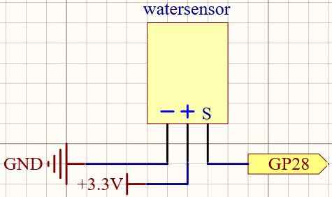
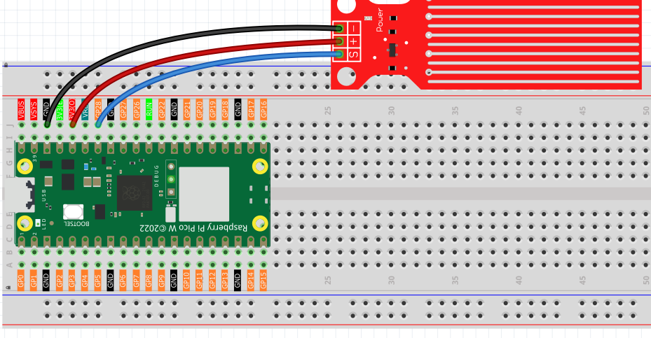
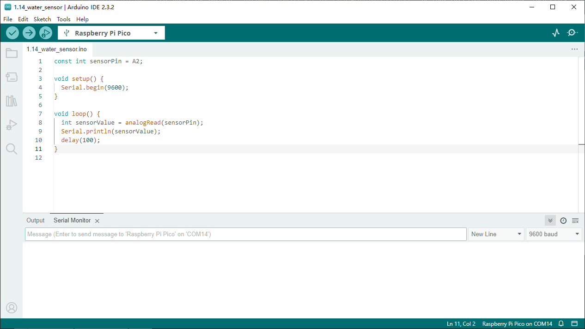
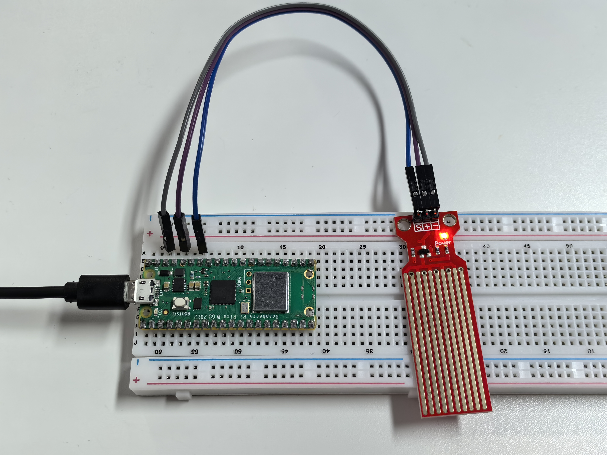

1.14 Water Sensor
====================
Water sensor is designed for water detection, which can be widely used in sensing 
rainfall, water level, and even liquid leakage.

It measures the water level by having a series of exposed parallel wire traces to 
measure the size of the water drops/volume. The water volume is easily converted 
to an analog signal, and the output analog value can be read directly by the main 
control board to achieve the water level alarm effect.

.. warning:: 

    The sensor cannot be fully submerged in water, please only leave the part 
    where the ten Traces are located in contact with water. Also, energizing the 
    sensor in a humid environment will accelerate the corrosion of the probe and 
    reduce the life of the sensor, so it is recommended that you only supply power 
    when taking readings.

Component List
^^^^^^^^^^^^^^^
- Raspberry Pi Pico W x1
- MicroUSB cable x1
- 830 Tie-Points Breadboard x1
- Jumper Wire Several
- Water Level Sensor Module x1

Component knowledge
^^^^^^^^^^^^^^^^^^^^
:ref:`RGB-LED <cpn_rgb_led>`
"""""""""""""""""""""""""""""""

Schematic
^^^^^^^^^^

Connect
^^^^^^^^^

Code
^^^^^^^
.. note::

    * Open the ``1.14_water_sensor.py`` file under the path of ``Super-Starter-Kit-for-Pico\Python\1.Project`` or copy this code into Thonny, then click "Run Current Script" or simply press F5 to run it.

    * Don't forget to click on the "MicroPython (Raspberry Pi Pico)" interpreter in the bottom right corner. 

After the program is run, submerge the Water Sensor module slowly into the water, 
and as the depth increases, the Shell will print a larger value.

The following is the program code:

.. code-block:: python

    import machine
    import utime

    sensor = machine.ADC(28)

    while True:
        value=sensor.read_u16()
        print(value)
        utime.sleep_ms(200)

Phenomenon
^^^^^^^^^^^
