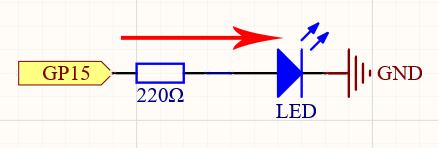
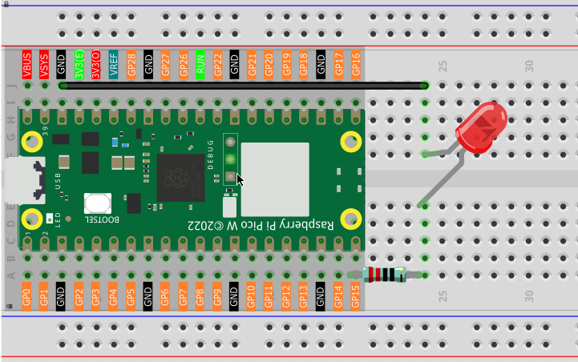
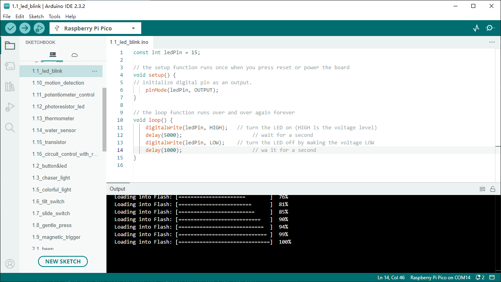

1.1 LED_Blink (Important)
=================================
This chapter is the Start Point in the journey to build and explore Raspberry Pi Pico
electronic projects. We will start with simple “Blink” project.

In this project, we will use Pico to control blinking a common LED.

Power Pico needs 5v power supply. In this tutorial, we need connect Pico to computer via USB cable to power it and program it.

Component List
^^^^^^^^^^^^^^^
- Raspberry Pi Pico W x1
- MicroUSB cable x1
- 830 Tie-Points Breadboard x1
- LED x1
- Resistor 220Ω x1
- Jumper Wire Several
  
Component knowledge
^^^^^^^^^^^^^^^^^^^^
:ref:`LED <cpn_led>`
""""""""""""""""""""

:ref:`Resistor <component_resistor>`
"""""""""""""""""""""""""""""""""""""

:ref:`Breadboard <cpn_breadboard>`
""""""""""""""""""""""""""""""""""

Schematic
^^^^^^^^^^

This circuit works on a simple principle, and the current direction is shown in 
the figure. The LED will light up after the 220ohm current limiting resistor when 
GP15 outputs high level (3.3v). The LED will turn off when GP15 outputs low level (0v).

Connect
^^^^^^^^^^^^^^^

Code
^^^^^^^^
.. note::

    * Open the ``1.1_led_blink.ino`` file under the path of ``Ultimate-Starter-Kit-for-Pico-W\Arduino\1.Project`` or copy this code into Thonny, then click "Run Current Script" or simply press F5 to run it.

    * Or copy this code into Arduino IDE.

    * Don’t forget to select the board(Raspberry Pi Pico) and the correct port before clicking the Upload button.

After running the code, you will see the LED light up for 200 milliseconds and then turn off for 200 milliseconds.

If you want to stop the code, you can click the stop button in the IDE or press Ctrl+C in the shell area.

The following is the program code:

.. code-block:: c++

    const int ledPin = 15;

    // the setup function runs once when you press reset or power the board
    void setup() {
    // initialize digital pin as an output.
        pinMode(ledPin, OUTPUT);
    }

    // the loop function runs over and over again forever
    void loop() {
        digitalWrite(ledPin, HIGH);   // turn the LED on (HIGH is the voltage level)
        delay(1000);                       // wait for a second
        digitalWrite(ledPin, LOW);    // turn the LED off by making the voltage LOW
        delay(1000);                       // wait for a second
    }

Phenomenon
^^^^^^^^^^^
.. video:: img/5.phenomenon/1.1-1.mp4
    :width: 100%