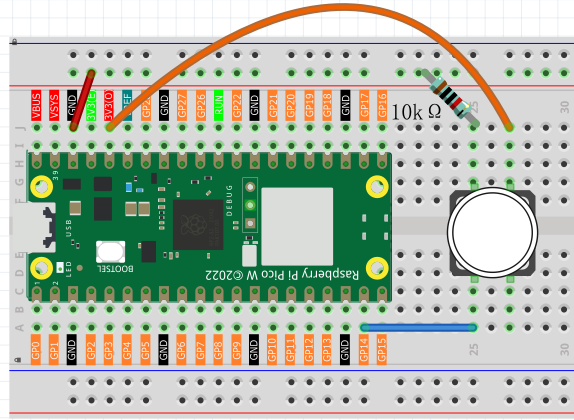
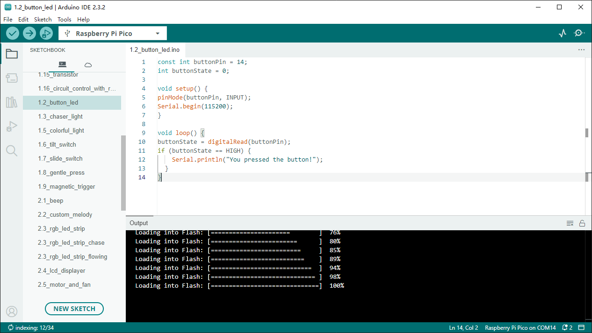

1.2 Button & LED
=========================
Usually, there are three essential parts in a complete automatic control device: 
INPUT, OUTPUT, and CONTROL. In last section, the LED module was the output part 
and Pico was the control part. In practical applications, we not only make 
LEDs flash, but also make a device sense the surrounding environment, receive 
instructions and then take the appropriate action such as LEDs light up, make a 
buzzer turn ON and so on.

Next, we will build a simple control system to control a LED through a push button switch.

These pins have both input and output functions, as indicated by their name GPIO 
(General-purpose input/output). Previously, we used the output function; in this 
chapter, we will use the input function to input the button value.

Component List
^^^^^^^^^^^^^^^
- Raspberry Pi Pico W x1
- MicroUSB cable x1
- 830 Tie-Points Breadboard x1
- Resistor 10KΩ x1
- Jumper Wire Several
- Button x1

Component knowledge
^^^^^^^^^^^^^^^^^^^^
:ref:`Button <cpn_button>`
"""""""""""""""""""""""""""

Schematic
^^^^^^^^^^
.. image:: img/2.sch/1.2.png

As long as one side of the button pin is connected to 3.3v, and the other side pin is connected to GP14, then when the button is pressed, GP14 will be high. However, when the button is not pressed, GP14 is in a suspended state and may be high or low. In order to get a stable low level when the button is not pressed, GP14 needs to be reconnected to GND through a 10K pull-down resistor.

Connect
^^^^^^^^^^

Code
^^^^^^^
.. note::

    * Open the ``1.2_button_led.ino`` file under the path of ``Ultimate-Starter-Kit-for-Pico\Arduino\1.Project`` or copy this code into Thonny, then click "Run Current Script" or simply press F5 to run it.

    * Or copy this code into Arduino IDE.

    * Don’t forget to select the board(Raspberry Pi Pico) and the correct port before clicking the Upload button.

After running the code, when you press the button, the IDE's shell will display "You pressed the button!"

The following is the program code:

.. code-block:: c++

    const int buttonPin = 14;
    int buttonState = 0;

    void setup() {
    pinMode(buttonPin, INPUT);
    Serial.begin(115200);
    }

    void loop() {
    buttonState = digitalRead(buttonPin);
    if (buttonState == HIGH) {
        Serial.println("You pressed the button!");
    }
    }

Phenomenon
^^^^^^^^^^^
.. image:: img/5.phenomenon/1.2.png
    :width: 100%