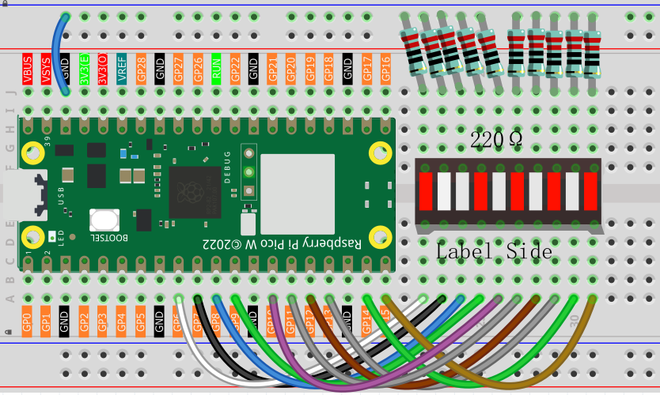

1.3 Chaser Light
====================
For our first project, we'll start with a simple yet effective task: making an LED 
blink. To achieve this, we'll use an LED Bar Graph, which consists of 10 LEDs housed 
in a plastic casing. This type of LED array is commonly used to display power levels 
or volume settings.

.. image:: img/1.detail/1.3.png

.. image:: img/1.detail/1.3-1.png

Component List
^^^^^^^^^^^^^^^
- Raspberry Pi Pico W x1
- MicroUSB cable x1
- 830 Tie-Points Breadboard x1
- Resistor 220Ω x10
- Jumper Wire Several
- LED Bar Graph x1

Component knowledge
^^^^^^^^^^^^^^^^^^^^
:ref:`LED Bar Graph <cpn_led_bar_graph>`
""""""""""""""""""""""""""""""""""""""""""

Schematic
^^^^^^^^^^
.. image:: img/2.sch/1.3.png

In the LED Bar Graph, there are 10 LEDs, each of which can be controlled individually. 
Each LED’s anode is connected to GP6*GP15, and its cathode to a 220ohm resistor, and then to GND.

Connect
^^^^^^^^^^

Code
^^^^^^^
.. note::

    * Open the ``1.3_chaser_light.ino`` file under the path of ``Ultimate-Starter-Kit-for-Pico-W\Arduino\1.Project`` or copy this code into Thonny, then click "Run Current Script" or simply press F5 to run it.

    * Or copy this code into Arduino IDE.

    * Don’t forget to select the board(Raspberry Pi Pico) and the correct port before clicking the Upload button.
  
After running the code, the LED Bar Graph will display a running light effect.

The following is the program code:

.. code-block:: c++
    
    void setup() {
        for(int i=6;i<=15;i++)
        {
            pinMode(i,OUTPUT);
        }
    }

    void loop() {
        for(int i=6;i<=15;i++)
        {
            digitalWrite(i,HIGH);
            delay(500);
            digitalWrite(i,LOW);
            delay(500);    
        }
    }

Phenomenon
^^^^^^^^^^^
.. video:: img/5.phenomenon/1.3.mp4
    :width: 100%