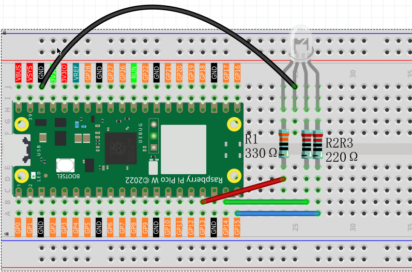
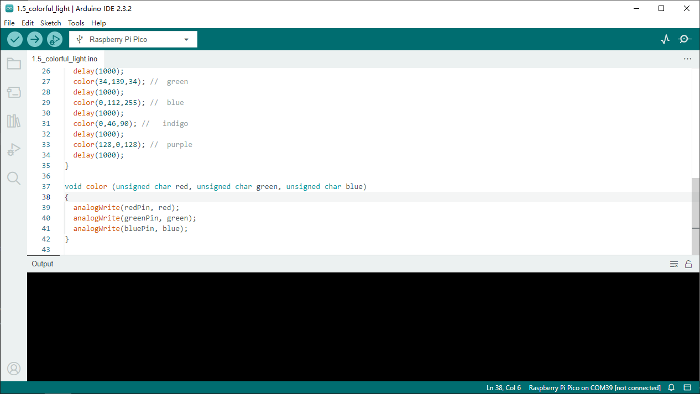

1.5 Colorful Light
=========================
In this chapter, we will learn how to control a RGB LED. It can emit different 
colors of light. Next, we will use RGB LED to make a multicolored light.

Random Color Light
-----------------------
In this project, we will make a multicolored LED. And we can control RGB LED to 
switch different colors automatically.

Component List
^^^^^^^^^^^^^^^
- Raspberry Pi Pico W x1
- 830 Tie-Points Breadboard x1
- LED-RGB x1
- Resistor 220Ω x3
- Jumper Wire Several

Schematic
^^^^^^^^^^
.. image:: img/2.sch/1.5.png

The PWM pins GP13, GP14 and GP15 control the Red, Green and Blue pins of the RGB 
LED respectively, and connect the common cathode pin to GND. This allows the RGB 
LED to display a specific color by superimposing light on these pins with differ
ent PWM values.

Component knowledge
^^^^^^^^^^^^^^^^^^^^
:ref:`RGB-LED <cpn_rgb_led>`
"""""""""""""""""""""""""""""""

Connect
^^^^^^^^^

Code
^^^^^^^
.. note::

    * Open the ``1.5_colorful_light.ino`` file under the path of ``Super-Starter-Kit-for-Pico\Arduino\1.Project`` or copy this code into Thonny, then click "Run Current Script" or simply press F5 to run it.

    * Or copy this code into Arduino IDE.

    * Don’t forget to select the board(Raspberry Pi Pico) and the correct port before clicking the Upload button. 
  

**RandomColorLight**

Click “Run current script”, RGBLED begins to display random colors.

The following is the program code:

.. code-block:: c++

    const int redPin = 13;   
    const int greenPin = 14;  
    const int bluePin = 15;  

    void setup()
    { 
    pinMode(redPin, OUTPUT); 
    pinMode(greenPin, OUTPUT); 
    pinMode(bluePin, OUTPUT); 
    }    

    void loop() 
    {    
    color(255, 0, 0); //  red 
    delay(1000); 
    color(0,255, 0); //  green  
    delay(1000);  
    color(0, 0, 255); //  blue  
    delay(1000);

    color(255,0,252); // red  
    delay(1000);   
    color(237,109,0); //  orange  
    delay(1000);   
    color(255,215,0); //  yellow  
    delay(1000);   
    color(34,139,34); //  green  
    delay(1000);  
    color(0,112,255); //  blue  
    delay(1000);  
    color(0,46,90); //   indigo 
    delay(1000);  
    color(128,0,128); //  purple  
    delay(1000);  
    }     

    void color (unsigned char red, unsigned char green, unsigned char blue)
    {    
    analogWrite(redPin, red);   
    analogWrite(greenPin, green); 
    analogWrite(bluePin, blue); 
    }

Phenomenon
^^^^^^^^^^^
.. video:: img/5.phenomenon/1.5-1.mp4
    :width: 100%

