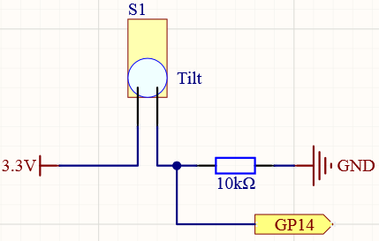

1.6 Tilt Switch
=================
The tilt switch is a 2-pin device with a metal ball in the middle. When the swit
ch is upright, the two pins are connected; when it is tilted, the two pins are d
isconnected.

Component List
^^^^^^^^^^^^^^^
- Raspberry Pi Pico W x1
- MicroUSB cable x1
- 830 Tie-Points Breadboard x1
- Tilt Switch x1
- Resistor 10KΩ x1
- Jumper Wire Several 

Component knowledge
^^^^^^^^^^^^^^^^^^^^
:ref:`RGB-LED <cpn_rgb_led>`
"""""""""""""""""""""""""""""""

Schematic
^^^^^^^^^^

When you put it upright, GP14 will get high; after tilting it, GP14 will get low.

The purpose of the 10K resistor is to keep the GP14 in a stable low state when 
the tilt switch is in a tilted state.

Connect
^^^^^^^^^

Code
^^^^^^^
.. note::

    * Open the ``1.6_tilt_switch.ino`` file under the path of ``Super-Starter-Kit-for-Pico\Arduino\1.Project`` or copy this code into Thonny, then click "Run Current Script" or simply press F5 to run it.

    * Or copy this code into Arduino IDE.

    * Don’t forget to select the board(Raspberry Pi Pico) and the correct port before clicking the Upload button.
  

Click “Run current script”, when you tilt the breadboard (tilt switch), “The switch works!” will appear in the shell.

The following is the program code:

.. code-block:: c++

    const int tiltPin = 14; 
    int state = 0;        

    void setup() {
    pinMode(tiltPin, INPUT);
    Serial.begin(115200);
    }

    void loop() {
    state = digitalRead(tiltPin); 
    if (state == LOW) { 
        Serial.println("The switch works!"); 
    }
    }

Phenomenon
^^^^^^^^^^^
.. image:: img/5.phenomenon/1.6.png
    :width: 100%