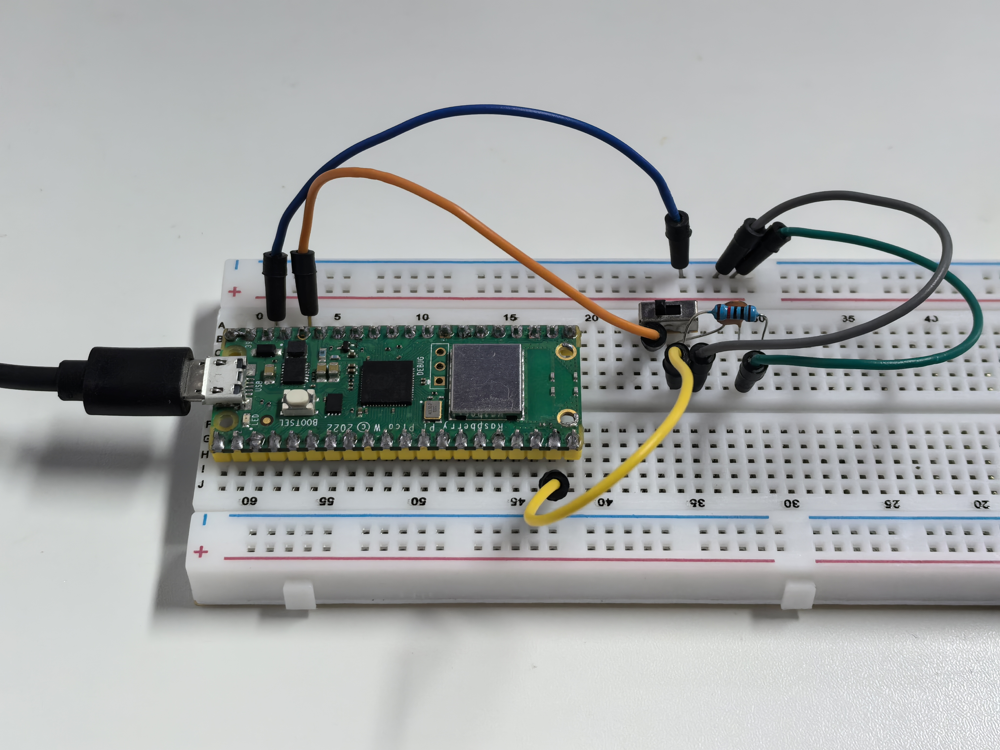

1.7 Slide_Switch
=========================
The slide switch is a 3-pin device, with pin 2 (middle) being the common pin. 
When the switch is toggled to the left, the left two pins are connected together
, and when toggled to the right, the right two pins are connected together.

Component List
^^^^^^^^^^^^^^^
- Raspberry Pi Pico W x1
- MicroUSB cable x1
- 830 Tie-Points Breadboard x1
- Jumper Wire Several
- Slide Switch x1
- Resistor 10KΩ x1
- Capacitor 104 x1

Component knowledge
^^^^^^^^^^^^^^^^^^^^
:ref:`RGB-LED <cpn_rgb_led>`
"""""""""""""""""""""""""""""""

Schematic
^^^^^^^^^^
.. image:: img/2.sch/1.7.png

GP14 will get a different level, when you toggle the slide switch to the right or left.

The purpose of the 10K resistor is to keep the GP14 low during toggling (not toggling to the far left and not toggling to the far right).

The 104 ceramic capacitor is used here to eliminate jitter.

Connect
^^^^^^^^^

.. image:: img/3.connect/1.7.png

Code
^^^^^^^
.. note::

    * Open the ``1.7_slide_switch.ino`` file under the path of ``Super-Starter-Kit-for-Pico\Arduino\1.Project`` or copy this code into Thonny, then click "Run Current Script" or simply press F5 to run it.

    * Or copy this code into Arduino IDE.

    * Don’t forget to select the board(Raspberry Pi Pico) and the correct port before clicking the Upload button.

.. image:: img/4.software/1.7.png

Click “Run current script”, when you toggle the slide switch to the right, “The 
switch works!” will appear in the shell.

The following is the program code:

.. code-block:: c++

    const int slidePin = 14;  // Define the pin connected to the slide switch
    int state = 0;            // Variable to store the state of the switch

    void setup() {
    pinMode(slidePin, INPUT);  // Set the slide switch pin as an input
    Serial.begin(115200);      // Initialize serial communication at 115200 baud rate
    }

    void loop() {
    state = digitalRead(slidePin);  // Read the state of the slide switch
    if (state == HIGH) {            // Check if the switch is in the HIGH position
        Serial.println("ON");         // Print "ON" to the serial monitor
    }
    else {                          // If the switch is not HIGH (i.e., LOW)
        Serial.println("OFF");        // Print "OFF" to the serial monitor
    }
    }

Phenomenon
^^^^^^^^^^^

