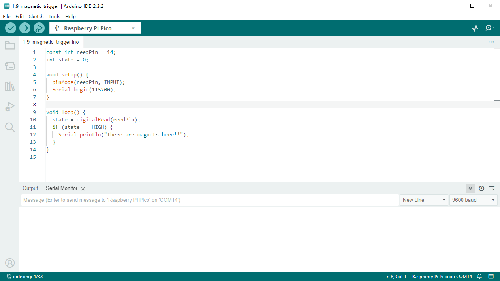

1.9 Magnetic Trigger
=========================
The most common type of reed switch contains a pair of magnetizable, flexible, m
etal reeds whose end portions are separated by a small gap when the switch is open.

A magnetic field from an electromagnet or a permanent magnet will cause the reed
s to attract each other, thus completing an electrical circuit. The spring force 
of the reeds causes them to separate, and open the circuit, when the magnetic field ceases.

A common example of a reed switch application is to detect the opening of a door 
or windows, for a security alarm.

Component List
^^^^^^^^^^^^^^^
- Raspberry Pi Pico W x1
- MicroUSB cable x1
- 830 Tie-Points Breadboard x1
- Jumper Wire Several
- Resistor 10KΩ x1
- Reed Switch x1

Component knowledge
^^^^^^^^^^^^^^^^^^^^
:ref:`RGB-LED <cpn_rgb_led>`
"""""""""""""""""""""""""""""""

Schematic
^^^^^^^^^^

Connect
^^^^^^^^^
.. image:: img/3.connect/1.9.png

Code
^^^^^^^
.. note::

    * Open the ``1.9_magnetic_trigger.ino`` file under the path of ``Super-Starter-Kit-for-Pico\Arduino\1.Project`` or copy this code into Thonny, then click "Run Current Script" or simply press F5 to run it.

    * Or copy this code into Arduino IDE.

    * Don’t forget to select the board(Raspberry Pi Pico) and the correct port before clicking the Upload button. 

Click “Run current script”, GP14 goes high when a magnet is near the reed switch, other
wise it goes low.

The following is the program code:

.. code-block:: python

    import machine
    import utime
    reed = machine.Pin(14, machine.Pin.IN)
    while True:
        if reed.value() == 1:
            print("There are magnets here!!")
            utime.sleep(1)

Phenomenon
^^^^^^^^^^^
.. image:: img/5.phenomenon/1.9.png
    :width: 100%
    

