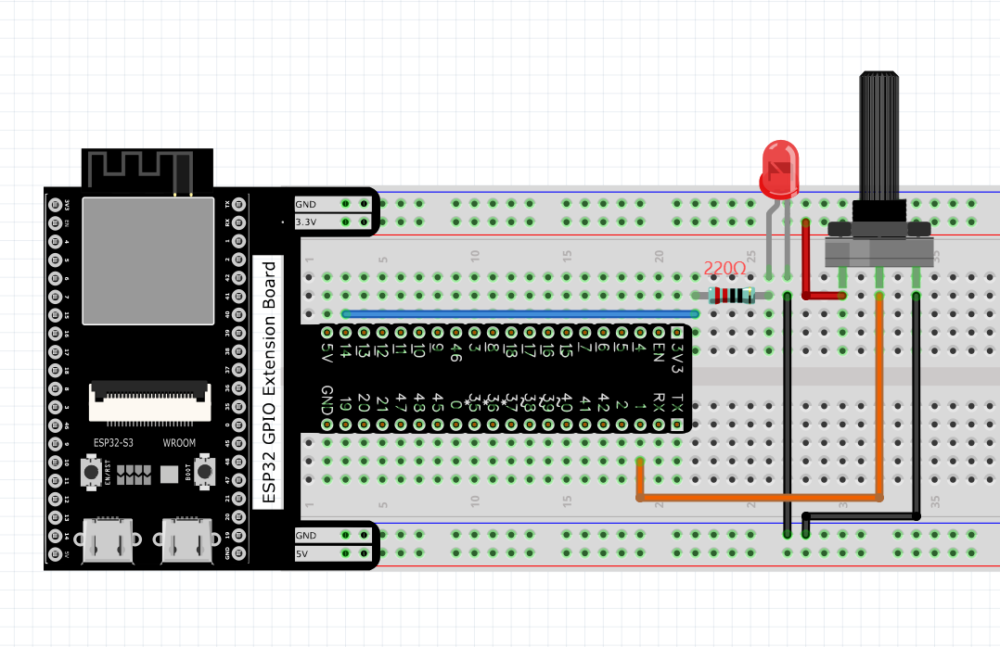
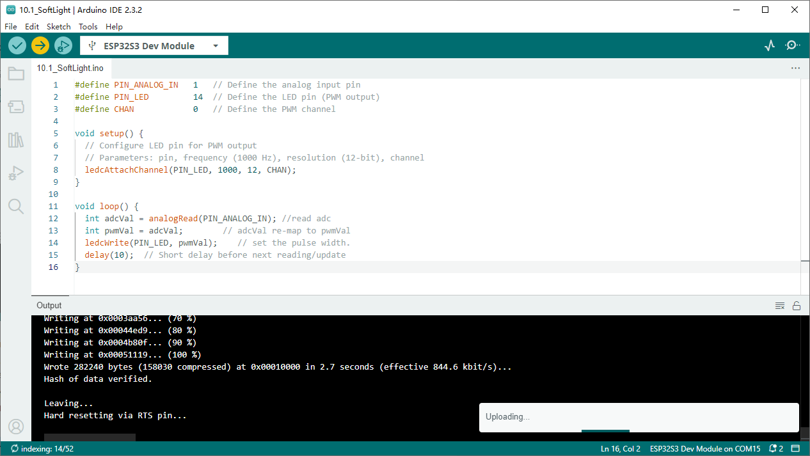
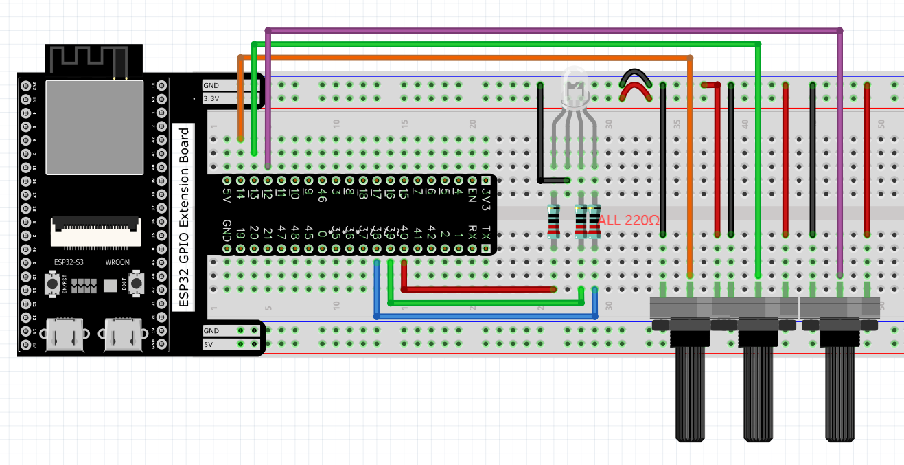
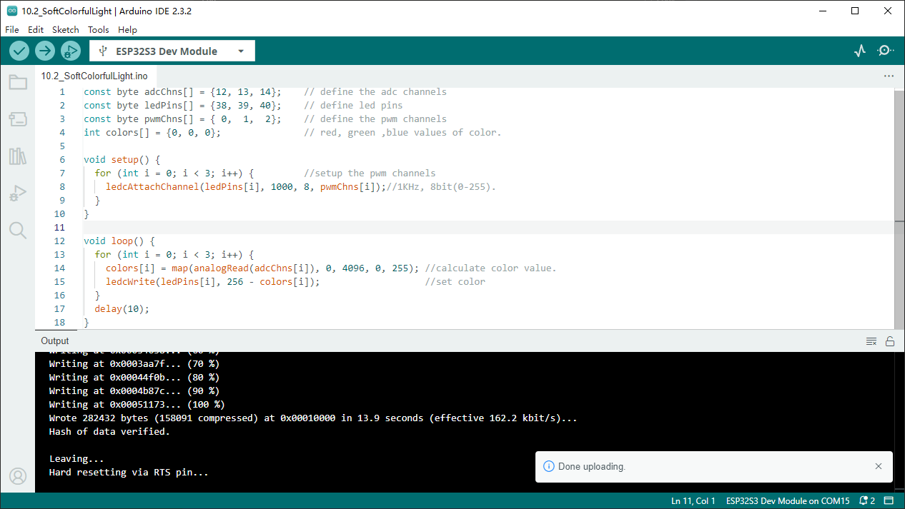

Chapter 10 Potentiometer & LED
================================
Earlier we have learned the use of ADC and PWM. In this chapter, we will learn 
how to use a potentiometer to control the brightness of an LED.

Project 10.1 Soft Light
------------------------
In this project, we will make a soft light. We will use an ADC Module to read ADC 
values of a potentiometer and map it to duty cycle of the PWM used to control the 
brightness of a LED. Then you can change the brightness of a LED by adjusting the 
potentiometer.

Component List
^^^^^^^^^^^^^^^
- ESP32-S3-WROOM x1
- GPIO Extension Board x1
- 830 Tie-Points Breadboard x1
- Resistor 220Ω x1
- Potentiometer(10k) x1
- LED x1
- Jumper Wire x5

Connect
^^^^^^^^^^^

Sketch
^^^^^^^
**Sketch_10.1_Softlight**

Download the code to ESP32-S3 WROOM, by turning the adjustable resistor to change 
the input voltage of GPIO19, ESP32-S3 changes the output voltage of GPIO14 according 
to this voltage value, thus changing the brightness of the LED.

Code
^^^^^^
The following is the program code:

.. code-block:: C

    #define PIN_ANALOG_IN   1
    #define PIN_LED         14
    #define CHAN            0
    void setup() {
    ledcAttachChannel(PIN_LED, 1000, 12, CHAN);
    }

    void loop() {
    int adcVal = analogRead(PIN_ANALOG_IN); //read adc
    int pwmVal = adcVal;        // adcVal re-map to pwmVal
    ledcWrite(PIN_LED, pwmVal);    // set the pulse width.
    delay(10);
    }

In the code, read the ADC value of potentiometer and map it to the duty cycle of 
PWM to control LED brightness.

Project 10.2 Soft Colorful Light
---------------------------------

In this project, 3 potentiometers are used to control the RGB LED and in principle 
it is the same as the Soft Light project. Namely, read the voltage value of the 
potentiometer and then convert it to PWM used to control LED brightness. Difference 
is that the original project only controlled one LED, but this project required (3) 
RGB LEDs.

Component List
^^^^^^^^^^^^^^^
- ESP32-S3-WROOM x1
- GPIO Extension Board x1
- 830 Tie-Points Breadboard x1
- Resistor 220Ω  x3
- Potentiometer(10k) x3
- LED-RGB x1
- Jumper Wire x13

Connect
^^^^^^^

Sketch
**Sketch_10.2_SoftColorfulLight**

Download the code to ESP32-S3 WROOM, rotate one of the potentiometers, then the 
color of RGB LED will change.

Code
^^^^^^
The following is the program code:

.. code-block:: C

    const byte adcChns[] = {12, 13, 14};    // define the adc channels
    const byte ledPins[] = {38, 39, 40};    // define led pins
    const byte pwmChns[] = { 0,  1,  2};    // define the pwm channels
    int colors[] = {0, 0, 0};               // red, green ,blue values of color.
    void setup() {
    for (int i = 0; i < 3; i++) {         //setup the pwm channels
        ledcAttachChannel(ledPins[i], 1000, 8, pwmChns[i]);//1KHz, 8bit(0-255).
    }
    }

    void loop() {
    for (int i = 0; i < 3; i++) {
        colors[i] = map(analogRead(adcChns[i]), 0, 4096, 0, 255); //calculate color value.
        ledcWrite(ledPins[i], 256 - colors[i]);                   //set color
    }
    delay(10);
    }

In the code you can read the ADC values of the 3 potentiometers and map it into 
a PWM duty cycle to control the 3 LED elements to vary the color of their respective 
RGB LED.
