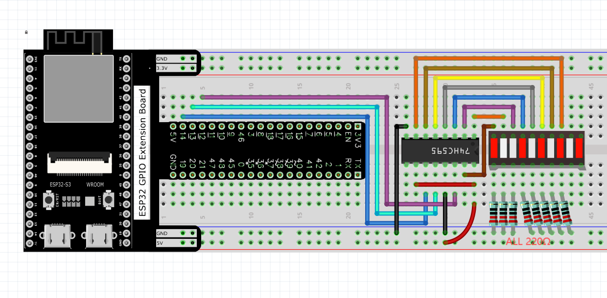
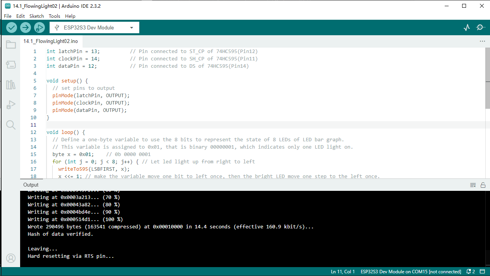

Chapter 14 74HC595 & LED Bar Graph
===================================
We have used LED bar graph to make a flowing water light, in which 10 GPIO ports 
of ESP32-S3 is occupied. More GPIO ports mean that more peripherals can be connected 
to ESP32-S3, so GPIO resource is very precious. Can we make flowing water light 
with less GPIO? In this chapter, we will learn a component, 74HC595, which can 
achieve the target.

Project 14.1 Flowing Water Light
--------------------------------
Now let’s learn how to use the 74HC595 IC chip to make a flowing water light using 
less GPIO.

Component List
^^^^^^^^^^^^^^^
- ESP32-S3-WROOM x1
- GPIO Extension Board x1
- 830 Tie-Points Breadboard x1
- 74HC595 x1
- Resistor 220Ω  x8
- LED Bar Graph x1
- Jumper Wire x15

Connect
^^^^^^^^^^^

Sketch
^^^^^^^
In this project, we will make a flowing water light with a 74HC595 chip to learn 
about its functions.

**14.1_FlowingLight2**

Download the code to ESP32-S3 WROOM. You will see that LED bar graph starts with 
the flowing water pattern flashing from left to right and then back from right 
to left.

Code
^^^^^^
The following is the program code:

.. code-block:: C

    int latchPin = 13;          // Pin connected to ST_CP of 74HC595(Pin12)
    int clockPin = 14;          // Pin connected to SH_CP of 74HC595(Pin11)
    int dataPin = 12;           // Pin connected to DS of 74HC595(Pin14)

    void setup() {
    // set pins to output
    pinMode(latchPin, OUTPUT);
    pinMode(clockPin, OUTPUT);
    pinMode(dataPin, OUTPUT);
    }

    void loop() {
    // Define a one-byte variable to use the 8 bits to represent the state of 8 LEDs of LED bar graph.
    // This variable is assigned to 0x01, that is binary 00000001, which indicates only one LED light on.
    byte x = 0x01;    // 0b 0000 0001
    for (int j = 0; j < 8; j++) { // Let led light up from right to left
        writeTo595(LSBFIRST, x);
        x <<= 1; // make the variable move one bit to left once, then the bright LED move one step to the left once.
        delay(50);
    }
    delay(100);
    x = 0x80;       //0b 1000 0000
    for (int j = 0; j < 8; j++) { // Let led light up from left to right
        writeTo595(LSBFIRST, x);
        x >>= 1;    
        delay(50);
    }
    delay(100);
    }
    void writeTo595(int order, byte _data ) {
    // Output low level to latchPin
    digitalWrite(latchPin, LOW);
    // Send serial data to 74HC595
    shiftOut(dataPin, clockPin, order, _data);
    // Output high level to latchPin, and 74HC595 will update the data to the parallel output port.
    digitalWrite(latchPin, HIGH);
    }

