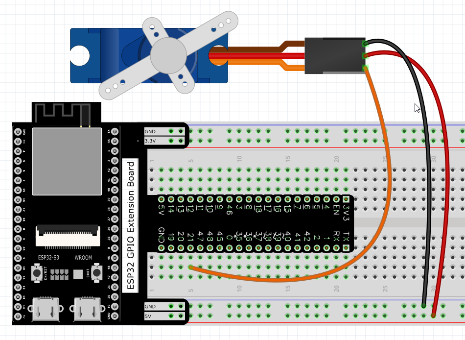
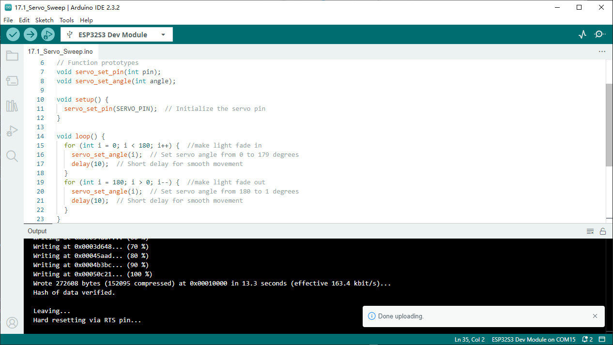
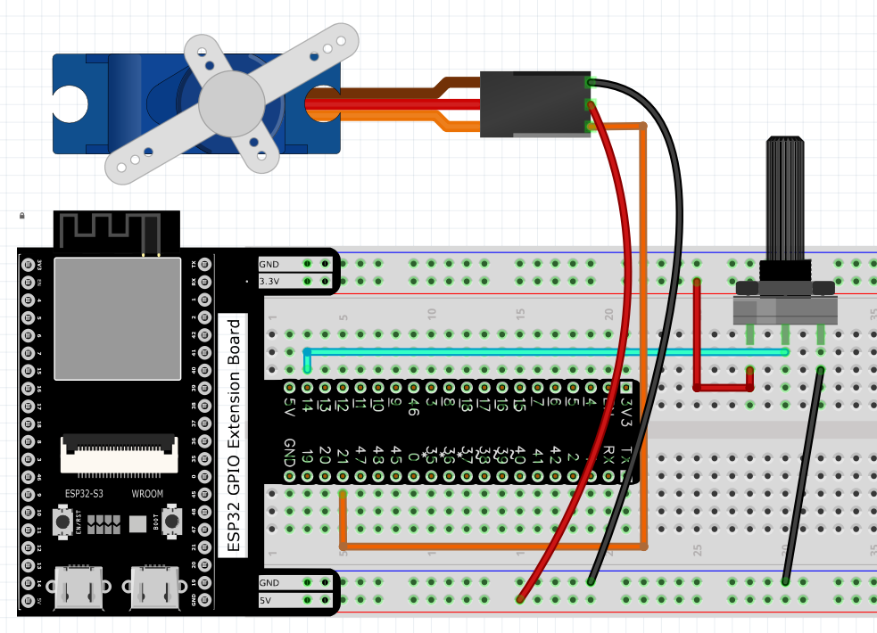
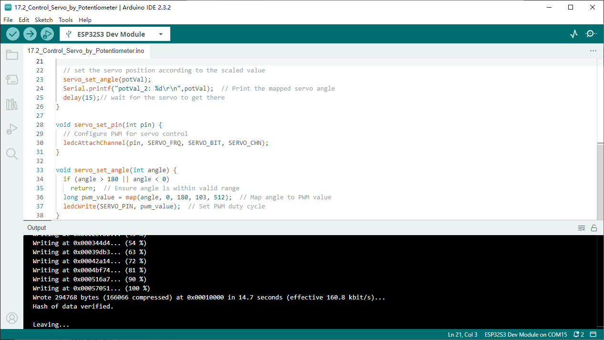

Chapter 17 Servo 
=========================
Previously, we learned how to control the speed and rotational direction of a mo
tor. In this chapter, we will learn about servos which are a rotary actuator ty
pe motor that can be controlled to rotate to specific angles.

Project 17.1 Servo Sweep
------------------------
First, we need to learn how to make a servo rotate.

Component List
^^^^^^^^^^^^^^^
- ESP32-S3-WROOM x1
- GPIO Extension Board x1
- 830 Tie-Points Breadboard x1
- Servo x1
- Jumper Wire x5

Connect
^^^^^^^^^^^
Use caution when supplying power to the servo, it should be 5V. Make sure you do 
not make any errors when connecting the servo to the power supply.

Sketch
^^^^^^^
**Sketch_17.1_Servo_Sweep**

Compile and upload the code to ESP32-S3 WROOM, the servo will rotate from 0 degree
s to 180 degrees and then reverse the direction to make it rotate from 180 degrees 
to 0 degrees and repeat these actions in an endless loop.

.. image:: img/phenomenon/17.1.png

Code
^^^^^^
The following is the program code:

.. code-block:: C

    #define SERVO_PIN 21  //define the pwm pin
    #define SERVO_CHN 0   //define the pwm channel
    #define SERVO_FRQ 50  //define the pwm frequency
    #define SERVO_BIT 12  //define the pwm precision

    // Function prototypes
    void servo_set_pin(int pin);
    void servo_set_angle(int angle);

    void setup() {
    servo_set_pin(SERVO_PIN);  // Initialize the servo pin
    }

    void loop() {
    for (int i = 0; i < 180; i++) {  //make light fade in
        servo_set_angle(i);  // Set servo angle from 0 to 179 degrees
        delay(10);  // Short delay for smooth movement
    }
    for (int i = 180; i > 0; i--) {  //make light fade out
        servo_set_angle(i);  // Set servo angle from 180 to 1 degrees
        delay(10);  // Short delay for smooth movement
    }
    }

    void servo_set_pin(int pin) {
    // Configure PWM for servo control
    ledcAttachChannel(pin, SERVO_FRQ, SERVO_BIT, SERVO_CHN);
    }

    void servo_set_angle(int angle) {
    if (angle > 180 || angle < 0)
        return;  // Ensure angle is within valid range
    long pwm_value = map(angle, 0, 180, 103, 512);  // Map angle to PWM value
    ledcWrite(SERVO_PIN, pwm_value);  // Set PWM duty cycle
    }

Project 17.2 Servo Knop
------------------------
Use a potentiometer to control the servo motor to rotate at any angle.

Component List
^^^^^^^^^^^^^^^
- ESP32-S3-WROOM x1
- GPIO Extension Board x1
- 830 Tie-Points Breadboard x1
- Servo x1
- Potentiometer(10k) x1
- Jumper Wire x6

Connect
^^^^^^^
Use caution when supplying power to the servo, it should be 5V. Make sure you do 
not make any errors when connecting the servo to the power supply.

Sketch
^^^^^^^
**Sketch_17.2_Servo_Sweep**

Compile and upload the code to ESP32-S3 WROOM, twist the potentiometer back and 
forth, and the servo motor rotates accordingly.

.. image:: img/phenomenon/17.2.png

Code
^^^^^^
The following is the program code:

.. code-block:: C

    #define SERVO_PIN 21  //define the pwm pin
    #define SERVO_CHN 0   //define the pwm channel
    #define SERVO_FRQ 50  //define the pwm frequency
    #define SERVO_BIT 12  //define the pwm precision
    #define ADC_PIN   14  //define the adc pin  

    void servo_set_pin(int pin);
    void servo_set_angle(int angle);

    void setup() {
    servo_set_pin(SERVO_PIN);  // Initialize the servo pin
    Serial.begin(115200);  // Start serial communication at 115200 baud
    }

    void loop() {
    // read the value of the potentiometer (value between 0 and 4095)
    int potVal = analogRead(ADC_PIN);               
    Serial.printf("potVal_1: %d\t",potVal);  // Print the raw potentiometer value
    // scale it to use it with the servo (value between 0 and 180)
    potVal = map(potVal, 0, 4095, 0, 180);   // Map potentiometer value to servo angle range
    
    // set the servo position according to the scaled value
    servo_set_angle(potVal);                    
    Serial.printf("potVal_2: %d\r\n",potVal);  // Print the mapped servo angle
    delay(15);// wait for the servo to get there
    }

    void servo_set_pin(int pin) {
    // Configure PWM for servo control
    ledcAttachChannel(pin, SERVO_FRQ, SERVO_BIT, SERVO_CHN);
    }

    void servo_set_angle(int angle) {
    if (angle > 180 || angle < 0)
        return;  // Ensure angle is within valid range
    long pwm_value = map(angle, 0, 180, 103, 512);  // Map angle to PWM value
    ledcWrite(SERVO_PIN, pwm_value);  // Set PWM duty cycle
    }

In this experiment, we obtain the ADC value of the potentiometer and store it in 
potVal. Use map function to convert it into corresponding angle value and we can 
control the motor to rotate to a specified angle, and print the value via serial.

