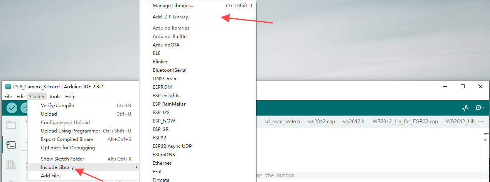
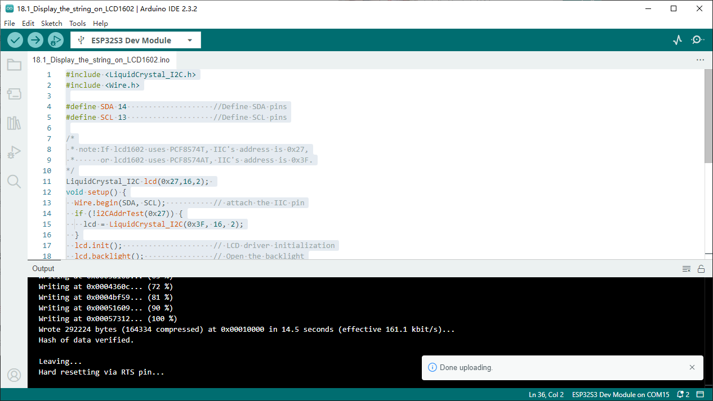

Chapter 18 LCD1602
=========================
In this chapter, we will learn about the LCD1602 Display Screen

Project 18.1 LCD1602
-----------------------
In this section we learn how to use LCD1602 to display something.

Component List
^^^^^^^^^^^^^^^
- ESP32-S3-WROOM x1
- GPIO Extension Board x1
- 830 Tie-Points Breadboard x1
- LCD1602 IIC x1
- F-M DuPont Cable x4

Connect
^^^^^^^^^^^

.. image:: img/connect/18.png

Sketch
^^^^^^^
**How to install the library**

We use the third party library LiquidCrystal I2C. If you haven't installed it yet, 
please do so before learning. The steps to add third-party Libraries are as follows: 
open ``arduino->Sketch->Include library-> Add .zip Library``.... Select "Super_S
tarter_Kit_for_ESP32_S3\C\Libraries\LiquidCrystal_I2C.zip" for installation.

.. image:: img/other

Use I2C LCD 1602 to display characters and variables.

**Sketch_18.1_Display_the_string_on_LCD1602**

Compile and upload the code to ESP32-S3 WROOM and the LCD1602 displays characters.

.. image:: img/phenomenon/18.1.png

Code
^^^^^^
The following is the program code:

.. code-block:: C

    #include <LiquidCrystal_I2C.h>
    #include <Wire.h>

    #define SDA 14                    //Define SDA pins
    #define SCL 13                    //Define SCL pins

    /*
    * note:If lcd1602 uses PCF8574T, IIC's address is 0x27,
    *      or lcd1602 uses PCF8574AT, IIC's address is 0x3F.
    */
    LiquidCrystal_I2C lcd(0x27,16,2); 
    void setup() {
    Wire.begin(SDA, SCL);           // attach the IIC pin
    if (!i2CAddrTest(0x27)) {
        lcd = LiquidCrystal_I2C(0x3F, 16, 2);
    }
    lcd.init();                     // LCD driver initialization
    lcd.backlight();                // Open the backlight
    lcd.setCursor(0,0);             // Move the cursor to row 0, column 0
    lcd.print("hello, world!");     // The print content is displayed on the LCD
    }

    void loop() {
    lcd.setCursor(0,1);             // Move the cursor to row 1, column 0
    lcd.print("Counter:");          // The count is displayed every second
    lcd.print(millis() / 1000);
    delay(1000);
    }

    bool i2CAddrTest(uint8_t addr) {
    Wire.beginTransmission(addr);
    if (Wire.endTransmission() == 0) {
        return true;
    }
    return false;
    }

