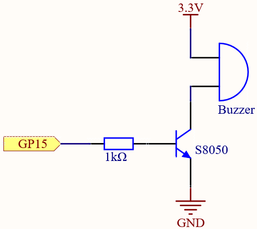
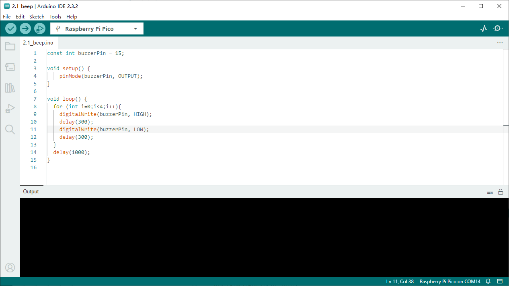

2.1 Beep
=========================
The active buzzer is a typical digital output device that is as easy to use as lighting up an LED!

Component List
^^^^^^^^^^^^^^^
- Raspberry Pi Pico W x1
- 830 Tie-Points Breadboard x1
- Transistor S8050 x1
- Resistor 1KΩ x1
- Active Buzzer x1
- Jumper Wire Several

Component knowledge
^^^^^^^^^^^^^^^^^^^^
:ref:`transistor <cpn_transistor>`
"""""""""""""""""""""""""""""""""""

:ref:`Buzzer <cpn_buzzer>`
"""""""""""""""""""""""""""

Schematic
^^^^^^^^^^

When the GP15 output is high, after the 1K current limiting resistor (to protect 
the transistor), the S8050 (NPN transistor) will conduct, so that the buzzer will 
sound.

The role of S8050 (NPN transistor) is to amplify the current and make the buzzer 
sound louder. In fact, you can also connect the buzzer directly to GP15, but you 
will find that the buzzer sound is smaller.

Connect
^^^^^^^^
Two types of buzzers are included in the kit. We need to use active buzzer. Turn 
them around, the sealed back (not the exposed PCB) is the one we want.

The buzzer needs to use a transistor when working, here we use S8050 (NPN Transistor).

.. image:: img/3.connect/2.1.png

Code
^^^^^^^
.. note::

    * Open the ``2.1_beep.ino`` file under the path of ``Ultimate-Starter-Kit-for-Pico\Arduino\1.Project`` or copy this code into Thonny, then click "Run Current Script" or simply press F5 to run it.

    * Or copy this code into Arduino IDE.

    * Don’t forget to select the board(Raspberry Pi Pico) and the correct port before clicking the Upload button. 

Click “Run current script”, you will hear a beep every second.

The following is the program code:

.. code-block:: c++

    const int buzzerPin = 15;

    void setup() {
        pinMode(buzzerPin, OUTPUT);
    }

    void loop() {
    for (int i=0;i<4;i++){
        digitalWrite(buzzerPin, HIGH);   
        delay(300);                       
        digitalWrite(buzzerPin, LOW);    
        delay(300);     
    }
    delay(1000);      
    }

Phenomenon
^^^^^^^^^^^
.. video:: img/5.phenomenon/2.1.mp4
    :width: 100%