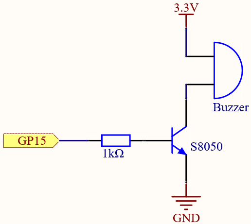

2.2 Custom Melody
=========================
In our previous project, we used an active buzzer, but this time we'll switch to 
a passive buzzer. Similar to the active buzzer, the passive buzzer operates based 
on electromagnetic induction. However, unlike the active buzzer, the passive buzzer 
lacks an internal oscillation source, meaning it won't produce sound with a simple 
DC signal. This feature, however, allows the passive buzzer to adjust its own 
oscillation frequency, enabling it to produce different musical notes like “doh, 
re, mi, fa, sol, la, ti.” Let's make the passive buzzer play a melody!

Component List
^^^^^^^^^^^^^^^
- Raspberry Pi Pico W x1
- 830 Tie-Points Breadboard x1
- Transistor S8050 x1
- Resistor 1KΩ x1
- Passive Buzzer x1
- Jumper Wire Several

Component knowledge
^^^^^^^^^^^^^^^^^^^^

:ref:`transistor <cpn_transistor>`
"""""""""""""""""""""""""""""""""""

:ref:`Buzzer <cpn_buzzer>`
"""""""""""""""""""""""""""

Schematic
^^^^^^^^^^

When GP15 outputs a high signal, the 1K resistor limits the current to protect the 
transistor. The S8050 (NPN transistor) then conducts, allowing the buzzer to sound. 
The S8050 transistor amplifies the current, resulting in a louder sound from the 
buzzer. While you can connect the buzzer directly to GP15, the sound will be quieter 
without the transistor.

Connect
^^^^^^^^
Two buzzers are included in the kit, we use a passive buzzer (one with an exposed PCB on the back).

The buzzer needs a transistor to work, here we use S8050.

.. image:: img/3.connect/2.2.png

Code
^^^^^^^
.. note::

    * Open the ``2.2_beep.ino`` file under the path of ``Ultimate-Starter-Kit-for-Pico-W\Arduino\1.Project`` or copy this code into Thonny, then click "Run Current Script" or simply press F5 to run it.

    * Or copy this code into Arduino IDE.

    * Don’t forget to select the board(Raspberry Pi Pico) and the correct port before clicking the Upload button. 

Click “Run current script”, you will hear a beep every second.

.. image:: img/5.phenomenon/2.2.png

The following is the program code:

.. code-block:: c++

    #include <Adafruit_NeoPixel.h>
    #ifdef __AVR__
    #include <avr/power.h>
    #endif

    #define PIXEL_PIN    0
    #define PIXEL_COUNT 8

    // Declare our NeoPixel strip object:
    Adafruit_NeoPixel strip(PIXEL_COUNT, PIXEL_PIN, NEO_GRB + NEO_KHZ800);
    // Argument 1 = Number of pixels in NeoPixel strip
    // Argument 2 = Arduino pin number (most are valid)
    // Argument 3 = Pixel type flags, add together as needed:
    //   NEO_KHZ800  800 KHz bitstream (most NeoPixel products w/WS2812 LEDs)
    //   NEO_KHZ400  400 KHz (classic 'v1' (not v2) FLORA pixels, WS2811 drivers)
    //   NEO_GRB     Pixels are wired for GRB bitstream (most NeoPixel products)
    //   NEO_RGB     Pixels are wired for RGB bitstream (v1 FLORA pixels, not v2)
    //   NEO_RGBW    Pixels are wired for RGBW bitstream (NeoPixel RGBW products)

    void setup() {
    strip.begin(); // Initialize NeoPixel strip object (REQUIRED)
    strip.show();  // Initialize all pixels to 'off'

    strip.setPixelColor(0, strip.Color(64, 154, 227));       //  Set pixel's color (in RAM)
    strip.setPixelColor(1, strip.Color(128, 0, 128));
    strip.setPixelColor(2, strip.Color(50, 150, 50));
    strip.setPixelColor(3, strip.Color(255, 30, 30));
    strip.setPixelColor(4, strip.Color(0, 128, 255));
    strip.setPixelColor(5, strip.Color(99, 199, 0));
    strip.setPixelColor(6, strip.Color(64, 154, 227));
    strip.setPixelColor(7, strip.Color(255, 100, 0));
    strip.show();                          //  Update strip to match
    }

    void loop() {

    }

Phenomenon
^^^^^^^^^^^
.. image:: img/5.phenomenon/2.2.png
    :width: 100%