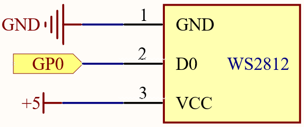

2.3 RGB LED Strip
=========================
WS2812 is a intelligent control LED light source that the control circuit and RGB 
chip are integrated in a package of 5050 components. It internal include intelligent 
digital port data latch and signal reshaping amplification drive circuit. Also 
include a precision internal oscillator and a programmable constant current control 
part, effectively ensuring the pixel point light color height consistent.

The data transfer protocol use single NZR communication mode. After the pixel power-on 
reset, the DIN port receive data from controller, the first pixel collect initial 
24bit data then sent to the internal data latch, the other data which reshaping 
by the internal signal reshaping amplification circuit sent to the next cascade 
pixel through the DO port. After transmission for each pixel, the signal to reduce 
24bit. pixel adopt auto reshaping transmit technology, making the pixel cascade 
number is not limited the signal transmission, only depend on the speed of signal 
transmission.

Component List
^^^^^^^^^^^^^^^
- Raspberry Pi Pico W x1
- MicroUSB cable x1
- 830 Tie-Points Breadboard x1
- RGB 8 LED Strip x1
- Jumper Wire Several

Component knowledge
^^^^^^^^^^^^^^^^^^^^

:ref:`transistor <cpn_transistor>`
"""""""""""""""""""""""""""""""""""

Schematic
^^^^^^^^^^

Connect
^^^^^^^^^
.. image:: img/3.connect/2.3.png

.. warning:: 
    One thing you need to pay attention to is current.

    Although the LED Strip with any number of LEDs can be used in Pico W, the power 
    of its VBUS pin is limited. Here, we will use eight LEDs, which are safe. But if 
    you want to use more LEDs, you need to add a separate power supply.

Code
^^^^^^^
.. note::

    * Open the ``2.3.1_rgb_led_strip.ino``  ``2.3.2_rgb_led_strip_flowing.ino``and ``2.3.3_rgb_led_strip_rainbow.ino``file under the path of ``Ultimate-Starter-Kit-for-Pico\Arduino\1.Project`` or copy this code into Thonny, then click "Run Current Script" or simply press F5 to run it.

    * Or copy this code into Arduino IDE.

    * Don’t forget to select the board(Raspberry Pi Pico) and the correct port before clicking the Upload button. 

.. image:: img/4.software/2.3.png

Click “Run current script”, Let’s select some favorite colors and display them on the RGB LED Strip!

The following is the program code:

.. code-block:: c++
    :caption: 2.3.1_rgb_led_strip.ino

    #include <Adafruit_NeoPixel.h>
    #ifdef __AVR__
    #include <avr/power.h>
    #endif

    #define PIXEL_PIN    0
    #define PIXEL_COUNT 8

    // Declare our NeoPixel strip object:
    Adafruit_NeoPixel strip(PIXEL_COUNT, PIXEL_PIN, NEO_GRB + NEO_KHZ800);
    // Argument 1 = Number of pixels in NeoPixel strip
    // Argument 2 = Arduino pin number (most are valid)
    // Argument 3 = Pixel type flags, add together as needed:
    //   NEO_KHZ800  800 KHz bitstream (most NeoPixel products w/WS2812 LEDs)
    //   NEO_KHZ400  400 KHz (classic 'v1' (not v2) FLORA pixels, WS2811 drivers)
    //   NEO_GRB     Pixels are wired for GRB bitstream (most NeoPixel products)
    //   NEO_RGB     Pixels are wired for RGB bitstream (v1 FLORA pixels, not v2)
    //   NEO_RGBW    Pixels are wired for RGBW bitstream (NeoPixel RGBW products)

    void setup() {
    strip.begin(); // Initialize NeoPixel strip object (REQUIRED)
    strip.show();  // Initialize all pixels to 'off'

    strip.setPixelColor(0, strip.Color(64, 154, 227));       //  Set pixel's color (in RAM)
    strip.setPixelColor(1, strip.Color(128, 0, 128));
    strip.setPixelColor(2, strip.Color(50, 150, 50));
    strip.setPixelColor(3, strip.Color(255, 30, 30));
    strip.setPixelColor(4, strip.Color(0, 128, 255));
    strip.setPixelColor(5, strip.Color(99, 199, 0));
    strip.setPixelColor(6, strip.Color(64, 154, 227));
    strip.setPixelColor(7, strip.Color(255, 100, 0));
    strip.show();                          //  Update strip to match
    }

    void loop() {

    }

.. code-block:: c++
    :caption: 2.3.2_rgb_led_strip_flowing.ino

    #include <Adafruit_NeoPixel.h>
    #ifdef __AVR__
    #include <avr/power.h>
    #endif

    #define PIXEL_PIN    0
    #define PIXEL_COUNT 8

    // Declare our NeoPixel strip object:
    Adafruit_NeoPixel strip(PIXEL_COUNT, PIXEL_PIN, NEO_GRB + NEO_KHZ800);
    // Argument 1 = Number of pixels in NeoPixel strip
    // Argument 2 = Arduino pin number (most are valid)
    // Argument 3 = Pixel type flags, add together as needed:
    //   NEO_KHZ800  800 KHz bitstream (most NeoPixel products w/WS2812 LEDs)
    //   NEO_KHZ400  400 KHz (classic 'v1' (not v2) FLORA pixels, WS2811 drivers)
    //   NEO_GRB     Pixels are wired for GRB bitstream (most NeoPixel products)
    //   NEO_RGB     Pixels are wired for RGB bitstream (v1 FLORA pixels, not v2)
    //   NEO_RGBW    Pixels are wired for RGBW bitstream (NeoPixel RGBW products)

    void setup() {
    strip.begin(); // Initialize NeoPixel strip object (REQUIRED)
    strip.show();  // Initialize all pixels to 'off'
    }

    void loop() {
    flowing(80);
    }

    void flowing(int wait) {
    // Let the colors pass one by one from back to front.
    // The last one re-fetches a random color.
    for (int i = 0; i < PIXEL_COUNT ; i++) {
        strip.setPixelColor(i, strip.getPixelColor(i + 1));
    }
    int pixelHue = random(65535); // Get a random color from the color wheel (range of 65535).

    // strip.ColorHSV() can take 1 or 3 arguments: a hue (0 to 65535) or
    // optionally add saturation and value (brightness) (each 0 to 255).
    // Here we're using just the single-argument hue variant. The result
    // is passed through strip.gamma32() to provide 'truer' colors
    // before assigning to each pixel:
    strip.setPixelColor(PIXEL_COUNT - 1, strip.gamma32(strip.ColorHSV(pixelHue)));

    strip.show(); // Update strip with new contents
    delay(wait);  // Pause for a moment
    }

.. code-block:: c++
    :caption: 2.3.3_rgb_led_strip_rainbow.ino
    
    #include <Adafruit_NeoPixel.h>
    #ifdef __AVR__
    #include <avr/power.h>
    #endif

    #define PIXEL_PIN    0
    #define PIXEL_COUNT 8

    // Declare our NeoPixel strip object:
    Adafruit_NeoPixel strip(PIXEL_COUNT, PIXEL_PIN, NEO_GRB + NEO_KHZ800);
    // Argument 1 = Number of pixels in NeoPixel strip
    // Argument 2 = Arduino pin number (most are valid)
    // Argument 3 = Pixel type flags, add together as needed:
    //   NEO_KHZ800  800 KHz bitstream (most NeoPixel products w/WS2812 LEDs)
    //   NEO_KHZ400  400 KHz (classic 'v1' (not v2) FLORA pixels, WS2811 drivers)
    //   NEO_GRB     Pixels are wired for GRB bitstream (most NeoPixel products)
    //   NEO_RGB     Pixels are wired for RGB bitstream (v1 FLORA pixels, not v2)
    //   NEO_RGBW    Pixels are wired for RGBW bitstream (NeoPixel RGBW products)

    void setup() {
    strip.begin(); // Initialize NeoPixel strip object (REQUIRED)
    strip.show();  // Initialize all pixels to 'off'
    }

    void loop() {
    rainbow(10);
    }

    // Rainbow cycle along whole strip. Pass delay time (in ms) between frames.
    void rainbow(int wait) {
    // Hue of first pixel runs a complete loops through the color wheel.
    // Color wheel has a range of 65536 but it's OK if we roll over.

    for (long firstPixelHue = 0; firstPixelHue < 65536; firstPixelHue += 256) {
        for (int i = 0; i < PIXEL_COUNT; i++) { // For each pixel in strip...

        // Offset pixel hue by an amount to make one full revolution of the
        // color wheel (range of 65536) along the length of the strip.
        int pixelHue = firstPixelHue + (i * 65536L / PIXEL_COUNT);

        // strip.ColorHSV() can take 1 or 3 arguments: a hue (0 to 65535) or
        // optionally add saturation and value (brightness) (each 0 to 255).
        // Here we're using just the single-argument hue variant.
        strip.setPixelColor(i, strip.gamma32(strip.ColorHSV(pixelHue)));
        }
        strip.show(); // Update strip with new contents
        delay(wait);  // Pause for a moment
    }
    }

Phenomenon
^^^^^^^^^^^
.. image:: img/5.phenomenon/2.3.png
    :width: 100%