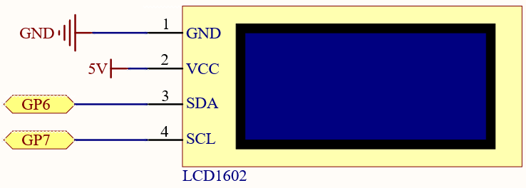
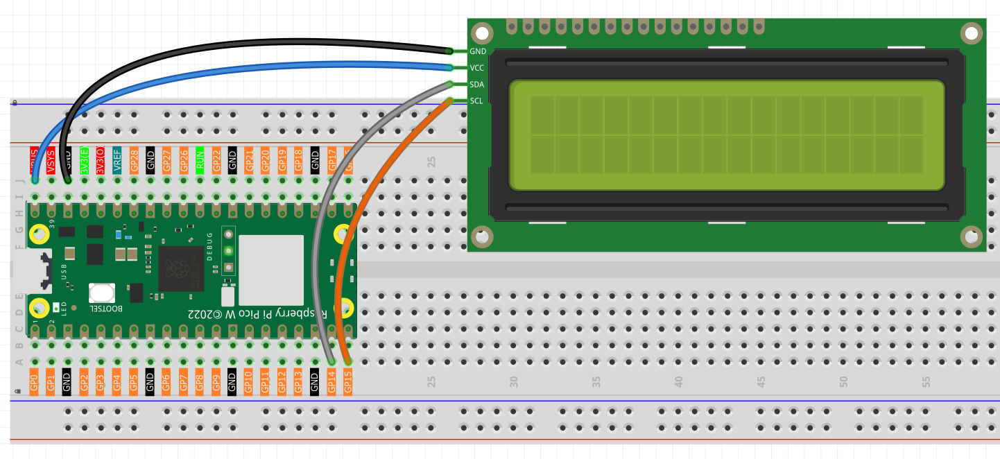
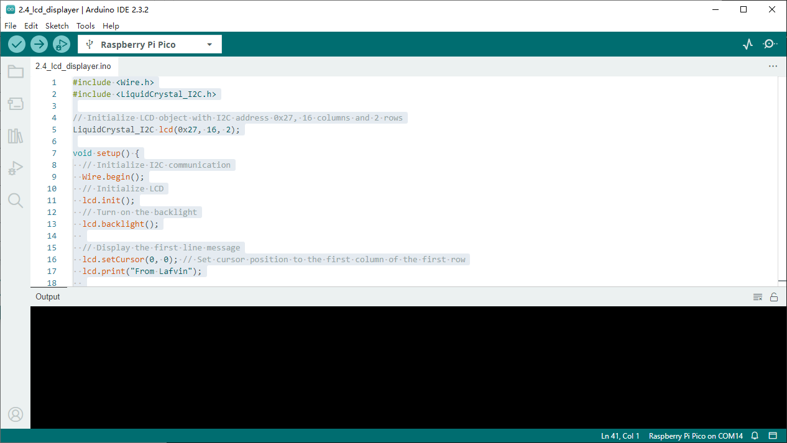

2.4 LCD Displayer
=========================
LCD1602 is a character type liquid crystal display, which can display 32 (16*2) 
characters at the same time.

As we all know, though LCD and some other displays greatly enrich the man-machine 
interaction, they share a common weakness. When they are connected to a controller, 
multiple IOs will be occupied of the controller which has no so many outer ports. 
Also it restricts other functions of the controller. Therefore, LCD1602 with an 
I2C bus is developed to solve the problem.

Here we will use the I2C1 interface to control the LCD1602 and display text.

Component List
^^^^^^^^^^^^^^^
- Raspberry Pi Pico W x1
- MicroUSB cable x1
- 830 Tie-Points Breadboard x1
- LCD1602 IIC x1
- Jumper Wire Several

Component knowledge
^^^^^^^^^^^^^^^^^^^^

:ref:`transistor <cpn_transistor>`
"""""""""""""""""""""""""""""""""""

Schematic
^^^^^^^^^^

Connect
^^^^^^^^^

Code
^^^^^^^
.. note::

    * Open the ``2.4_lcd_displayer.ino`` file under the path of ``Ultimate-Starter-Kit-for-Pico\Arduino\1.Project`` or copy this code into Thonny, then click "Run Current Script" or simply press F5 to run it.

    * Or copy this code into Arduino IDE.

    * Don’t forget to select the board(Raspberry Pi Pico) and the correct port before clicking the Upload button. 

Click “Run current script”, you will be able to see two lines of text appear on the LCD in turn, and then disappear.

The following is the program code:

.. code-block:: c++

    #include <Wire.h>
    #include <LiquidCrystal_I2C.h>

    // Initialize LCD object with I2C address 0x27, 16 columns and 2 rows
    LiquidCrystal_I2C lcd(0x27, 16, 2);

    void setup() {
    // Initialize I2C communication
    Wire.begin();
    // Initialize LCD
    lcd.init();
    // Turn on the backlight
    lcd.backlight();
    
    // Display the first line message
    lcd.setCursor(0, 0); // Set cursor position to the first column of the first row
    lcd.print("From Lafvin");
    
    // Wait for 2 seconds
    delay(2000);
    
    // Clear the display
    lcd.clear();
    
    // Display the second line message
    lcd.setCursor(0, 0); // Set cursor position to the first column of the first row
    lcd.print("Hello");
    lcd.setCursor(0, 1); // Set cursor position to the first column of the second row
    lcd.print("       World!");
    
    // Wait for 5 seconds
    delay(5000);
    
    // Clear the display
    lcd.clear();
    }

    void loop() {
    // Empty loop, no operation
    }

Phenomenon
^^^^^^^^^^^
.. video:: img/5.phenomenon/2.4.mp4
    :width: 100%