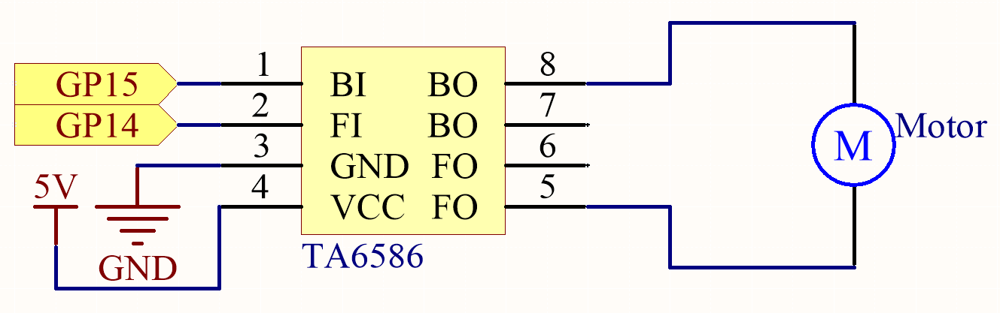
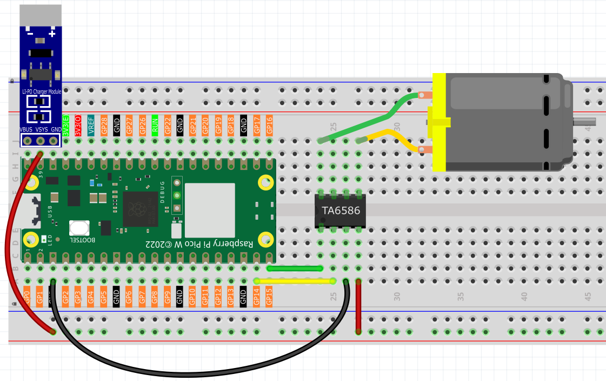
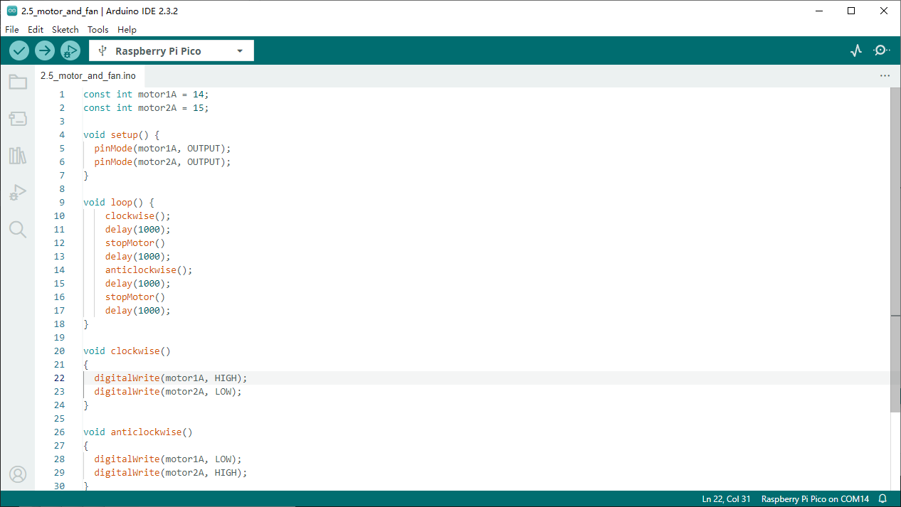

2.5 Motor & Fan
=========================
We're now using the TA6586 to control the DC motor, enabling it to rotate both 
clockwise and counterclockwise. Given that DC motors typically require a significant 
amount of current, we're employing a dedicated power module to safely supply power 
to the motor.

Component List
^^^^^^^^^^^^^^^
- Raspberry Pi Pico W x1
- MicroUSB cable x1
- 830 Tie-Points Breadboard x1
- TA6586 x1
- DC Motor x1
- Li-po Charger Module x1
- Battery Holder x1
- Jumper Wire Several

Component knowledge
^^^^^^^^^^^^^^^^^^^^
:ref:`TA6586 <cpn_ta6586>`
"""""""""""""""""""""""""""

:ref:`Li-po Charger Module <cpn_li-po_charger_module>`
"""""""""""""""""""""""""""""""""""""""""""""""""""""""""

:ref:`DC Motor <cpn_dc_motor>`
""""""""""""""""""""""""""""""""

Schematic
^^^^^^^^^^

.. note:: 

    * Since DC motors require a high current, we use a Li-po Charger module to power the motor here for safety reasons.

    * Make sure your Li-po Charger Module is connected as shown in the diagram. Otherwise, a short circuit will likely damage your battery and circuitry.

Connect
^^^^^^^^^

Code
^^^^^^^
.. note::

    * Open the ``2.5_motor_and_fan.ino`` file under the path of ``Ultimate-Starter-Kit-for-Pico\Arduino\1.Project`` or copy this code into Thonny, then click "Run Current Script" or simply press F5 to run it.

    * Or copy this code into Arduino IDE.

    * Don’t forget to select the board(Raspberry Pi Pico) and the correct port before clicking the Upload button. 

Click “Run current script”, the motor will rotate back and forth in a regular pattern.

The following is the program code:

.. code-block:: c++

    const int motor1A = 14;
    const int motor2A = 15;

    void setup() {
    pinMode(motor1A, OUTPUT);
    pinMode(motor2A, OUTPUT);
    }

    void loop() {
        clockwise();
        delay(1000);
        stopMotor()
        delay(1000);
        anticlockwise();
        delay(1000);
        stopMotor()
        delay(1000);
    }

    void clockwise()
    {
    digitalWrite(motor1A, HIGH);
    digitalWrite(motor2A, LOW);
    }

    void anticlockwise()
    {
    digitalWrite(motor1A, LOW);
    digitalWrite(motor2A, HIGH);
    }

    void stopMotor()
    {
    digitalWrite(motor1A, LOW);
    digitalWrite(motor2A, LOW);
    }

Phenomenon
^^^^^^^^^^^
.. video:: img/5.phenomenon/2.5.mp4
    :width: 100%