Chapter 21 Read and Write the SDcard
=============================================
An SDcard slot is integrated on the back of the ESP32-S3 WROOM. In this chapter 
we learn how to use ESP32S3 to read and write SDcard.

Project 21.1 SDMMC Test
------------------------

Component List
^^^^^^^^^^^^^^^
- ESP32-S3-WROOM x1
- Type C USB Cable x1
- Memory Card x1

Format SD card
^^^^^^^^^^^^^^^^^^
Before starting the tutorial, we need to create a drive letter for the blank SD 
card and format it. This step requires a card reader and SD card. Please prepare 
them in advance. Below we will guide you to do it on different computer systems. 
You can choose the guide that matches your computer. 
**Windows**
Insert the SD card into the card reader, then insert the card reader into the 
computer. In the Windows search box, enter "Disk Management" and select "Create 
and format hard disk partitions".

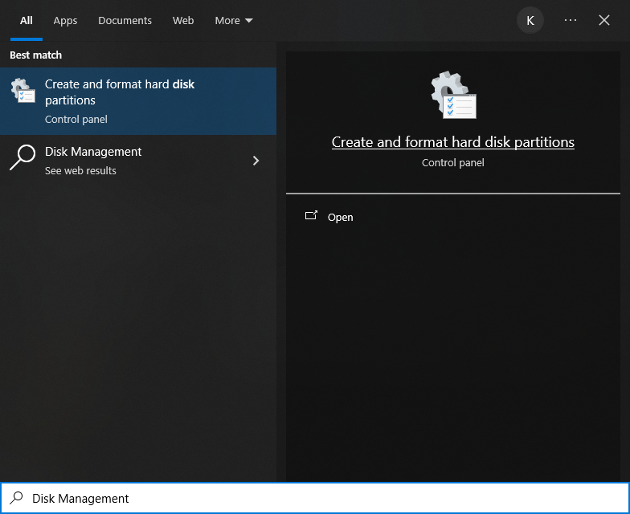

In the new pop-up window, find an unallocated volume close to 1G in size.

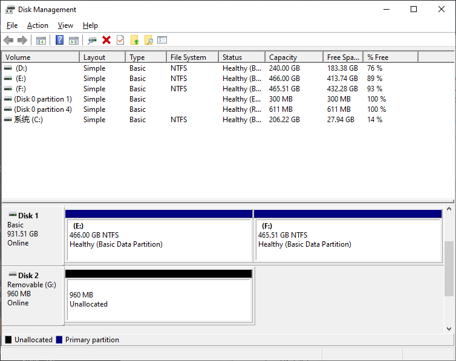

Click to select the volume, right-click and select "New Simple Volume".

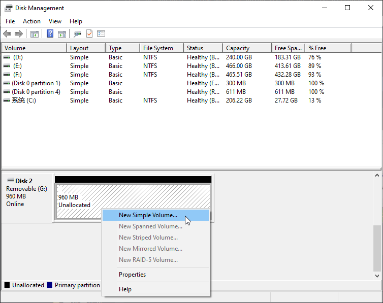

Click Next.

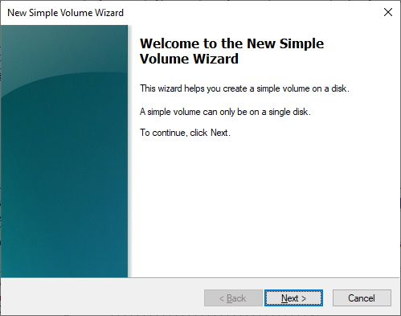

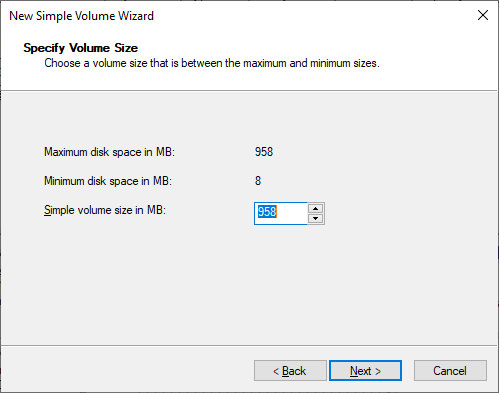

You can choose the drive letter on the right, or you can choose the default. By 
default, just click Next.

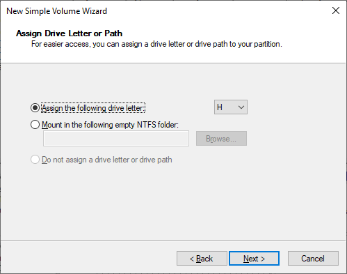

File system is FAT(or FAT32). The Allocation unit size is 16K, and the Volume 
label can be set to any name. After setting, click Next.

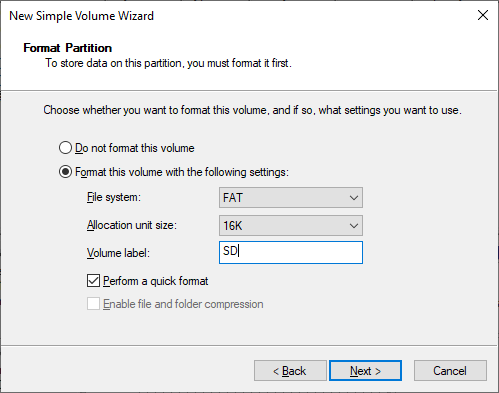

Click Finish. Wait for the SD card initialization to complete.

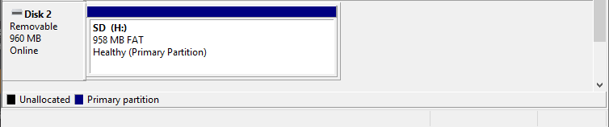

At this point, you can see the SD card in This PC.

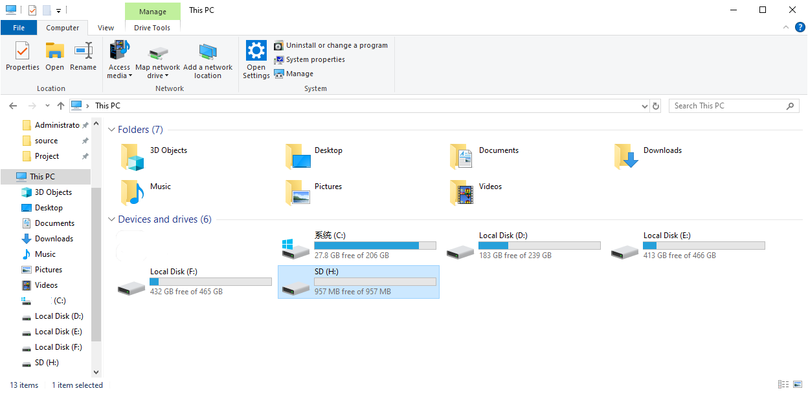

**MAC**
Insert the SD card into the card reader, then insert the card reader into the 
computer. Some computers will prompt the following information, please click to 
ignore it.

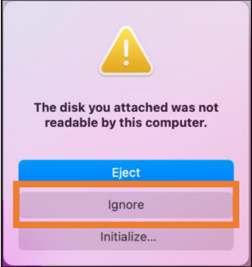

Find "Disk Utility" in the MAC system and click to open it.

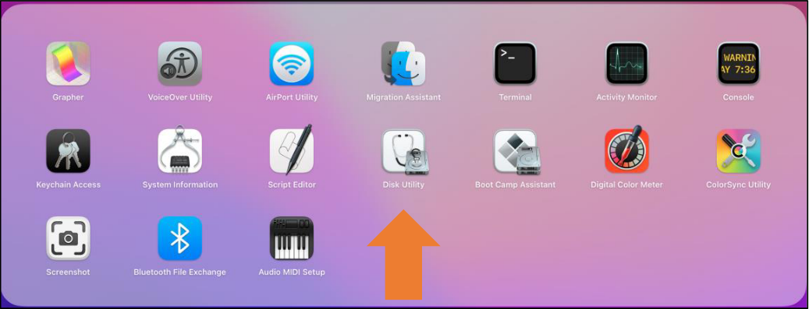

Select "Generic MassStorageClass Media", note that its size is about 1G. Please 
do not choose wrong item. Click "Erase".

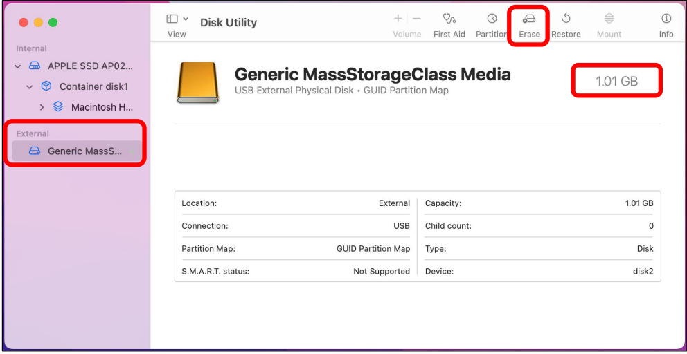

Select the configuration as shown in the figure below, and then click "Erase".

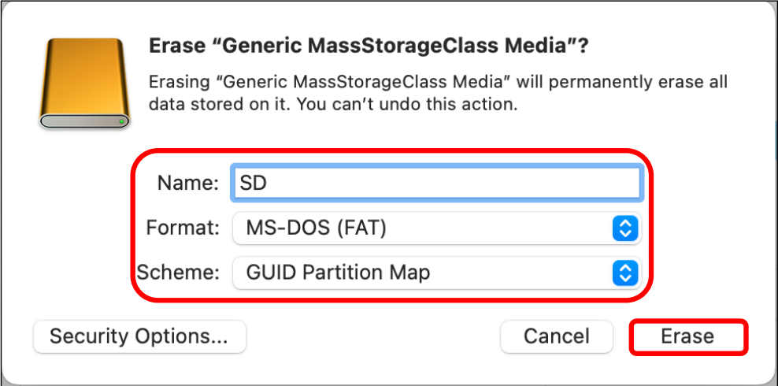

Wait for the formatting to complete. When finished, it will look like the picture 
below. At this point, you can see a new disk on the desktop named "SD".

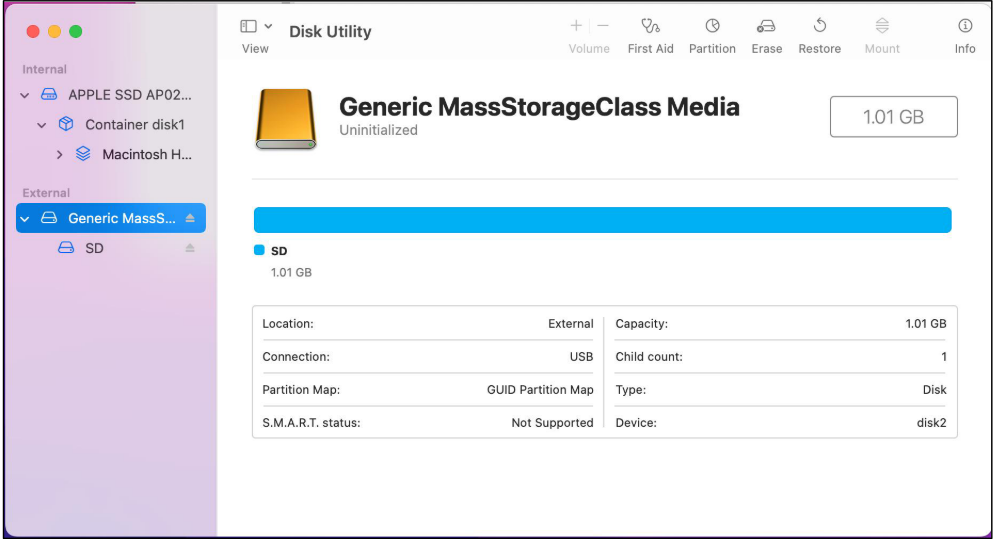

Connect
^^^^^^^^^^^
Connect ESP32-S3 to the computer using the USB cable.

.. image:: img/0/connect1.png

Before connecting the USB cable, insert the SD card into the SD card slot on the 
back of the ESP32-S3.

Sketch
^^^^^^^
**Sketch_21.1_SDMMC_Test**

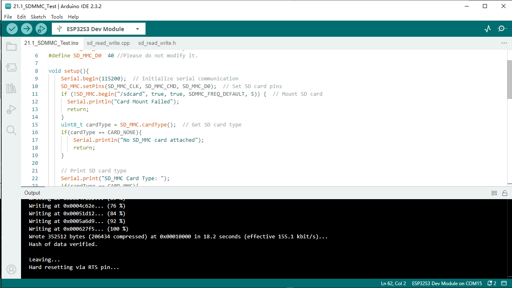

Compile and upload the code to ESP32-S3-WROOM, open the serial monitor, and press 
the RST button on the board.
You can see the printout as shown below.

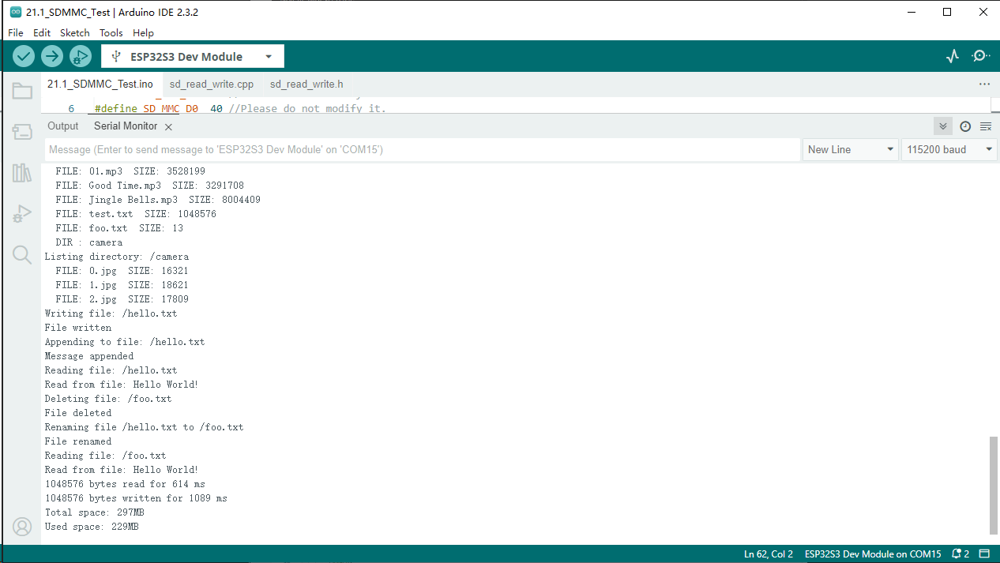

Code
^^^^^^
The following is the program code:

.. code-block:: C

    #include "sd_read_write.h"
    #include "SD_MMC.h"

    #define SD_MMC_CMD 38 //Please do not modify it.
    #define SD_MMC_CLK 39 //Please do not modify it. 
    #define SD_MMC_D0  40 //Please do not modify it.

    void setup(){
        Serial.begin(115200);  // Initialize serial communication
        SD_MMC.setPins(SD_MMC_CLK, SD_MMC_CMD, SD_MMC_D0);  // Set SD card pins
        if (!SD_MMC.begin("/sdcard", true, true, SDMMC_FREQ_DEFAULT, 5)) {  // Mount SD card
        Serial.println("Card Mount Failed");
        return;
        }
        uint8_t cardType = SD_MMC.cardType();  // Get SD card type
        if(cardType == CARD_NONE){
            Serial.println("No SD_MMC card attached");
            return;
        }

        // Print SD card type
        Serial.print("SD_MMC Card Type: ");
        if(cardType == CARD_MMC){
            Serial.println("MMC");
        } else if(cardType == CARD_SD){
            Serial.println("SDSC");
        } else if(cardType == CARD_SDHC){
            Serial.println("SDHC");
        } else {
            Serial.println("UNKNOWN");
        }

        // Print SD card size
        uint64_t cardSize = SD_MMC.cardSize() / (1024 * 1024);
        Serial.printf("SD_MMC Card Size: %lluMB\n", cardSize);

        listDir(SD_MMC, "/", 0);  // List root directory contents

        createDir(SD_MMC, "/mydir");  // Create a directory
        listDir(SD_MMC, "/", 0);  // List root directory again

        removeDir(SD_MMC, "/mydir");  // Remove the created directory
        listDir(SD_MMC, "/", 2);  // List root directory with depth 2

        writeFile(SD_MMC, "/hello.txt", "Hello ");  // Write to a file
        appendFile(SD_MMC, "/hello.txt", "World!\n");  // Append to the file
        readFile(SD_MMC, "/hello.txt");  // Read the file

        deleteFile(SD_MMC, "/foo.txt");  // Delete a file (if it exists)
        renameFile(SD_MMC, "/hello.txt", "/foo.txt");  // Rename a file
        readFile(SD_MMC, "/foo.txt");  // Read the renamed file

        testFileIO(SD_MMC, "/test.txt");  // Perform I/O test on a file
        
        // Print total and used space on the SD card
        Serial.printf("Total space: %lluMB\r\n", SD_MMC.totalBytes() / (1024 * 1024));
        Serial.printf("Used space: %lluMB\r\n", SD_MMC.usedBytes() / (1024 * 1024));
    }

    void loop(){
    delay(10000);  // Wait for 10 seconds
    }

