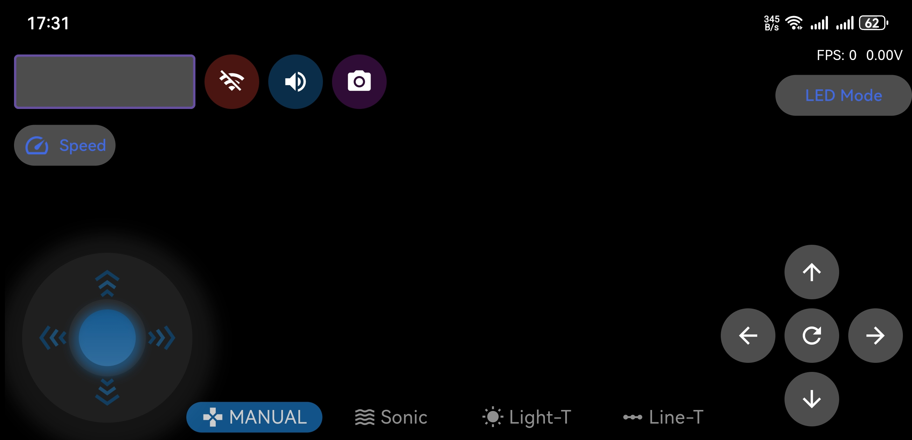
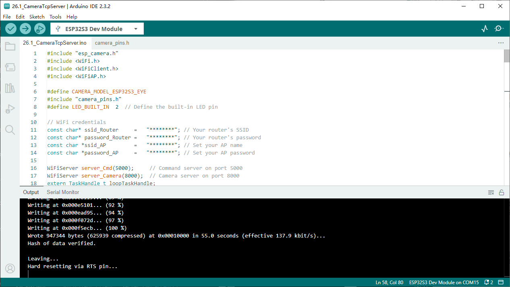
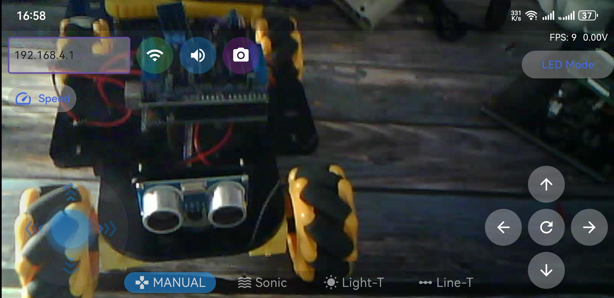
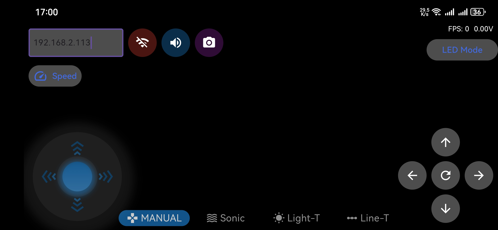

Chapter 26 Camera Tcp Server
==============================
In the previous section, we used web page to display the video data captured by 
ESP32-S3, and in this section, we will use a mobile phone to display it.

Project 26.1 Camera Tcp Server
--------------------------------
Connect ESP32-S3 using USB and check its IP address through serial monitor. Use 
a mobile phone to obtain video and image data.

Connect
^^^^^^^
Connect ESP32-S3 to the computer using the USB cable.

.. image:: img/0/connect1.png

Sketch
^^^^^^^
First, you need to download the RaspPICar APP installation package from this 
address and manually install it on your Android phone.

`RaspPICar App <https://www.dropbox.com/scl/fo/vbwll6vgk9h5bo036g45q/AHH2STGDT-9w2qvV967ypI8?rlkey=u094s4bloaymovt0k4tscrr9i&e=1&st=eb22cjfn&dl=0>`_

Then, when you open RaspPICar on your phone, this interface will be displayed.

After making sure the Tools is configured correctly, don’t run Sketch. Due to 
WiFi, we need to modify Sketch a little bit based on physical situation.

In the box in the figure above, ssid_Router and password_Router are the user's 
Router name and password, which need to be modified according to the actual name 
and password. ssid_AP and password_AP are name and password of a AP created by 
ESP32-S3, and they are freely set by the user. When all settings are correct, com
pile and upload the code to ESP32-S3, turn on the serial port monitor, and set the 
baud rate to 115200. The serial monitor will print out two IP addresses.

.. image:: img/phenomenon/26.1.png

There are two methods for you to check camera data of ESP32-S3 via mobile phone APP.

Method 1: 
Using your phone's WiFi function, select the WiFi name represented by ssid_AP in 
Sketch and enter the password “password_AP” to connect.

Here, the ssid_AP is set to "ESP32S3" and the password_AP is "12345678".

Next, open RaspPICar app and Enter the IP address printed by serial port in the new interface, which generally 
is “192.168.4.1”

Click “WIFI” button.

Method 2: 
Using your phone's WiFi function, select the router named ssid_Router and enter 
the password “ssid_password” to connect. And then open RaspPICar app and select 
4WD Car for Raspberry Pi mode. The operation is similar to Method 1.

Enter the IP address printed by serial port in the new interface, which generally 
is not “192.168.4.1” but another one. The IP address in this example is “192.168.
2.113”. After entering the IP address, click “Connect”.

    
Code
^^^^^^
The following is the program code.You need include other code files in the same 
folder when write your own code.
**Sketch_26.1_Camera_Tcp_Server**

.. code-block:: C

    #include "esp_camera.h"
    #include <WiFi.h>
    #include <WiFiClient.h>
    #include <WiFiAP.h>

    #define CAMERA_MODEL_ESP32S3_EYE
    #include "camera_pins.h"
    #define LED_BUILT_IN  2  // Define the built-in LED pin

    // WiFi credentials
    const char* ssid_Router     =   "********"; // Your router's SSID
    const char* password_Router =   "********";; // Your router's password
    const char *ssid_AP         =   "ESP32S3"; // Set your AP name
    const char *password_AP     =   "12345678"; // Set your AP password

    WiFiServer server_Cmd(5000);     // Command server on port 5000
    WiFiServer server_Camera(8000);  // Camera server on port 8000
    extern TaskHandle_t loopTaskHandle;

    void setup() {
    Serial.begin(115200);
    Serial.setDebugOutput(false);
    Serial.println();
    pinMode(LED_BUILT_IN, OUTPUT);
    cameraSetup();  // Initialize the camera

    // Set up WiFi Access Point
    WiFi.softAP(ssid_AP, password_AP);
    IPAddress myIP = WiFi.softAPIP();
    Serial.print("AP IP address: ");
    Serial.println(myIP);
    server_Camera.begin(8000);
    server_Cmd.begin(5000);
    /////////////////////////////////////////////////////
    // Connect to WiFi router
    WiFi.begin(ssid_Router, password_Router);
    Serial.print("Connecting ");
    Serial.print(ssid_Router);
    while (WiFi.status() != WL_CONNECTED) {
        delay(500);
        Serial.print(".");
    }
    while (WiFi.STA.hasIP() != true) {
        Serial.print(".");
        delay(500);
    }
    Serial.println("");
    Serial.println("WiFi connected");
    /////////////////////////////////////////////////////
    Serial.print("Camera Ready! Use '");
    Serial.print(WiFi.softAPIP());
    Serial.print(" or ");
    Serial.print(WiFi.localIP());
    Serial.println("' to connect in RaspPICar app.");

    disableCore0WDT();  // Disable watchdog timer on core 0
    // Create tasks for command handling and LED blinking on core 0
    xTaskCreateUniversal(loopTask_Cmd, "loopTask_Cmd", 8192, NULL, 1, &loopTaskHandle, 0);
    xTaskCreateUniversal(loopTask_Blink, "loopTask_Blink", 8192, NULL, 1, &loopTaskHandle, 0);
    }

    // Main loop (runs on core 1)
    void loop() {
    WiFiClient client = server_Camera.accept();  // Listen for incoming clients
    if (client) {
        Serial.println("Camera Server connected to a client.");
        String currentLine = "";
        while (client.connected()) {
        camera_fb_t * fb = NULL;
        while (client.connected()) {
            fb = esp_camera_fb_get();  // Get a frame from the camera
            if (fb != NULL) {
            // Send frame size
            uint8_t slen[4];
            slen[0] = fb->len >> 0;
            slen[1] = fb->len >> 8;
            slen[2] = fb->len >> 16;
            slen[3] = fb->len >> 24;
            client.write(slen, 4);
            // Send frame data
            client.write(fb->buf, fb->len);
            esp_camera_fb_return(fb);
            }
            else {
            Serial.println("Camera Error");
            }
        }
        }
        client.stop();
        Serial.println("Camera Client Disconnected.");
    }
    }

    // Task for handling commands (runs on core 0)
    void loopTask_Cmd(void *pvParameters) {
    Serial.println("Task Cmd_Server is starting ... ");
    while (1) {
        WiFiClient client = server_Cmd.accept();
        if (client) {
        Serial.println("Command Server connected to a client.");
        String currentLine = "";
        while (client.connected()) {
            if (client.available()) {
            char c = client.read();
            client.write(c);
            Serial.write(c);
            if (c == '\n') {
                currentLine = "";
            }
            else {
                currentLine += c;
            }
            }
        }
        client.stop();
        Serial.println("Command Client Disconnected.");
        }
    }
    }

    // Task for blinking LED (runs on core 0)
    void loopTask_Blink(void *pvParameters) {
    Serial.println("Task Blink is starting ... ");
    while (1) {
        digitalWrite(LED_BUILT_IN, !digitalRead(LED_BUILT_IN));  // Toggle LED state
        delay(1000);
    }
    }

    // Function to set up the camera
    void cameraSetup() {
    camera_config_t config;
    config.ledc_channel = LEDC_CHANNEL_0;
    config.ledc_timer = LEDC_TIMER_0;
    config.pin_d0 = Y2_GPIO_NUM;
    config.pin_d1 = Y3_GPIO_NUM;
    config.pin_d2 = Y4_GPIO_NUM;
    config.pin_d3 = Y5_GPIO_NUM;
    config.pin_d4 = Y6_GPIO_NUM;
    config.pin_d5 = Y7_GPIO_NUM;
    config.pin_d6 = Y8_GPIO_NUM;
    config.pin_d7 = Y9_GPIO_NUM;
    config.pin_xclk = XCLK_GPIO_NUM;
    config.pin_pclk = PCLK_GPIO_NUM;
    config.pin_vsync = VSYNC_GPIO_NUM;
    config.pin_href = HREF_GPIO_NUM;
    config.pin_sccb_sda = SIOD_GPIO_NUM;
    config.pin_sccb_scl = SIOC_GPIO_NUM;
    config.pin_pwdn = PWDN_GPIO_NUM;
    config.pin_reset = RESET_GPIO_NUM;
    config.xclk_freq_hz = 20000000;
    config.frame_size = FRAMESIZE_UXGA;
    config.pixel_format = PIXFORMAT_JPEG; // for streaming
    config.grab_mode = CAMERA_GRAB_WHEN_EMPTY;
    config.fb_location = CAMERA_FB_IN_PSRAM;
    config.jpeg_quality = 12;
    config.fb_count = 1;
    
    // if PSRAM IC present, init with UXGA resolution and higher JPEG quality
    // for larger pre-allocated frame buffer.
    if(psramFound()){
        config.jpeg_quality = 10;
        config.fb_count = 2;
        config.grab_mode = CAMERA_GRAB_LATEST;
    } else {
        // Limit the frame size when PSRAM is not available
        config.frame_size = FRAMESIZE_SVGA;
        config.fb_location = CAMERA_FB_IN_DRAM;
    }

    // camera init
    esp_err_t err = esp_camera_init(&config);
    if (err != ESP_OK) {
        Serial.printf("Camera init failed with error 0x%x", err);
        return;
    }

    sensor_t * s = esp_camera_sensor_get();
    // initial sensors are flipped vertically and colors are a bit saturated
    s->set_vflip(s, 1); // flip it back
    s->set_brightness(s, 1); // up the brightness just a bit
    s->set_saturation(s, 0); // lower the saturation

    Serial.println("Camera configuration complete!");
    }

