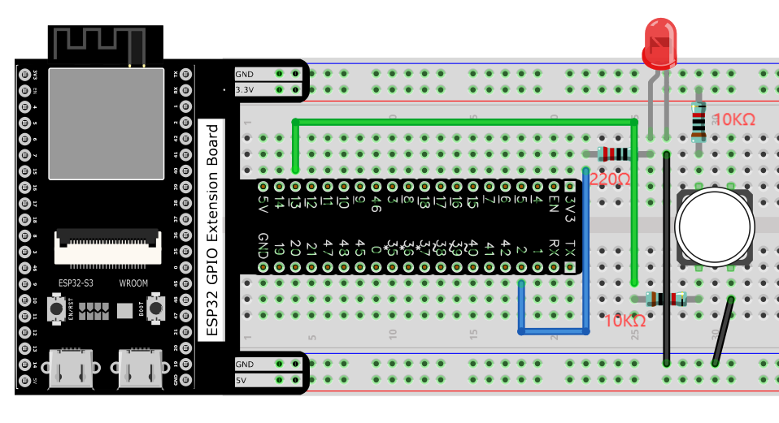
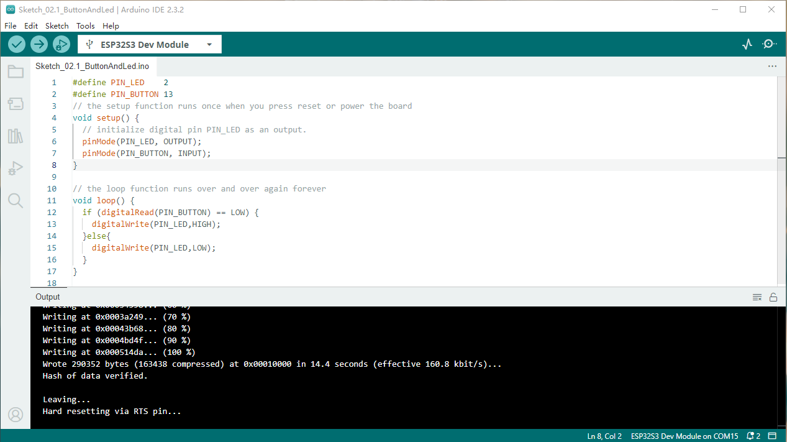
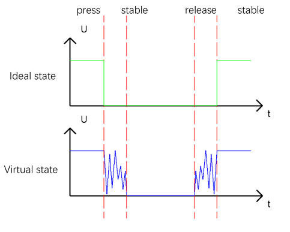
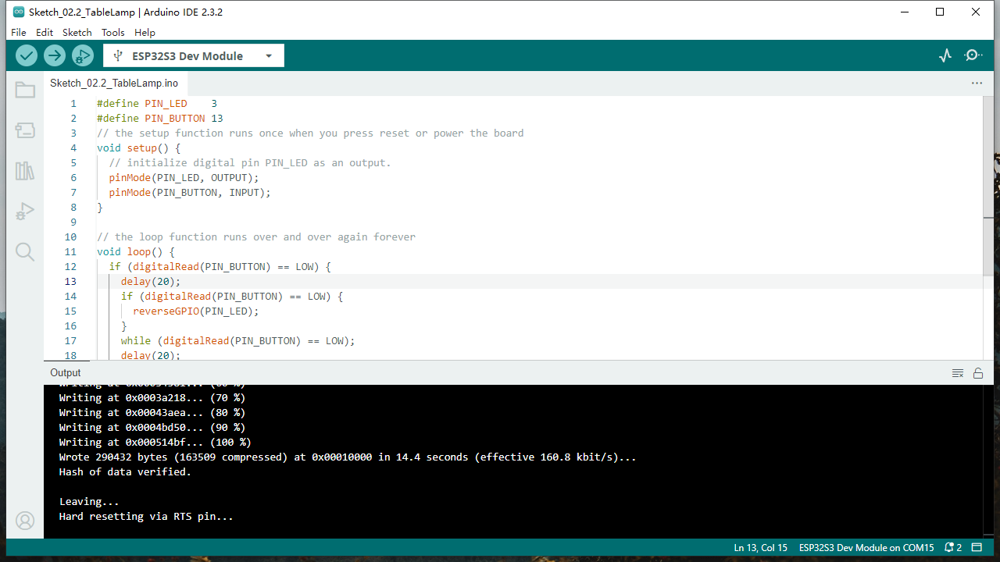
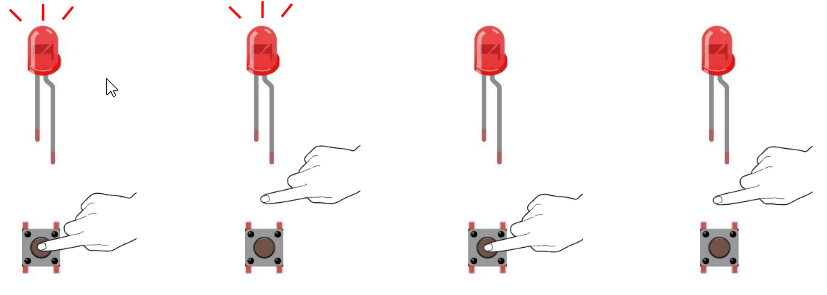

Chapter 2 Button & LED
==========================
Usually, there are three essential parts in a complete automatic control device: 
INPUT, OUTPUT, and CONTROL. In last section, the LED module was the output part 
and ESP32-S3 was the control part. In practical applications, we not only make 
LEDs flash, but also make a device sense the surrounding environment, receive 
instructions and then take the appropriate action such as LEDs light up, make a 
buzzer turn ON and so on.

.. image:: img/other/2.png

Next, we will build a simple control system to control a LED through a push button switch.

Project 2.1 Button & LED
------------------------

In the project, we will control the LED state through a Push Button Switch. When 
the button is pressed, our LED will turn ON, and when it is released, the LED will 
turn OFF.

Component List
^^^^^^^^^^^^^^^^^
- ESP32-S3-WROOM x1
- GPIO Extension Board x1
- 830 Tie-Points Breadboard x1
- LED x1
- Resistor 220Ω x1
- Resistor 10kΩ x2
- Jumper Wire x4
- Button x1
  
Component knowledge
^^^^^^^^^^^^^^^^^^^^
:ref:`Button <cpn_button>`
"""""""""""""""""""""""""""

Connect
^^^^^^^^^^^^^^

    
Sketch
^^^^^^^
This project is designed for learning how to use push button switch to control a 
LED. We first need to read the state of switch, and then determine whether to turn 
the LED ON in accordance to the state of the switch. 
Upload following sketch: 
:guilabel:`LAFVIN_Super_Starter_Kit_For_Esp32_S3\Sketches\Sketch_02.1_ButtonAndLed.`

Download the code to ESP32-S3 WROOM, then press the key, the LED turns ON, release 
the switch, the LED turns OFF.

.. image:: img/phenomenon/2.1.png

Code
^^^^^^

The following is the program code:

.. code-block:: C

    #define PIN_LED 2
    #define PIN_BUTTON 13 
    // the setup function runs once when you press reset or power the board 
    void setup() { 
        // initialize digital pin PIN_LED as an output. 
        pinMode(PIN_LED, OUTPUT); 
        pinMode(PIN_BUTTON, INPUT);
    }

    // the loop function runs over and over again forever 
    void loop() { 
        if (digitalRead(PIN_BUTTON) == LOW) {
        digitalWrite(PIN_LED,LOW);
        }else{
        digitalWrite(PIN_LED,HIGH);
    }
    }

Project 2.2 MINI table lamp
----------------------------

We will also use a push button switch, LED and ESP32-S3 to make a MINI table lamp 
but this will function differently: Press the button, the LED will turn ON, and 
pressing the button again, the LED turns OFF. The ON switch action is no longer 
momentary (like a door bell) but remains ON without needing to continually press 
on the Button Switch. First, let us learn something about the push button switch.

Debounce for Push Button
^^^^^^^^^^^^^^^^^^^^^^^^^^

The moment when a push button switch is pressed, it will not change from one state 
to another state immediately. Due to tiny mechanical vibrations, there will be a 
short period of continuous buffeting before it completely reaches another state 
too fast for humans to detect but not for computer microcontrollers. The same is 
true when the push button switch is released. This unwanted phenomenon is known 
as “bounce”.

Therefore, if we can directly detect the state of the push button switch, there 
are multiple pressing and releasing actions in one pressing cycle. This buffeting 
will mislead the high-speed operation of the microcontroller to cause many false 
decisions. Therefore, we need to eliminate the impact of buffeting. Our solution: 
to judge the state of the button multiple times. Only when the button state is 
stable (consistent) over a period of time, can it indicate that the button is 
actually in the ON state (being pressed). This project needs the same components 
and circuits as we used in the previous section.

Sketch
^^^^^^^
**Sketch_02.2_Tablelamp**

Download the code to the ESP32-S3 WROOM, press the button, the LED turns ON, and 
press the button again, the LED turns OFF.

