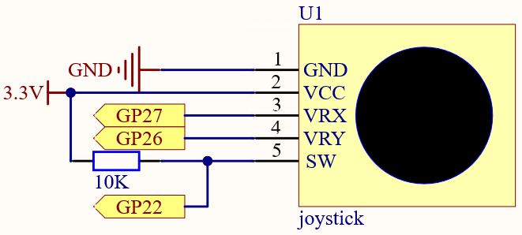

3.1 Joystick
=========================
If you play a lot of video games, then you should be very familiar with the Joystick. It is usually used to move the character around, rotate the screen, etc.

The principle behind Joystick’s ability to allow the computer to read our actions is very simple. It can be thought of as consisting of two potentiometers that are perpendicular to each other. These two potentiometers measure the analog value of the joystick vertically and horizontally, resulting in a value (x,y) in a planar right-angle coordinate system.

The joystick of this kit also has a digital input, which is activated when the joystick is pressed.

Component List
^^^^^^^^^^^^^^^
- Raspberry Pi Pico W x1
- MicroUSB cable x1
- 830 Tie-Points Breadboard x1
- Joystick Module x1
- Resistor 10KΩ x1
- Jumper Wire Several

Component knowledge
^^^^^^^^^^^^^^^^^^^^

:ref:`transistor <cpn_transistor>`
"""""""""""""""""""""""""""""""""""

:ref:`Buzzer <cpn_buzzer>`
"""""""""""""""""""""""""""

Schematic
^^^^^^^^^^

The SW pin is connected to a 10K pull-up resistor, the reason is to be able to 
get a stable high level on the SW pin (Z axis) when the joystick is not pressed; 
otherwise the SW is in a suspended state and the output value may vary between 0/1.

Connect
^^^^^^^^^
.. image:: img/3.connect/3.1.png

Code
^^^^^^^
.. note::

    * Open the ``3.1_joystick.ino`` file under the path of ``Super-Starter-Kit-for-Pico\Arduino\1.Project`` or copy this code into Thonny, then click "Run Current Script" or simply press F5 to run it.

    * Or copy this code into Arduino IDE.

    * Don’t forget to select the board(Raspberry Pi Pico) and the correct port before clicking the Upload button. 

.. image:: img/4.software/3.1.png

Click “Run current script”, the Shell prints out the x,y,z values of joystick.

* The x-axis and y-axis values are analog values that vary from 0 to 65535.
* The Z-axis is a digital value with a status of 1 or 0.

The following is the program code:

.. code-block:: python

    import machine
    import utime

    x_joystick = machine.ADC(27)
    y_joystick = machine.ADC(26)

    while True:
        x_value = x_joystick.read_u16()
        y_value = y_joystick.read_u16()

        print('X: %d  Y: %d' % (x_value, y_value))
        utime.sleep_ms(200)

Phenomenon
^^^^^^^^^^^
.. image:: img/5.phenomenon/3.1.png
    :width: 100%