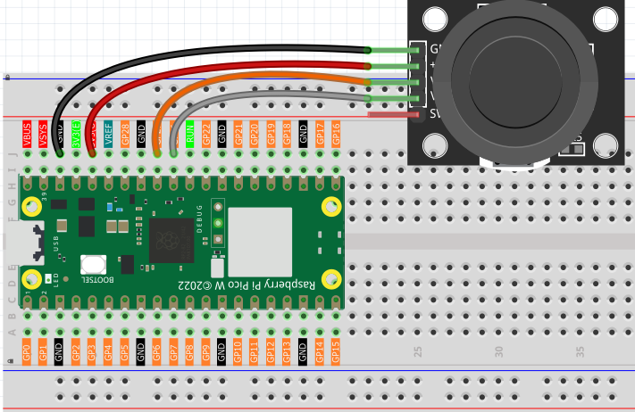
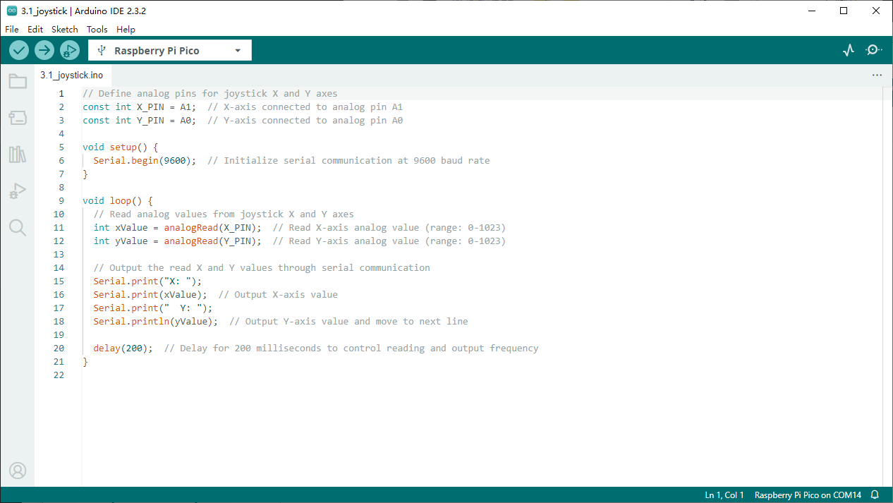

3.1 Joystick
=========================
If you’re an avid gamer, you’re likely very familiar with the joystick. It’s commonly 
used to navigate characters, rotate screens, and perform other in-game actions. The 
way a joystick allows a computer to interpret our movements is actually quite straightforward. 
Essentially, it consists of two potentiometers oriented perpendicular to each other. 
These potentiometers measure the joystick’s position in both the vertical and horizontal 
directions, generating a coordinate value (x, y) within a two-dimensional Cartesian 
coordinate system.

Component List
^^^^^^^^^^^^^^^
- Raspberry Pi Pico W x1
- MicroUSB cable x1
- 830 Tie-Points Breadboard x1
- Joystick Module x1
- Resistor 10KΩ x1
- Jumper Wire Several

Component knowledge
^^^^^^^^^^^^^^^^^^^^
:ref:`Joystick Module <cpn_joystick>`
""""""""""""""""""""""""""""""""""""""

Connect
^^^^^^^^^

Code
^^^^^^^
.. note::

    * Open the ``3.1_joystick.ino`` file under the path of ``Ultimate-Starter-Kit-for-Pico\Arduino\1.Project`` or copy this code into Thonny, then click "Run Current Script" or simply press F5 to run it.

    * Or copy this code into Arduino IDE.

    * Don’t forget to select the board(Raspberry Pi Pico) and the correct port before clicking the Upload button. 

Click “Run current script”, the Shell prints out the x,y,z values of joystick.

* The x-axis and y-axis values are analog values that vary from 0 to 1023.

The following is the program code:

.. code-block:: c++

    // Define analog pins for joystick X and Y axes
    const int X_PIN = A1;  // X-axis connected to analog pin A1
    const int Y_PIN = A0;  // Y-axis connected to analog pin A0

    void setup() {
    Serial.begin(9600);  // Initialize serial communication at 9600 baud rate
    }

    void loop() {
    // Read analog values from joystick X and Y axes
    int xValue = analogRead(X_PIN);  // Read X-axis analog value (range: 0-1023)
    int yValue = analogRead(Y_PIN);  // Read Y-axis analog value (range: 0-1023)

    // Output the read X and Y values through serial communication
    Serial.print("X: ");
    Serial.print(xValue);  // Output X-axis value
    Serial.print("  Y: ");
    Serial.println(yValue);  // Output Y-axis value and move to next line

    delay(200);  // Delay for 200 milliseconds to control reading and output frequency
    }

Phenomenon
^^^^^^^^^^^
.. image:: img/5.phenomenon/3.1.png
    :width: 100%