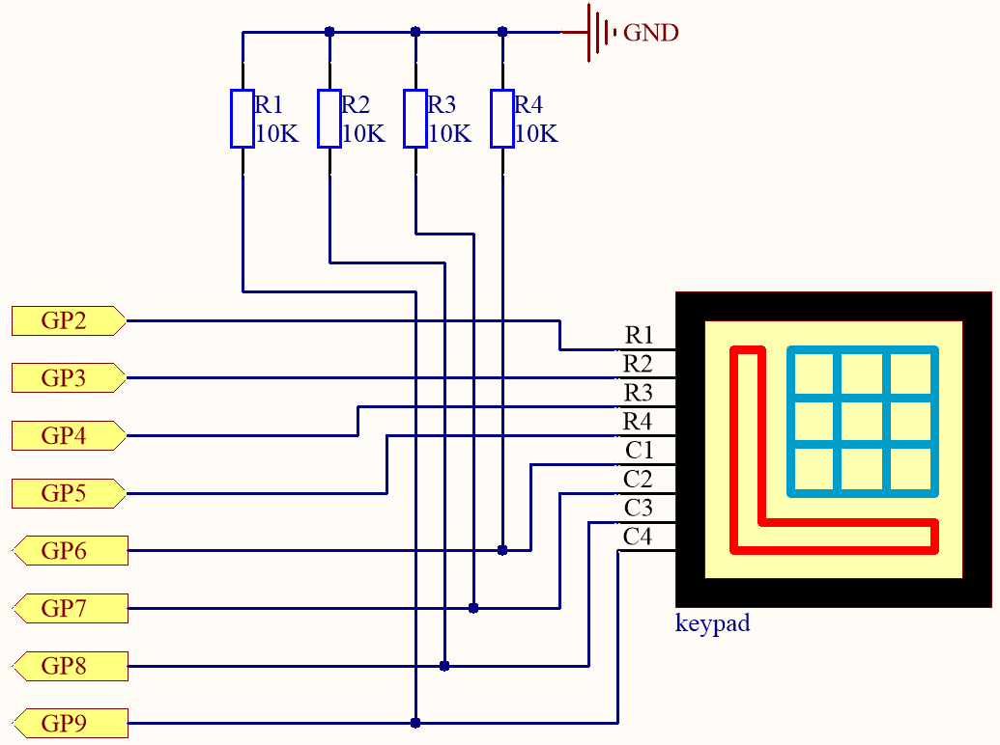

3.2 4x4 Keypad
=========================
The 4x4 keyboard, also known as the matrix keyboard, is a matrix of 16 keys excluded in a single panel.

The keypad can be found on devices that mainly require digital input, such as calculators, TV remote controls, push-button phones, vending machines, ATMs, combination locks, and digital door locks.

In this project, we will learn how to determine which key is pressed and get the related key value.

Component List
^^^^^^^^^^^^^^^
- Raspberry Pi Pico W x1
- MicroUSB cable x1
- 830 Tie-Points Breadboard x1
- Resistor 10KΩ x4
- 4x4 Keypad x1
- Jumper Wire Several

Component knowledge
^^^^^^^^^^^^^^^^^^^^

:ref:`transistor <cpn_transistor>`
"""""""""""""""""""""""""""""""""""

:ref:`Buzzer <cpn_buzzer>`
"""""""""""""""""""""""""""

Schematic
^^^^^^^^^^

4 pull-down resistors are connected to each of the columns of the matrix keyboard, so that G6 ~ G9 get a stable low level when the keys are not pressed.

The rows of the keyboard (G2 ~ G5) are programmed to go high; if one of G6 ~ G9 is read high, then we know which key is pressed.

For example, if G6 is read high, then numeric key 1 is pressed; this is because the control pins of numeric key 1 are G2 and G6, when numeric key 1 is pressed, G2 and G6 will be connected together and G6 is also high.

Connect
^^^^^^^^^
.. image:: img/3.connect/3.2.png

To make the wiring easier, in the above diagram, the column row of the matrix keyboard and the 10K resistors are inserted into the holes where G6 ~ G9 are located at the same time.

Code
^^^^^^^
.. note::

    * Open the ``3.2_4x4_keypad.ino`` file under the path of ``Ultimate-Starter-Kit-for-Pico\Arduino\1.Project`` or copy this code into Thonny, then click "Run Current Script" or simply press F5 to run it.

    * Or copy this code into Arduino IDE.

    * Don’t forget to select the board(Raspberry Pi Pico) and the correct port before clicking the Upload button. 

Click “Run current script”, the Shell will print out the keys you pressed on the Keypad.

The following is the program code:

.. code-block:: c++

    // Include the Adafruit_Keypad library
    #include "Adafruit_Keypad.h"

    // Define the number of rows and columns for the keypad
    const byte ROWS = 4;
    const byte COLS = 4;

    // Define the characters mapped to each button on the 4x4 keypad
    char keys[ROWS][COLS] = {
    { '1', '2', '3', 'A' },
    { '4', '5', '6', 'B' },
    { '7', '8', '9', 'C' },
    { '*', '0', '#', 'D' }
    };

    // Define the Arduino pins connected to the row pinouts of the keypad
    byte rowPins[ROWS] = { 2, 3, 4, 5 };
    // Define the Arduino pins connected to the column pinouts of the keypad
    byte colPins[COLS] = { 6, 7, 8, 9 };

    // Initialize a custom keypad instance
    Adafruit_Keypad myKeypad = Adafruit_Keypad(makeKeymap(keys), rowPins, colPins, ROWS, COLS);

    // Setup function
    void setup() {
    // Initialize Serial communication at 9600 baud rate
    Serial.begin(9600);
    // Initialize the custom keypad
    myKeypad.begin();
    }

    // Main loop function
    void loop() {
    // Update the state of keys
    myKeypad.tick();

    // Check if there are new keypad events
    while (myKeypad.available()) {
        // Read the keypad event
        keypadEvent e = myKeypad.read();
        // Print the key that triggered the event
        Serial.print((char)e.bit.KEY);
        // Print the type of event: pressed or released
        if (e.bit.EVENT == KEY_JUST_PRESSED) Serial.println(" pressed");
        else if (e.bit.EVENT == KEY_JUST_RELEASED) Serial.println(" released");
    }

    delay(10);
    }

Phenomenon
^^^^^^^^^^^
.. image:: img/5.phenomenon/3.2.png
    :width: 100%