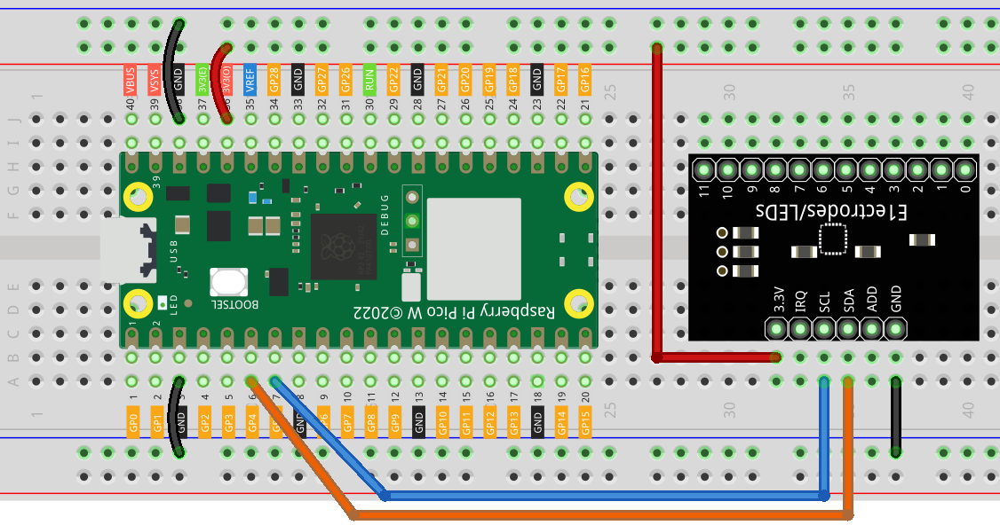

3.3 Touch Keyboard
=========================
The MPR121 is a good choice when you want to add a large number of touch switches to your project. It has electrodes that can be extended with conductors. If you connect the electrodes to a banana, you can turn the banana into a touch switch.

Component List
^^^^^^^^^^^^^^^
- Raspberry Pi Pico W x1
- MicroUSB cable x1
- 830 Tie-Points Breadboard x1
- MPR121 Module x1
- Jumper Wire Several

Component knowledge
^^^^^^^^^^^^^^^^^^^^

:ref:`transistor <cpn_transistor>`
"""""""""""""""""""""""""""""""""""

:ref:`Buzzer <cpn_buzzer>`
"""""""""""""""""""""""""""

Schematic
^^^^^^^^^^
.. image:: img/2.sch/3.3.png

xxx

Connect
^^^^^^^^^

Code
^^^^^^^
.. note::

    * Open the ``3.3_touch_keyboard.ino`` file under the path of ``Super-Starter-Kit-for-Pico\Arduino\1.Project`` or copy this code into Thonny, then click "Run Current Script" or simply press F5 to run it.

    * Or copy this code into Arduino IDE.

    * Don’t forget to select the board(Raspberry Pi Pico) and the correct port before clicking the Upload button. 

.. image:: img/4.software/3.3.png

Click “Run current script”, After the program runs, you can touch the twelve electrodes on the MPR121 with your hand and the touched electrodes will be printed out.

You can extend the electrodes to connect other conductors such as fruit, wire, foil, etc. This will give you more ways to trigger these electrodes.

The following is the program code:

.. code-block:: c++

    from mpr121 import MPR121
    from machine import Pin, I2C
    import time

    i2c = I2C(1, sda=Pin(6), scl=Pin(7))
    mpr = MPR121(i2c)

    # check all keys
    while True:
        value = mpr.get_all_states()
        if len(value) != 0:
            print(value)
        time.sleep_ms(100)

Phenomenon
^^^^^^^^^^^
.. image:: img/5.phenomenon/3.3.png
    :width: 100%