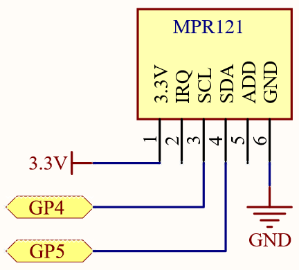
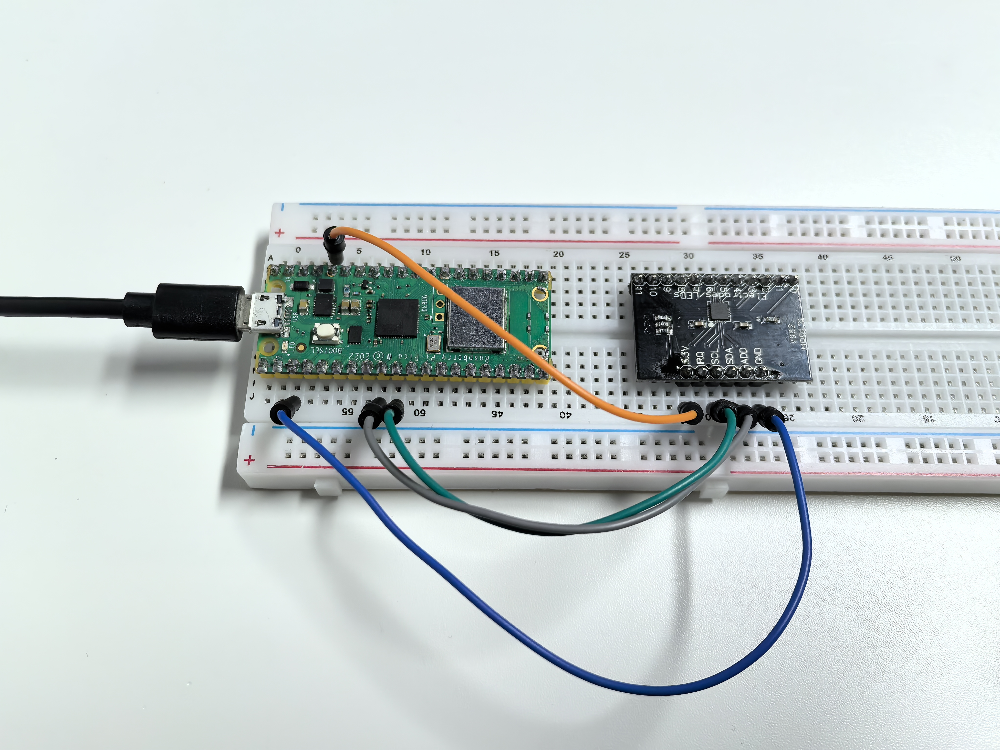

3.3 Touch Keyboard
=========================
The MPR121 is an excellent option for adding multiple touch switches to your project. 
It features electrodes that can be extended using conductive materials. For example, 
if you connect the electrodes to a banana, you can transform the banana into a 
functional touch switch.

Component List
^^^^^^^^^^^^^^^
- Raspberry Pi Pico W x1
- MicroUSB cable x1
- 830 Tie-Points Breadboard x1
- MPR121 Module x1
- Jumper Wire Several

Component knowledge
^^^^^^^^^^^^^^^^^^^^
:ref:`MPR121 Module <cpn_mpr121>`
"""""""""""""""""""""""""""""""""""

Schematic
^^^^^^^^^^

Connect
^^^^^^^^^
.. image:: img/3.connect/3.3.png

Code
^^^^^^^
.. note::

    * Open the ``3.3_touch_keyboard.ino`` file under the path of ``Ultimate-Starter-Kit-for-Pico-W\Arduino\1.Project`` or copy this code into Thonny, then click "Run Current Script" or simply press F5 to run it.

    * Or copy this code into Arduino IDE.

    * Don’t forget to select the board(Raspberry Pi Pico) and the correct port before clicking the Upload button. 

.. image:: img/4.software/3.3.png

Click “Run current script”, After the program runs, you can touch the twelve electrodes on the MPR121 with your hand and the touched electrodes will be printed out.

You can extend the electrodes to connect other conductors such as fruit, wire, foil, etc. This will give you more ways to trigger these electrodes.

The following is the program code:

.. code-block:: c++

    #include <Wire.h>
    #include "Adafruit_MPR121.h"

    // You can have up to 4 on one i2c bus but one is enough for testing!
    Adafruit_MPR121 cap = Adafruit_MPR121();

    // Keeps track of the last pins touched
    // so we know when buttons are 'released'
    uint16_t lasttouched = 0;
    uint16_t currtouched = 0;
    boolean touchStates[12];

    void setup() {
    Serial.begin(9600);

    while (!Serial) { // needed to keep leonardo/micro from starting too fast!
        delay(10);
    }

    Serial.println("MPR121 Capacitive Touch sensor test");

    // Default address is 0x5A, if tied to 3.3V its 0x5B
    // If tied to SDA its 0x5C and if SCL then 0x5D
    int check = cap.begin(0x5A);
    if (!check) {
        Serial.println("MPR121 not found, check wiring?");
        while (1);
    }
    Serial.println("MPR121 found!");
    }

    void loop() {
    // Get the currently touched pads
    currtouched = cap.touched();

    //  Serial.println(cap.touched(), BIN);
    //  delay(100);
    if (currtouched != lasttouched) {
        for (int i = 0; i < 12; i++) {
        if (currtouched & (1 << i)) touchStates[i] = 1;
        else touchStates[i] = 0;
        }
        for (int i = 0; i < 12; i++)
        {
        Serial.print(touchStates[i]);
        }
        Serial.println();
    }

    // reset our state
    lasttouched = currtouched;
    }

Phenomenon
^^^^^^^^^^^
