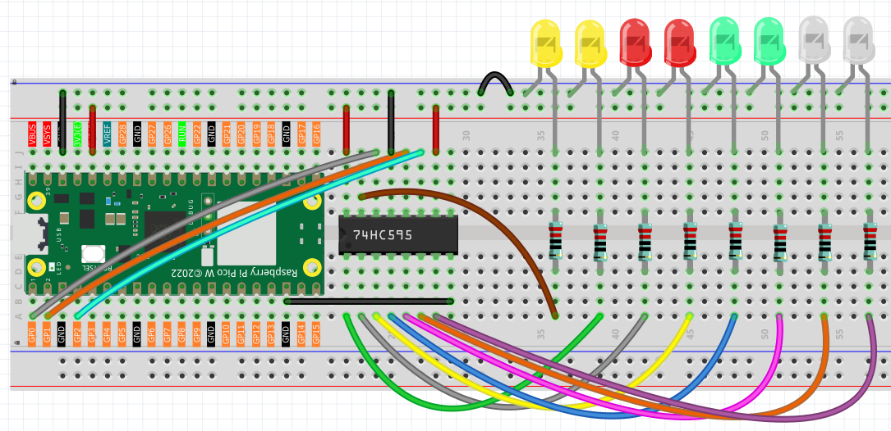
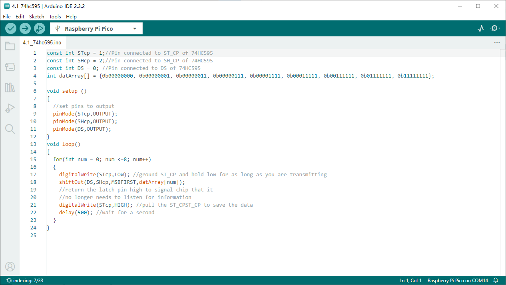

4.1 74HC595
=========================
Integrated circuit (integrated circuit) is a kind of miniature electronic device or component, which is represented by the letter “IC” in the circuit.

A certain process is used to interconnect the transistors, resistors, capacitors, inductors and other components and wiring required in a circuit, fabricate on a small or several small semiconductor wafers or dielectric substrates, and then package them in a package , it has become a micro-structure with the required circuit functions; all of the components have been structured as a whole, making electronic components a big step towards micro-miniaturization, low power consumption, intelligence and high reliability.

The inventors of integrated circuits are Jack Kilby (integrated circuits based on germanium (Ge)) and Robert Norton Noyce (integrated circuits based on silicon (Si)).

This kit is equipped with an IC, 74HC595, which can greatly save the use of GPIO pins. Specifically, it can replace 8 pins for digital signal output by writing an 8-bit binary number.

Component List
^^^^^^^^^^^^^^^
- Raspberry Pi Pico W x1
- MicroUSB cable x1
- 830 Tie-Points Breadboard x1
- LED x8
- Resistor 220Ω x8
- 74HC595 x1
- Jumper Wire Several

Component knowledge
^^^^^^^^^^^^^^^^^^^^

:ref:`transistor <cpn_transistor>`
"""""""""""""""""""""""""""""""""""

Schematic
^^^^^^^^^^
.. image:: img/2.sch/4.1.png

When MR (pin10) is high level and OE (pin13) is low level, data is input in the rising edge of SHcp and goes to the memory register through the rising edge of SHcp.

If the two clocks are connected together, the shift register is always one pulse earlier than the memory register.

There is a serial shift input pin (Ds), a serial output pin (Q) and an asynchronous reset button (low level) in the memory register.

The memory register outputs a Bus with a parallel 8-bit and in three states.

When OE is enabled (low level), the data in memory register is output to the bus(Q0 ~ Q7).

Connect
^^^^^^^^^

Code
^^^^^^^
.. note::

    * Open the ``4.1_74hc595.ino`` file under the path of ``Ultimate-Starter-Kit-for-Pico\Arduino\1.Project`` or copy this code into Thonny, then click "Run Current Script" or simply press F5 to run it.

    * Or copy this code into Arduino IDE.

    * Don’t forget to select the board(Raspberry Pi Pico) and the correct port before clicking the Upload button. 

Click “Run current script”, num will be written into the 74HC595 chip as an eight-bit binary number to control the on and off of the 8 LEDs. We can see the current value of num in the shell.

The following is the program code:

.. code-block:: c++

    const int STcp = 1;//Pin connected to ST_CP of 74HC595
    const int SHcp = 2;//Pin connected to SH_CP of 74HC595 
    const int DS = 0; //Pin connected to DS of 74HC595 
    int datArray[] = {0b00000000, 0b00000001, 0b00000011, 0b00000111, 0b00001111, 0b00011111, 0b00111111, 0b01111111, 0b11111111};

    void setup ()
    {
    //set pins to output
    pinMode(STcp,OUTPUT);
    pinMode(SHcp,OUTPUT);
    pinMode(DS,OUTPUT);
    }
    void loop()
    {
    for(int num = 0; num <=8; num++)
    {
        digitalWrite(STcp,LOW); //ground ST_CP and hold low for as long as you are transmitting
        shiftOut(DS,SHcp,MSBFIRST,datArray[num]);
        //return the latch pin high to signal chip that it 
        //no longer needs to listen for information
        digitalWrite(STcp,HIGH); //pull the ST_CPST_CP to save the data
        delay(500); //wait for a second
    }
    }

Phenomenon
^^^^^^^^^^^
.. video:: img/5.phenomenon/4.1.mp4
    :width: 100%