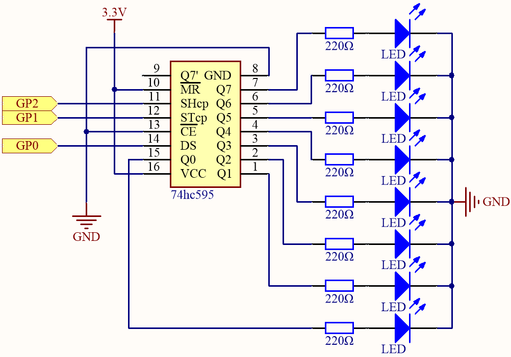

4.1 74HC595
=========================
An integrated circuit (IC) is a miniature electronic device or component, represented 
by the letter "IC" in circuits. It involves a specific process to interconnect transistors, 
resistors, capacitors, inductors, and other components and wiring required for a circuit. 
These are fabricated on a small semiconductor wafer or dielectric substrate and then packaged 
into a micro-structure with the desired circuit functions. This integration has significantly 
advanced electronic components towards micro-miniaturization, lower power consumption, 
intelligence, and higher reliability. The inventors of integrated circuits are 
Jack Kilby (who developed germanium-based ICs) and Robert N. Noyce (who developed silicon-based ICs).

This kit includes an IC, the 74HC595, which can greatly reduce the number of GPIO 
pins used. Specifically, it can replace eight pins for digital signal output by 
writing an 8-bit binary number.

Component List
^^^^^^^^^^^^^^^
- Raspberry Pi Pico W x1
- MicroUSB cable x1
- 830 Tie-Points Breadboard x1
- LED x8
- Resistor 220Ω x8
- 74HC595 x1
- Jumper Wire Several

Component knowledge
^^^^^^^^^^^^^^^^^^^^

:ref:`74HC595 <cpn_74hc595>`
"""""""""""""""""""""""""""""""""""

Schematic
^^^^^^^^^^

When the MR (pin 10) is at a high level and OE (pin 13) is at a low level, data is 
nput on the rising edge of SHcp and transferred to the memory register on the rising 
edge of SHcp. If the two clocks are connected together, the shift register is always 
one pulse ahead of the memory register.

The memory register includes a serial shift input pin (Ds), a serial output pin 
(Q), and an asynchronous reset button (active low). The memory register outputs 
an 8-bit parallel bus in three states. When OE is enabled (low level), the data 
stored in the memory register is output to the bus (Q0 to Q7).

Connect
^^^^^^^^^
.. image:: img/3.connect/4.1.png

Code
^^^^^^^
.. note::

    * Open the ``4.1_74hc595.ino`` file under the path of ``Ultimate-Starter-Kit-for-Pico-W\Arduino\1.Project`` or copy this code into Thonny, then click "Run Current Script" or simply press F5 to run it.

    * Or copy this code into Arduino IDE.

    * Don’t forget to select the board(Raspberry Pi Pico) and the correct port before clicking the Upload button. 

.. image:: img/4.software/4.1.png

Click “Run current script”, num will be written into the 74HC595 chip as an eight-bit binary number to control the on and off of the 8 LEDs. We can see the current value of num in the shell.

The following is the program code:

.. code-block:: c++

    const int STcp = 1;//Pin connected to ST_CP of 74HC595
    const int SHcp = 2;//Pin connected to SH_CP of 74HC595 
    const int DS = 0; //Pin connected to DS of 74HC595 
    int datArray[] = {0b00000000, 0b00000001, 0b00000011, 0b00000111, 0b00001111, 0b00011111, 0b00111111, 0b01111111, 0b11111111};

    void setup ()
    {
    //set pins to output
    pinMode(STcp,OUTPUT);
    pinMode(SHcp,OUTPUT);
    pinMode(DS,OUTPUT);
    }
    void loop()
    {
    for(int num = 0; num <=8; num++)
    {
        digitalWrite(STcp,LOW); //ground ST_CP and hold low for as long as you are transmitting
        shiftOut(DS,SHcp,MSBFIRST,datArray[num]);
        //return the latch pin high to signal chip that it 
        //no longer needs to listen for information
        digitalWrite(STcp,HIGH); //pull the ST_CPST_CP to save the data
        delay(500); //wait for a second
    }
    }

Phenomenon
^^^^^^^^^^^
.. video:: img/5.phenomenon/4.1.mp4
    :width: 100%