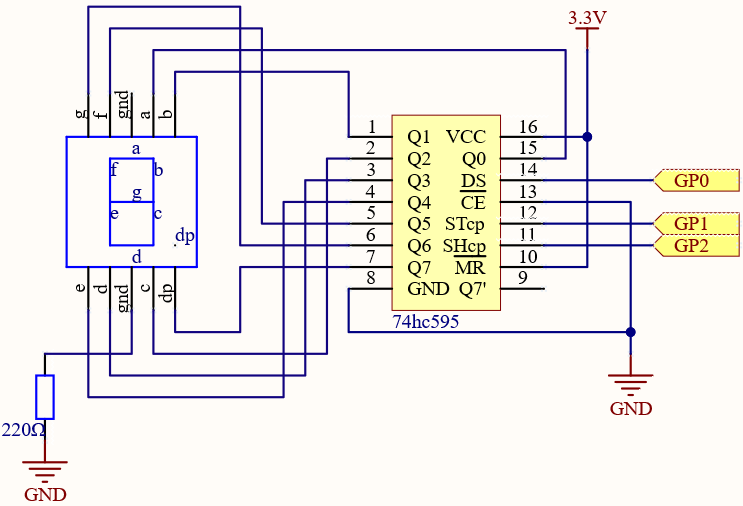
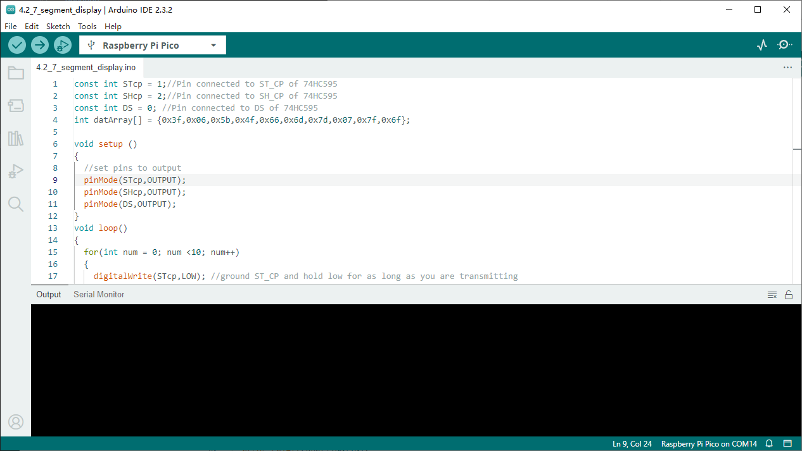

4.2 7-Segment Display
=========================
7 Segment Display can be seen everywhere in life. For example, on an air conditioner, it can be used to display temperature; on a traffic indicator, it can be used to display a timer.

The 7 Segment Display is essentially a device packaged by 8 LEDs, of which 7 strip-shaped LEDs form an “8” shape, and there is a slightly smaller dotted LED as a decimal point. These LEDs are marked as a, b, c, d, e, f, g, and dp. They have their own anode pins and share cathodes. Their pin locations are shown in the figure below.

.. image:: img/1.detail/4.2.png

This means that it needs to be controlled by 8 digital signals at the same time to fully work and the 74HC595 can do this.

Component List
^^^^^^^^^^^^^^^
- Raspberry Pi Pico W x1
- MicroUSB cable x1
- 830 Tie-Points Breadboard x1
- 7-segment Display x1
- Resistor 220Ω x1
- 74HC595 x1
- Jumper Wire Several

Component knowledge
^^^^^^^^^^^^^^^^^^^^

:ref:`transistor <cpn_transistor>`
"""""""""""""""""""""""""""""""""""

:ref:`Buzzer <cpn_buzzer>`
"""""""""""""""""""""""""""

Schematic
^^^^^^^^^^

Here the wiring principle is basically the same as 4.1 74HC595, the only difference is that Q0-Q7 are connected to the a ~ g pins of the 7 Segment Display.

Connect
^^^^^^^^^
.. image:: img/3.connect/4.2.png

Code
^^^^^^^
.. note::

    * Open the ``4.2_7_segment_display.ino`` file under the path of ``Ultimate-Starter-Kit-for-Pico\Arduino\1.Project`` or copy this code into Thonny, then click "Run Current Script" or simply press F5 to run it.

    * Or copy this code into Arduino IDE.

    * Don’t forget to select the board(Raspberry Pi Pico) and the correct port before clicking the Upload button. 

Click “Run current script”, you will be able to see the LED Segment Display display 0~9 in sequence.

The following is the program code:

.. code-block:: c++

    const int STcp = 1;//Pin connected to ST_CP of 74HC595
    const int SHcp = 2;//Pin connected to SH_CP of 74HC595 
    const int DS = 0; //Pin connected to DS of 74HC595 
    int datArray[] = {0x3f,0x06,0x5b,0x4f,0x66,0x6d,0x7d,0x07,0x7f,0x6f};

    void setup ()
    {
    //set pins to output
    pinMode(STcp,OUTPUT);
    pinMode(SHcp,OUTPUT);
    pinMode(DS,OUTPUT);
    }
    void loop()
    {
    for(int num = 0; num <10; num++)
    {
        digitalWrite(STcp,LOW); //ground ST_CP and hold low for as long as you are transmitting
        shiftOut(DS,SHcp,MSBFIRST,datArray[num]);
        digitalWrite(STcp,HIGH); //pull the ST_CPST_CP to save the data
        delay(1000);
    }
    }

Phenomenon
^^^^^^^^^^^
.. video:: img/5.phenomenon/4.2.mp4
    :width: 100%