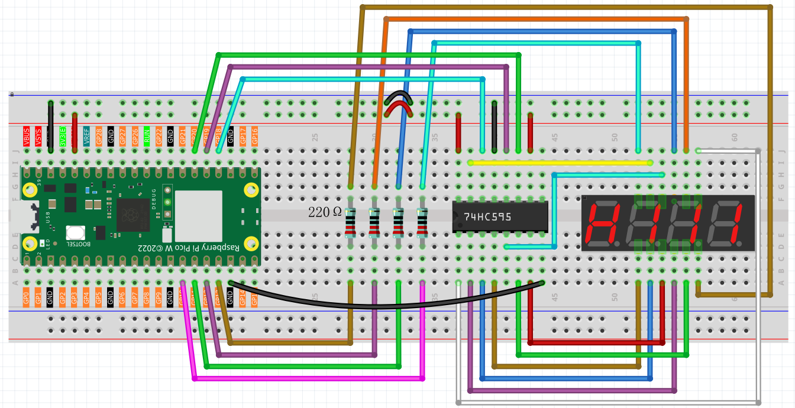
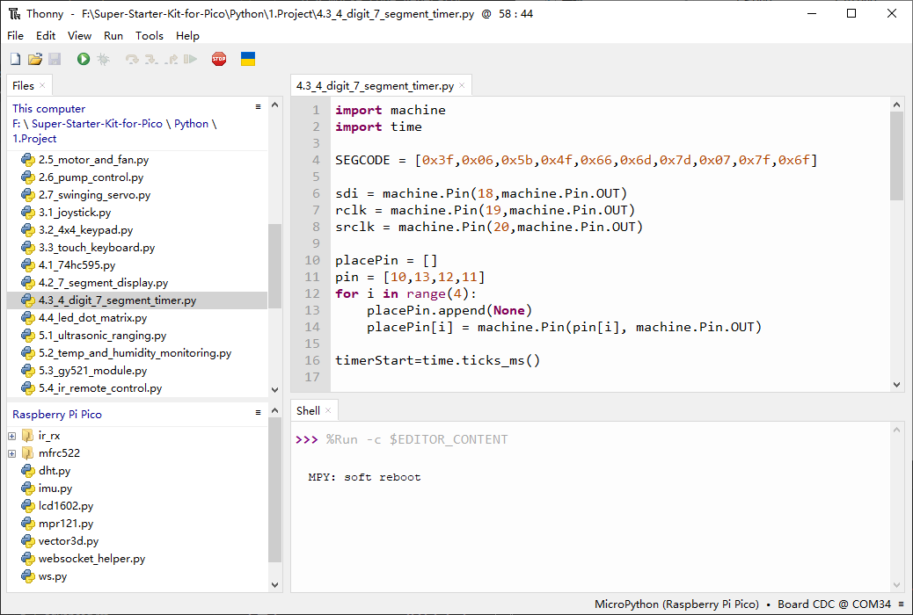

4.3 4 Digit 7 Segment Timer
================================
A 4-digit 7-segment display is composed of four individual 7-segment displays that 
operate in tandem. Each digit functions independently, leveraging the principle of 
human visual persistence. By rapidly cycling through and displaying characters on 
each 7-segment display, it creates the illusion of a continuous string of characters.

For example, when displaying “1234,” the first 7-segment shows “1” while the others 
remain blank. After a brief interval, the second 7-segment displays “2,” with the 
first, third, and fourth segments inactive. This sequence continues, cycling through 
all four digits. Because each cycle is extremely short (typically 5ms), the optical 
afterglow effect and the principle of visual persistence allow us to perceive all 
four characters simultaneously.

Component List
^^^^^^^^^^^^^^^
- Raspberry Pi Pico W x1
- MicroUSB cable x1
- 830 Tie-Points Breadboard x1
- 4-Digit 7-Segment Display x1
- Resistor 220Ω x4
- 74HC595 x1
- Jumper Wire Several

Component knowledge
^^^^^^^^^^^^^^^^^^^^
:ref:`4-Digit 7-Segment Display <cpn_4-digit_7-segment_display>`
"""""""""""""""""""""""""""""""""""""""""""""""""""""""""""""""""""""""""""

Schematic
^^^^^^^^^^
.. image:: img/2.sch/4.3.png

The wiring principle here is fundamentally the same as that of the 74HC595 described 
in Section 4.1. The only difference is that the Q0-Q7 outputs are connected to the a 
to g pins of the 4-digit 7-segment display. Additionally, pins G10 to G13 are used 
to select which of the four 7-segment displays is active at any given time.

Connect
^^^^^^^^^

Code
^^^^^^^
.. note::

    * Open the ``4.3_4_digit_7_segment_timer.ino`` file under the path of ``Ultimate-Starter-Kit-for-Pico\Arduino\1.Project`` or copy this code into Thonny, then click "Run Current Script" or simply press F5 to run it.

    * Or copy this code into Arduino IDE.

    * Don’t forget to select the board(Raspberry Pi Pico) and the correct port before clicking the Upload button. 

Click “Run current script”, you will see the 4-digit 7-segment display become a counter and the number increases by 1 per second.

The following is the program code:

.. code-block:: c++

    const int STcp = 19;//Pin connected to ST_CP of 74HC595
    const int SHcp = 20;//Pin connected to SH_CP of 74HC595 
    const int DS = 18; //Pin connected to DS of 74HC595 
    const int placePin[4] = {13,12,11,10}; 

    int datArray[] = {0x3f,0x06,0x5b,0x4f,0x66,0x6d,0x7d,0x07,0x7f,0x6f};
    unsigned long timerStart = 0;

    void setup ()
    {
    //set pins to output
    pinMode(STcp,OUTPUT);
    pinMode(SHcp,OUTPUT);
    pinMode(DS,OUTPUT);
    for (int i = 0; i<4;i++){
        pinMode(placePin[i],OUTPUT);
    }
    timerStart = millis();
    }

    void loop()
    {
    unsigned int count = (millis()-timerStart)/1000;
    
    pickDigit(0);
    hc595_shift(count%10/1);
    
    pickDigit(1);
    hc595_shift(count%100/10);
    
    pickDigit(2);
    hc595_shift(count%1000/100);
    
    pickDigit(3);
    hc595_shift(count%10000/1000);
    }

    void pickDigit(int digit){
    for(int i = 0; i < 4; i++){
        digitalWrite(placePin[i],HIGH);
    }
    digitalWrite(placePin[digit],LOW);
    }

    void hc595_shift(int num){
        digitalWrite(STcp,LOW); //ground ST_CP and hold low for as long as you are transmitting
        shiftOut(DS,SHcp,MSBFIRST,datArray[num]);
        digitalWrite(STcp,HIGH); //pull the ST_CPST_CP to save the data
        delay(1);
    }

Phenomenon
^^^^^^^^^^^
.. video:: img/5.phenomenon/4.3.mp4
    :width: 100%