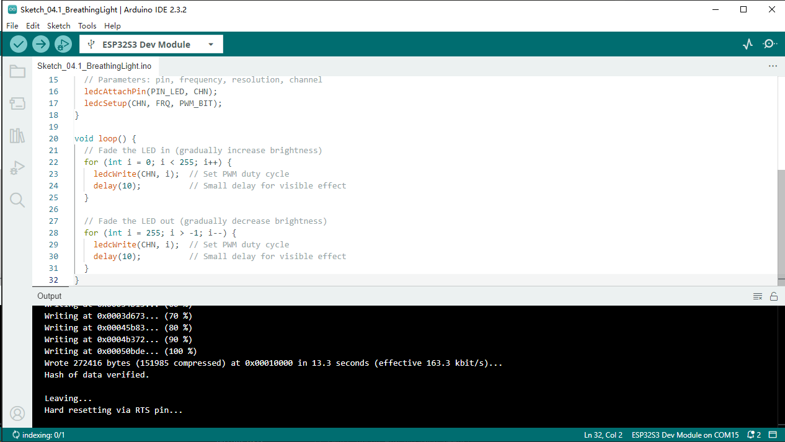
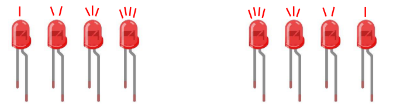

Chapter 4 Analog & PWM
=========================
In previous study, we have known that one button has two states: pressed and 
released, and LED has lighton/off state, then how to enter a middle state? How 
to output an intermediate state to let LED "semi bright"? That's what we're going 
to learn. First, let’s learn how to control the brightness of a LED.

Project 4.1 Breathing LED
----------------------------
Breathing light, that is, LED is turned from off to on gradually, and gradually 
from on to off, just like "breathing". So, how to control the brightness of a LED? 
We will use PWM to achieve this target.

Component List
^^^^^^^^^^^^^^^
- ESP32-S3-WROOM x1
- GPIO Extension Board x1
- 830 Tie-Points Breadboard x1
- LED x1
- Resistor 220Ω x1
- Jumper Wire x2

Connect
^^^^^^^^^^^
This circuit is the same as the one in engineering Blink.

.. image:: img/connect/4.1.png

Sketch
^^^^^^^
This project is designed to make PWM output GPIO2 with pulse width increasing from 
0% to 100%, and then reducing from 100% to 0% gradually.

Download the code to ESP32-S3 WROOM, and you'll see that LED is turned from on 
to off and then from off to on gradually like breathing.

Code
^^^^^^
The following is the program code:

.. code-block:: C

    #define PIN_LED   2     //define the led pin
    #define CHN       0     //define the pwm channel
    #define FRQ       1000  //define the pwm frequency
    #define PWM_BIT   8     //define the pwm precision
    void setup() {
    ledcAttachChannel(PIN_LED, FRQ, PWM_BIT, CHN);  //attach the led pin to pwm channel
    }

    void loop() {
    for (int i = 0; i < 255; i++) { //make light fade in
        ledcWrite(PIN_LED, i);
        delay(10);
    }
    for (int i = 255; i > -1; i--) {  //make light fade out
        ledcWrite(PIN_LED, i);
        delay(10);
        }
    }

Project 4.2 Meteor Flowing Light
------------------------------------
After learning about PWM, we can use it to control LED bar graph and realize a 
cooler flowing light. The component list, circuit, and hardware are exactly cons
istent with the project Flowing Light.

Component List
^^^^^^^^^^^^^^^
- ESP32-S3-WROOM x1
- GPIO Extension Board x1
- 830 Tie-Points Breadboard x1
- LED Bar Graph x1
- Resistor 220Ω x8
- Jumper Wire x8

Connect
^^^^^^^

.. image:: img/connect/4.2.png

Sketch
^^^^^^^
Meteor flowing light will be implemented with PWM.

Download the code to ESP32-S3 WROOM, and LED bar graph will gradually light up 
and out from left to right, then light up and out from right to left.

Code
^^^^^^
The following is the program code:

.. code-block:: C

    const byte ledPins[] = {21, 47, 38, 39, 40, 41, 42, 2};  //define led pins
    const byte chns[] = {0, 1, 2, 3, 4, 5, 6, 7};  //define the pwm channels
    const int dutys[] = {0, 0, 0, 0, 0, 0, 0, 0,
                        1023, 512, 256, 128, 64, 32, 16, 8,
                        0, 0, 0, 0, 0, 0, 0, 0
                        };  //define the pwm dutys
    int ledCounts;
    int delayTimes = 50;  //flowing speed ,the smaller, the faster
    void setup() {
    ledCounts = sizeof(ledPins);  //get the led counts
    for (int i = 0; i < ledCounts; i++) {  //setup the pwm channels
        ledcAttachChannel(ledPins[i], 1000, 10, chns[i]);
    }
    }

    void loop() {
    for (int i = 0; i < 16; i++) {        //flowing one side to other side
        for (int j = 0; j < ledCounts; j++) {
        ledcWrite(ledPins[j], dutys[i + j]);
        }
        delay(delayTimes);
    }
    for (int i = 0; i < 16; i++) {      //flowing one side to other side
        for (int j = ledCounts - 1; j > -1; j--) {
        ledcWrite(ledPins[j], dutys[i + (ledCounts - 1 - j)]);
        }
        delay(delayTimes);
    }
    }

