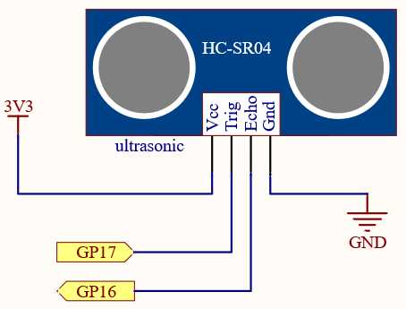
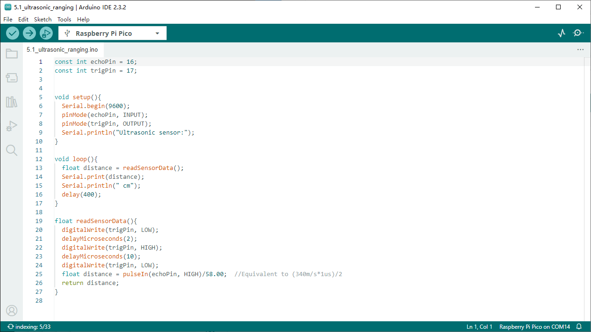

5.1 Ultrasonic Ranging
=========================
The ultrasonic sensor module operates based on the principles of sonar and radar to measure the distance to an object.

Component List
^^^^^^^^^^^^^^^
- Raspberry Pi Pico W x1
- MicroUSB cable x1
- 830 Tie-Points Breadboard x1
- Ultrasonic Module x1
- Jumper Wire Several

Component knowledge
^^^^^^^^^^^^^^^^^^^^
:ref:`Ultrasonic Module <cpn_ultrasonic_module>`
""""""""""""""""""""""""""""""""""""""""""""""""""

Schematic
^^^^^^^^^^

Connect
^^^^^^^^^
.. image:: img/3.connect/5.1.png

Code
^^^^^^^
.. note::

    * Open the ``5.1_ultrasonic_ranging.ino`` file under the path of ``Ultimate-Starter-Kit-for-Pico-W\Arduino\1.Project`` or copy this code into Thonny, then click "Run Current Script" or simply press F5 to run it.

    * Or copy this code into Arduino IDE.

    * Don’t forget to select the board(Raspberry Pi Pico) and the correct port before clicking the Upload button. 

Click “Run current script”, the Shell will print out the distance of the ultrasonic sensor from the obstacle ahead.

The following is the program code:

.. code-block:: c++

    const int echoPin = 16;
    const int trigPin = 17;

    void setup(){
    Serial.begin(9600);
    pinMode(echoPin, INPUT);
    pinMode(trigPin, OUTPUT);
    Serial.println("Ultrasonic sensor:");  
    }

    void loop(){
    float distance = readSensorData();
    Serial.print(distance);   
    Serial.println(" cm");
    delay(400);
    }

    float readSensorData(){
    digitalWrite(trigPin, LOW); 
    delayMicroseconds(2);
    digitalWrite(trigPin, HIGH); 
    delayMicroseconds(10);
    digitalWrite(trigPin, LOW);  
    float distance = pulseIn(echoPin, HIGH)/58.00;  //Equivalent to (340m/s*1us)/2
    return distance;
    }

Phenomenon
^^^^^^^^^^^
.. image:: img/5.phenomenon/5.1.png
    :width: 100%