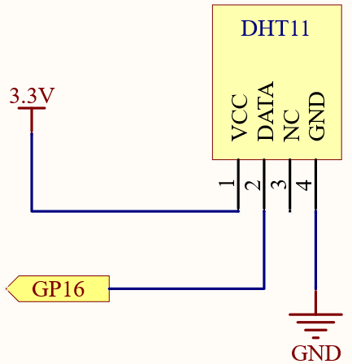
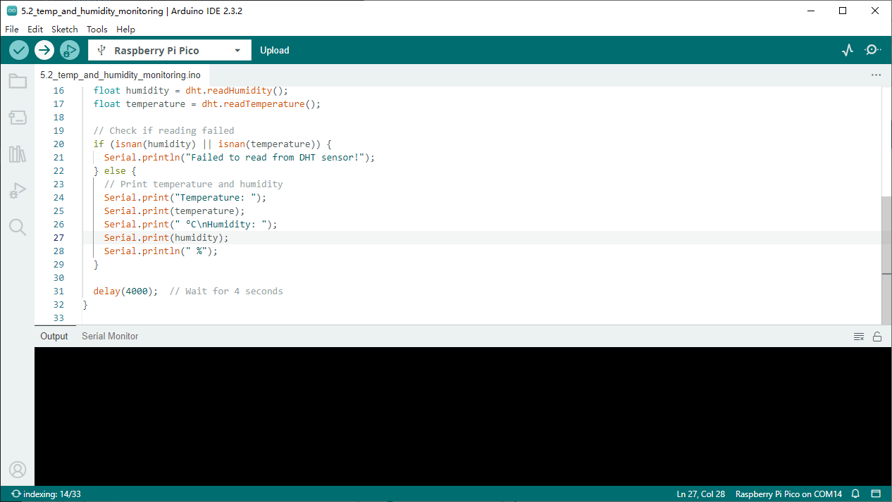

5.2 Temp & Humidity Monitoring
==============================
Humidity and temperature are closely related from the physical quantity itself to the actual people’s life. The temperature and humidity of human environment will directly affect the thermoregulatory function and heat transfer effect of human body. It will further affect the thinking activity and mental state, thus affecting the efficiency of our study and work.

Temperature is one of the seven basic physical quantities in the International System of Units, which is used to measure the degree of hot and cold of an object. Celsius is one of the more widely used temperature scales in the world, expressed by the symbol “℃”.

Humidity is the concentration of water vapor present in the air. The relative humidity of air is commonly used in life and is expressed in %RH. Relative humidity is closely related to temperature. For a certain volume of sealed gas, the higher the temperature, the lower the relative humidity, and the lower the temperature, the higher the relative humidity.

.. image:: img/1.detail/5.2.png

A basic digital temperature and humidity sensor, the DHT11, is provided in this kit. It uses a capacitive humidity sensor and thermistor to measure the surrounding air and outputs a digital signal on the data pins (no analog input pins are required).

Component List
^^^^^^^^^^^^^^^
- Raspberry Pi Pico W x1
- MicroUSB cable x1
- 830 Tie-Points Breadboard x1
- DHT11 Module x1
- Jumper Wire Several

Component knowledge
^^^^^^^^^^^^^^^^^^^^

:ref:`transistor <cpn_transistor>`
"""""""""""""""""""""""""""""""""""

:ref:`Buzzer <cpn_buzzer>`
"""""""""""""""""""""""""""

Schematic
^^^^^^^^^^

Connect
^^^^^^^^^
.. image:: img/3.connect/5.2.png

Code
^^^^^^^
.. note::

    * Open the ``5.2_temp_and_humidity_monitoring.ino`` file under the path of ``Ultimate-Starter-Kit-for-Pico\Arduino\1.Project`` or copy this code into Thonny, then click "Run Current Script" or simply press F5 to run it.

    * Or copy this code into Arduino IDE.

    * Don’t forget to select the board(Raspberry Pi Pico) and the correct port before clicking the Upload button. 

Click “Run current script”, you will see the Shell continuously print out the temperature and humidity, and as the program runs steadily, these two values will become more and more accurate.

The following is the program code:

.. code-block:: c++

    #include <DHT.h>

    #define DHTPIN 16     // Define the pin connected to the DHT11 sensor
    #define DHTTYPE DHT11 // Define the type of sensor used

    DHT dht(DHTPIN, DHTTYPE);

    void setup() {
    Serial.begin(9600);
    dht.begin();
    delay(5000);  // Initial delay of 5 seconds
    }

    void loop() {
    // Read humidity and temperature
    float humidity = dht.readHumidity();
    float temperature = dht.readTemperature();

    // Check if reading failed
    if (isnan(humidity) || isnan(temperature)) {
        Serial.println("Failed to read from DHT sensor!");
    } else {
        // Print temperature and humidity
        Serial.print("Temperature: ");
        Serial.print(temperature);
        Serial.print(" °C\nHumidity: ");
        Serial.print(humidity);
        Serial.println(" %");
    }

    delay(4000);  // Wait for 4 seconds
    }

Phenomenon
^^^^^^^^^^^
.. image:: img/5.phenomenon/5.2.png
    :width: 100%