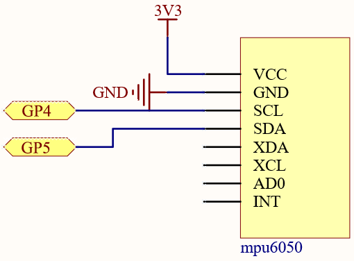
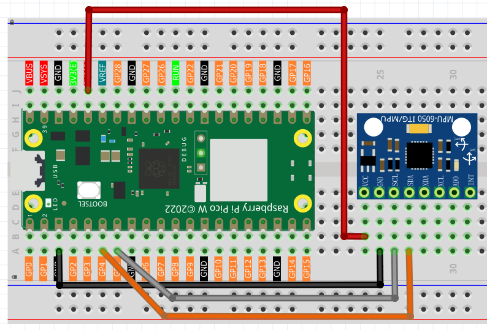
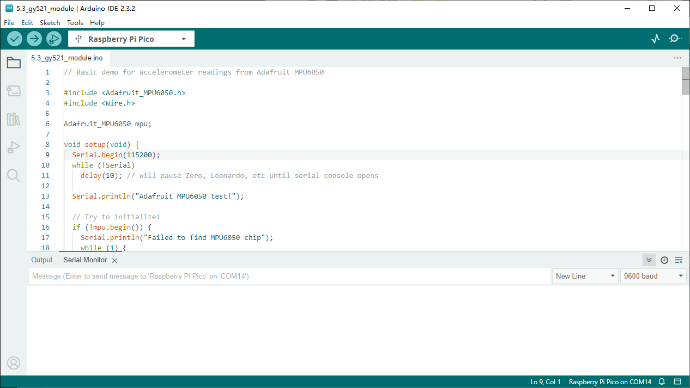

5.3 GY521 Module
=========================
The GY-521 module is an integrated six-axis motion tracking sensor that includes a 3-axis gyroscope and a 3-axis accelerometer. It is based on the MPU-6050 chip, which is a sensor specifically designed for mobile devices such as smartphones, tablets, and wearables. The GY-521 inherits the low power consumption, low cost, and high performance characteristics of the MPU-6050, meeting the stringent demands of these devices for dynamic capture and motion analysis. It is widely used in robots, game controllers, motion tracking systems, and any applications requiring precise measurement and analysis of movement data. With its I²C interface, the GY-521 can easily connect to various microcontrollers and processors, providing developers with a flexible and powerful solution.

In this experiment, use I²C to obtain the values of the three-axis acceleration sensor and three-axis gyroscope for GY-521 and display them on the screen.

Component List
^^^^^^^^^^^^^^^
- Raspberry Pi Pico W x1
- MicroUSB cable x1
- 830 Tie-Points Breadboard x1
- MPU6050 Module
- Jumper Wire Several

Component knowledge
^^^^^^^^^^^^^^^^^^^^

:ref:`transistor <cpn_transistor>`
"""""""""""""""""""""""""""""""""""

:ref:`Buzzer <cpn_buzzer>`
"""""""""""""""""""""""""""

Schematic
^^^^^^^^^^

Connect
^^^^^^^^^

Code
^^^^^^^
.. note::

    * Open the ``5.3_gy521_module.ino`` file under the path of ``Ultimate-Starter-Kit-for-Pico\Arduino\1.Project`` or copy this code into Thonny, then click "Run Current Script" or simply press F5 to run it.

    * Or copy this code into Arduino IDE.

    * Don’t forget to select the board(Raspberry Pi Pico) and the correct port before clicking the Upload button. 

Click “Run current script”, you can see the 3-axis accelerometer values and 3-axis gyroscope values cycling through the output. At this point you rotate the MPU6050 at random, and these values will appear to change accordingly. To make it easier to see the changes, you can comment out one of the print lines and concentrate on another set of data.

The unit of acceleration value is m/s², and the unit of gyroscope value is °/s.

The following is the program code:

.. code-block:: c++

    // Basic demo for accelerometer readings from Adafruit MPU6050

    #include <Adafruit_MPU6050.h>
    #include <Wire.h>

    Adafruit_MPU6050 mpu;

    void setup(void) {
    Serial.begin(115200);
    while (!Serial)
        delay(10); // will pause Zero, Leonardo, etc until serial console opens

    Serial.println("Adafruit MPU6050 test!");

    // Try to initialize!
    if (!mpu.begin()) {
        Serial.println("Failed to find MPU6050 chip");
        while (1) {
        delay(10);
        }
    }
    Serial.println("MPU6050 Found!");

    mpu.setAccelerometerRange(MPU6050_RANGE_8_G);
    Serial.print("Accelerometer range set to: ");
    switch (mpu.getAccelerometerRange()) {
    case MPU6050_RANGE_2_G:
        Serial.println("+-2G");
        break;
    case MPU6050_RANGE_4_G:
        Serial.println("+-4G");
        break;
    case MPU6050_RANGE_8_G:
        Serial.println("+-8G");
        break;
    case MPU6050_RANGE_16_G:
        Serial.println("+-16G");
        break;
    }
    mpu.setGyroRange(MPU6050_RANGE_500_DEG);
    Serial.print("Gyro range set to: ");
    switch (mpu.getGyroRange()) {
    case MPU6050_RANGE_250_DEG:
        Serial.println("+- 250 deg/s");
        break;
    case MPU6050_RANGE_500_DEG:
        Serial.println("+- 500 deg/s");
        break;
    case MPU6050_RANGE_1000_DEG:
        Serial.println("+- 1000 deg/s");
        break;
    case MPU6050_RANGE_2000_DEG:
        Serial.println("+- 2000 deg/s");
        break;
    }

    mpu.setFilterBandwidth(MPU6050_BAND_21_HZ);
    Serial.print("Filter bandwidth set to: ");
    switch (mpu.getFilterBandwidth()) {
    case MPU6050_BAND_260_HZ:
        Serial.println("260 Hz");
        break;
    case MPU6050_BAND_184_HZ:
        Serial.println("184 Hz");
        break;
    case MPU6050_BAND_94_HZ:
        Serial.println("94 Hz");
        break;
    case MPU6050_BAND_44_HZ:
        Serial.println("44 Hz");
        break;
    case MPU6050_BAND_21_HZ:
        Serial.println("21 Hz");
        break;
    case MPU6050_BAND_10_HZ:
        Serial.println("10 Hz");
        break;
    case MPU6050_BAND_5_HZ:
        Serial.println("5 Hz");
        break;
    }

    Serial.println("");
    delay(100);
    }

    void loop() {

    /* Get new sensor events with the readings */
    sensors_event_t a, g, temp;
    mpu.getEvent(&a, &g, &temp);

    /* Print out the values */
    Serial.print("Acceleration X: ");
    Serial.print(a.acceleration.x);
    Serial.print(", Y: ");
    Serial.print(a.acceleration.y);
    Serial.print(", Z: ");
    Serial.print(a.acceleration.z);
    Serial.println(" m/s^2");

    Serial.print("Rotation X: ");
    Serial.print(g.gyro.x);
    Serial.print(", Y: ");
    Serial.print(g.gyro.y);
    Serial.print(", Z: ");
    Serial.print(g.gyro.z);
    Serial.println(" rad/s");

    Serial.print("Temperature: ");
    Serial.print(temp.temperature);
    Serial.println(" degC");

    Serial.println("");
    delay(500);
    }

Phenomenon
^^^^^^^^^^^
.. image:: img/5.phenomenon/5.3.png 
    :width: 100%