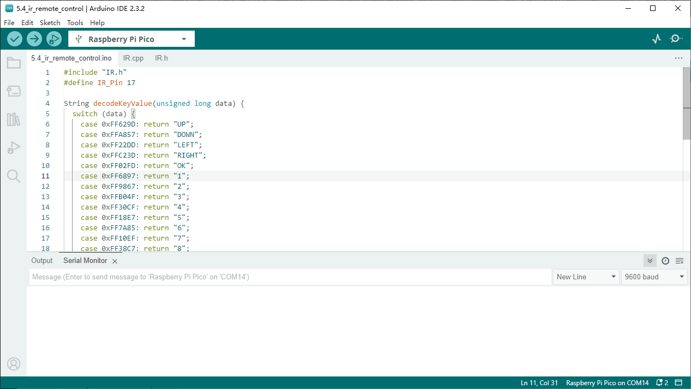

5.4 IR Remote Control
=========================
In consumer electronics, remote controls are commonly used to operate devices like 
televisions and DVD players. They also enable users to control devices that are out 
of reach, such as central air conditioning systems.

An IR Receiver is a component equipped with a photocell that is specifically designed 
to detect infrared light. It is typically used for remote control detection—almost 
every TV and DVD player has an IR Receiver on the front to capture the IR signals 
from the remote. Inside the remote control, there is a matching IR LED that emits 
infrared pulses to instruct the TV to turn on, off, or change channels.

Component List
^^^^^^^^^^^^^^^
- Raspberry Pi Pico W x1
- MicroUSB cable x1
- 830 Tie-Points Breadboard x1
- Infrared Receiver x1
- Jumper Wire Several

Component knowledge
^^^^^^^^^^^^^^^^^^^^

:ref:`Infrared Receiver <cpn_infrared_receiver>`
"""""""""""""""""""""""""""""""""""""""""""""""""""

Schematic
^^^^^^^^^^
.. image:: img/2.sch/5.4.png

Connect
^^^^^^^^^
.. image:: img/3.connect/5.4.png

Code
^^^^^^^
.. note::

    * Open the ``5.4_ir_remote_control.ino`` file under the path of ``Ultimate-Starter-Kit-for-Pico-W\Arduino\1.Project`` or copy this code into Thonny, then click "Run Current Script" or simply press F5 to run it.

    * Or copy this code into Arduino IDE.

    * Don’t forget to select the board(Raspberry Pi Pico) and the correct port before clicking the Upload button. 

The new remote control has a plastic piece at the end to isolate the battery inside. You need to pull out this plastic piece to power up the remote when you are using it. Once the program is running, when you press the remote control, the Shell will print out the key you pressed.

The following is the program code:

.. code-block:: c++

    #include "IR.h"
    #define IR_Pin 17

    String decodeKeyValue(unsigned long data) {
    switch (data) {
        case 0xFF629D: return "UP";
        case 0xFFA857: return "DOWN";
        case 0xFF22DD: return "LEFT";
        case 0xFFC23D: return "RIGHT";
        case 0xFF02FD: return "OK";
        case 0xFF6897: return "1";
        case 0xFF9867: return "2";
        case 0xFFB04F: return "3";
        case 0xFF30CF: return "4";
        case 0xFF18E7: return "5";
        case 0xFF7A85: return "6";
        case 0xFF10EF: return "7";
        case 0xFF38C7: return "8";
        case 0xFF5AA5: return "9";
        case 0xFF4AB5: return "0";
        case 0xFF42BD: return "*";
        case 0xFF52AD: return "#";
        default: 
        // For debugging: print the received code
        Serial.print("Raw IR Code: 0x");
        Serial.println(data, HEX);
        return "ERROR";
    }
    }

    void setup() {
    Serial.begin(115200);
    IR_Init(IR_Pin);
    }

    void loop() {
    if(flagCode) {
        unsigned long irValue = IR_Decode(flagCode);
        if(irValue != 0xFFFFFFFF) {  // Ignore repeat codes
        String keyName = decodeKeyValue(irValue);
        Serial.println(keyName);
        }
        IR_Release();
    }
    }

Phenomenon
^^^^^^^^^^^
.. image:: img/5.phenomenon/5.4.png
    :width: 100%