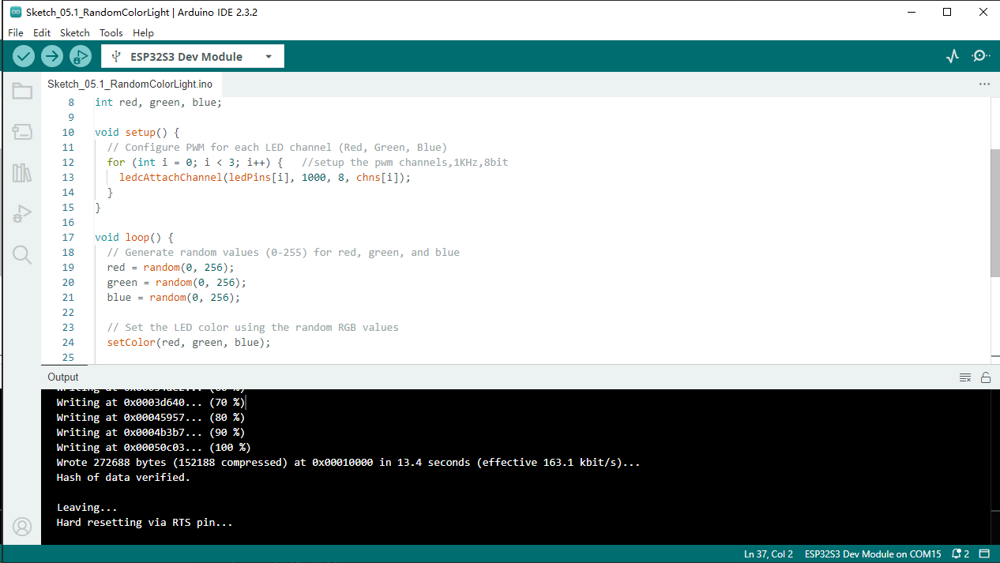
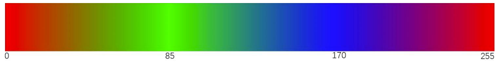

Chapter 5 RGB LED
=========================
In this chapter, we will learn how to control a RGB LED. It can emit different 
colors of light. Next, we will use RGB LED to make a multicolored light.

Project 5.1 Random Color Light
------------------------------------
In this project, we will make a multicolored LED. And we can control RGB LED to 
switch different colors automatically.

Component List
^^^^^^^^^^^^^^^
- ESP32-S3-WROOM x1
- GPIO Extension Board x1
- 830 Tie-Points Breadboard x1
- LED-RGB x1
- Resistor 220Ω x3
- Jumper Wire x4

Component knowledge
^^^^^^^^^^^^^^^^^^^^
:ref:`RGB-LED <cpn_rgb_led>`
"""""""""""""""""""""""""""""""

Connect
^^^^^^^^^^^

.. image:: img/connect/5.png

Sketch
^^^^^^^
We need to create three PWM channels and use random duty cycle to make random RGB 
LED color.

**Sketch_05.1_ColorfulLight**

With the code downloaded to ESP32-S3 WROOM, RGB LED begins to display random colors.

Code
^^^^^^
The following is the program code:

.. code-block:: C

    const byte ledPins[] = {38, 39, 40};    //define red, green, blue led pins
    const byte chns[] = {0, 1, 2};          //define the pwm channels
    int red, green, blue;
    void setup() {
    for (int i = 0; i < 3; i++) {   //setup the pwm channels,1KHz,8bit
        ledcAttachChannel(ledPins[i], 1000, 8, chns[i]);
    }
    }

    void loop() {
    red = random(0, 256);
    green = random(0, 256);
    blue = random(0, 256);
    setColor(red, green, blue);
    delay(200);
    }

    void setColor(byte r, byte g, byte b) {
    ledcWrite(ledPins[0], 255 - r); //Common anode LED, low level to turn on the led.
    ledcWrite(ledPins[1], 255 - g);
    ledcWrite(ledPins[2], 255 - b);
    }

Project 5.2 Gradient Color Light
------------------------------------
In the previous project, we have mastered the usage of RGB LED, but the random 
display of colors is rather stiff. This project will realize a fashionable light 
with soft color changes. 

Component list and the circuit are exactly the same as the random color light. 

Using a color model, the color changes from 0 to 255 as shown below.

In this code, the color model will be implemented and RGB LED will change colors 
along the model.

**Sketch_05.2_SoftColorfulLight**
The following is the program code:

.. code-block:: C

    const byte ledPins[] = {38, 39, 40};  //define led pins
    const byte chns[] = {0, 1, 2};        //define the pwm channels

    void setup() {
    for (int i = 0; i < 3; i++) {       //setup the pwm channels
        ledcAttachChannel(ledPins[i], 1000, 8, chns[i]);
    }
    }

    void loop() {
    for (int i = 0; i < 256; i++) {
        setColor(wheel(i));
        delay(20);
    }
    }

    void setColor(long rgb) {
    ledcWrite(ledPins[0], 255 - (rgb >> 16) & 0xFF);
    ledcWrite(ledPins[1], 255 - (rgb >> 8) & 0xFF);
    ledcWrite(ledPins[2], 255 - (rgb >> 0) & 0xFF);
    }

    long wheel(int pos) {
    long WheelPos = pos % 0xff;
    if (WheelPos < 85) {
        return ((255 - WheelPos * 3) << 16) | ((WheelPos * 3) << 8);
    } else if (WheelPos < 170) {
        WheelPos -= 85;
        return (((255 - WheelPos * 3) << 8) | (WheelPos * 3));
    } else {
        WheelPos -= 170;
        return ((WheelPos * 3) << 16 | (255 - WheelPos * 3));
    }
    }

