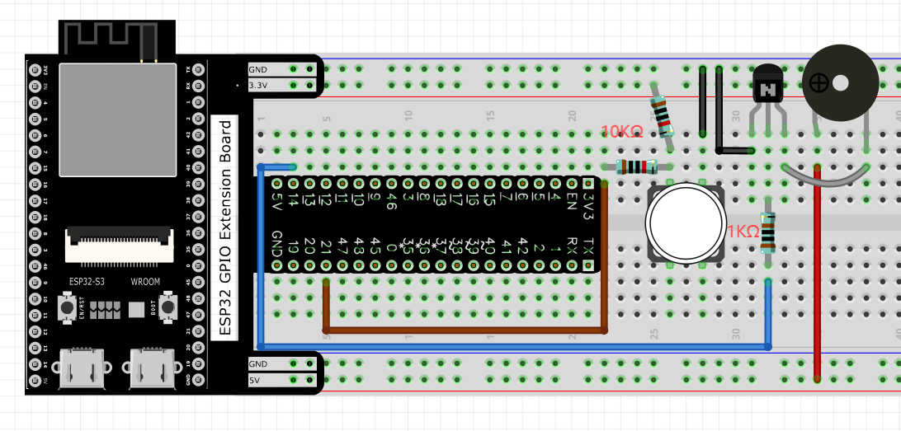
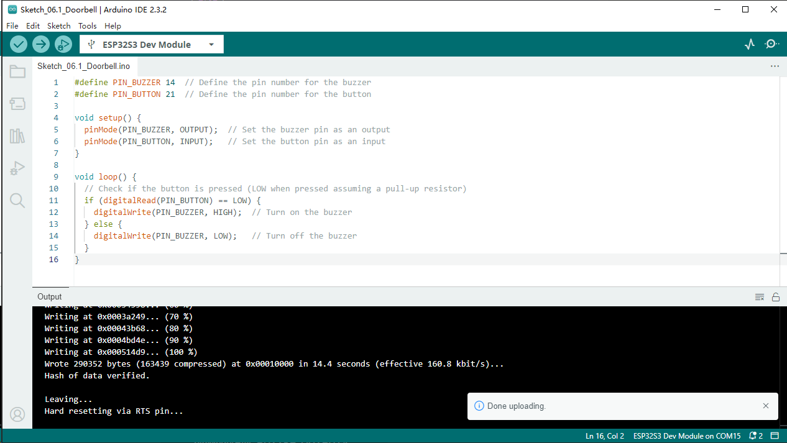
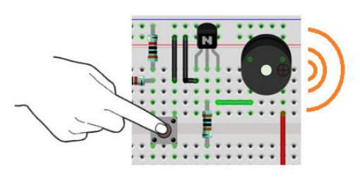
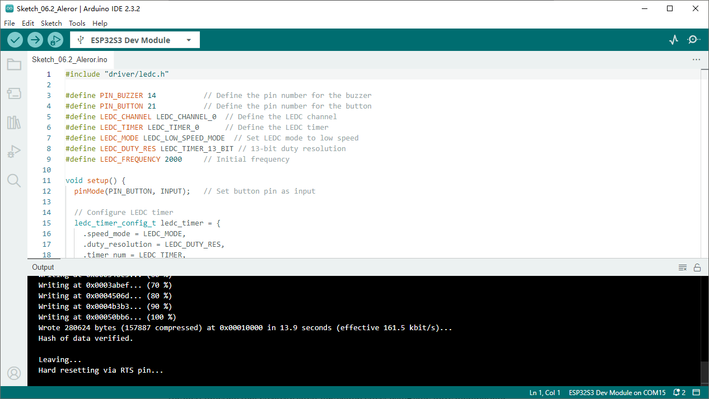

Chapter 6 Buzzer
=========================
In this chapter, we will learn about buzzers that can make sounds.

Project 6.1 Doorbell
----------------------
We will make this kind of doorbell: when the button is pressed, the buzzer sounds; 
and when the button is released, the buzzer stops sounding.

Component List
^^^^^^^^^^^^^^^
- ESP32-S3-WROOM x1
- GPIO Extension Board x1
- 830 Tie-Points Breadboard x1
- NPN transistor(S8050) x2
- Active Buzzer x1
- Resistor 10kΩ x2
- Resistor 1kΩ  x1
- Button x1
- Jumper Wire x6

Component knowledge
^^^^^^^^^^^^^^^^^^^^
:ref:`transistor <cpn_transistor>`
"""""""""""""""""""""""""""""""""""

:ref:`Buzzer <cpn_buzzer>`
"""""""""""""""""""""""""""

Connect
^^^^^^^^^^^

.. note:: 
    Note: in this circuit, the power supply for buzzer is 5V, and pull-up resistor 
    of the button connected to the power 3.3V. The buzzer can work when connected 
    to power 3.3V, but it will reduce the loudness.

Sketch
^^^^^^^
In this project, a buzzer will be controlled by a push button switch. When the 
button switch is pressed, the buzzer sounds and when the button is released, the 
buzzer stops. It is analogous to our earlier project that controlled a LED ON and 
OFF.

**Sketch_06.1_Doorbell**

Download the code to ESP32-S3 WROOM, press the push button switch and the buzzer 
will sound. Release the push button switch and the buzzer will stop.

Code
^^^^^^
The following is the program code:

.. code-block:: C

    #define PIN_BUZZER 14
    #define PIN_BUTTON 21

    void setup() {
    pinMode(PIN_BUZZER, OUTPUT);
    pinMode(PIN_BUTTON, INPUT);
    }

    void loop() {
    if (digitalRead(PIN_BUTTON) == LOW) {
        digitalWrite(PIN_BUZZER,HIGH);
    }else{
        digitalWrite(PIN_BUZZER,LOW);
    }
    }

The code is logically the same as using button to control LED.

Project 6.2 Alertor
----------------------
Next, we will use a passive buzzer to make an alarm. Component list and the circuit 
is similar to the last section. In the Doorbell circuit only the active buzzer 
needs to be replaced with a passive buzzer.

Sketch
^^^^^^^

In this project, the buzzer alarm is controlled by the button. Press the button, 
then buzzer sounds. If you release the button, the buzzer will stop sounding. It 
is logically the same as using button to control LED, but in the control method, 
passive buzzer requires PWM of certain frequency to sound.

**Sketch_06.2_Alertor**

Download the code to ESP32-S3 WROOM, press the button, then alarm sounds. And when 
the button is released, the alarm will stop sounding.

Code
^^^^^^
The following is the program code:

.. code-block:: C

    #define PIN_BUZZER 14
    #define PIN_BUTTON 21
    #define CHN        0   //define the pwm channel

    void setup() {
    pinMode(PIN_BUTTON, INPUT);
    pinMode(PIN_BUZZER, OUTPUT);
    ledcAttachChannel(PIN_BUZZER, 1, 10, CHN);  //attach the led pin to pwm channel
    ledcWriteTone(PIN_BUZZER, 2000);        //Sound at 2KHz for 0.3 seconds
    delay(300);
    }

    void loop() {
    if (digitalRead(PIN_BUTTON) == LOW) {
        alert();
    } else {
        ledcWriteTone(PIN_BUZZER, 0);
    }
    }

    void alert() {
    float sinVal;         // Define a variable to save sine value
    int toneVal;          // Define a variable to save sound frequency
    for (int x = 0; x < 360; x += 10) {     // X from 0 degree->360 degree
        sinVal = sin(x * (PI / 180));       // Calculate the sine of x
        toneVal = 2000 + sinVal * 500;      // Calculate sound frequency according to the sine of x
        ledcWriteTone(PIN_BUZZER, toneVal);
        delay(10);
    }
    }

