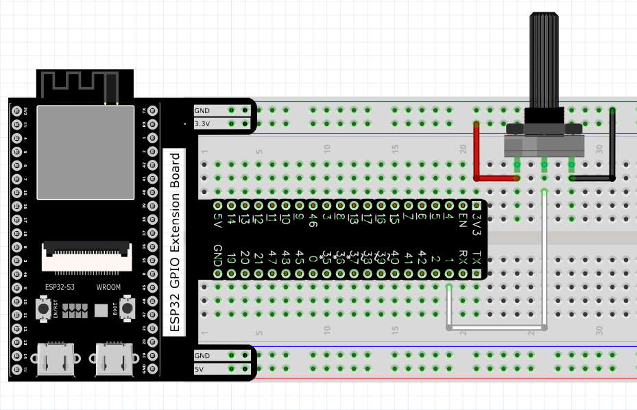
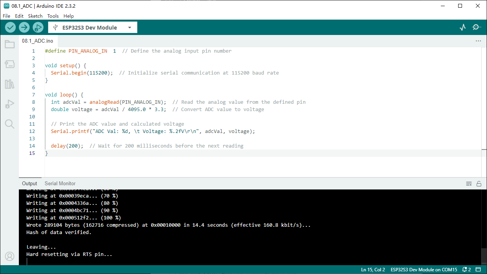
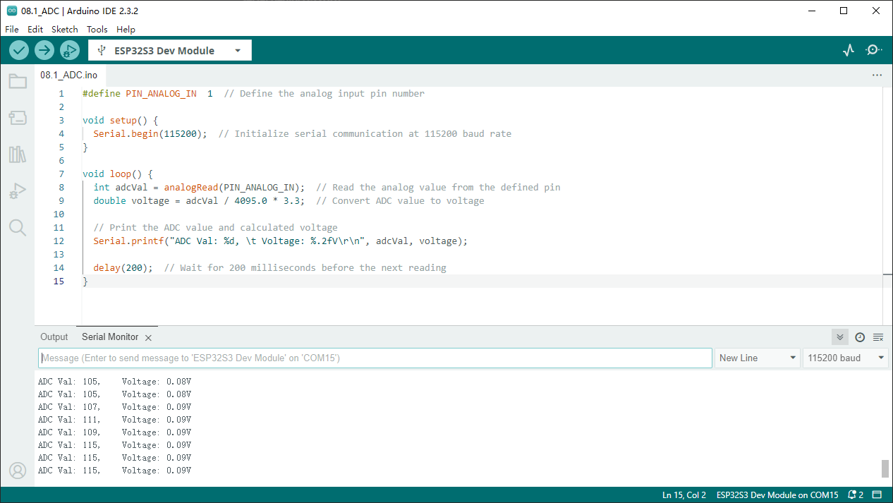

Chapter 8 AD Converter
========================
In this chapter, we will learn how to use ESP32-S3 to read analog signals.

Project 8.1 Read the Voltage of Potentiometer
------------------------------------------------
In this project, we will use the ADC function of ESP32-S3 to read the voltage value 
of the potentiometer and print it out through the serial monitor.

Component List
^^^^^^^^^^^^^^^
- ESP32-S3-WROOM x1
- GPIO Extension Board x1
- 830 Tie-Points Breadboard x1
- Potentiometer(10k) x1
- Jumper Wire x3

Component knowledge
^^^^^^^^^^^^^^^^^^^^
:ref:`Potentiometer <cpn_potentiometer>`
""""""""""""""""""""""""""""""""""""""""""

Connect
^^^^^^^^^^^

Sketch
^^^^^^^

**Sketch_08.1_ADC**

Download the code to ESP32-S3 WROOM, open the serial monitor, and set the baud 
rate to 115200. As shown in the following figure.

As shown in the picture above, as long as the handle of the potentiometer is 
rotated, the serial monitor will print out the ADC value, as well as the voltage 
value of the potentiometer.

Code
^^^^^^
The following is the program code:

.. code-block:: C

    #define PIN_ANALOG_IN  1
    void setup() {
    Serial.begin(115200);
    }

    void loop() {
    int adcVal = analogRead(PIN_ANALOG_IN);
    double voltage = adcVal / 4095.0 * 3.3;
    Serial.printf("ADC Val: %d, \t Voltage: %.2fV\r\n", adcVal, voltage);
    delay(200);
    }

