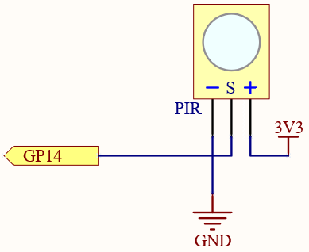
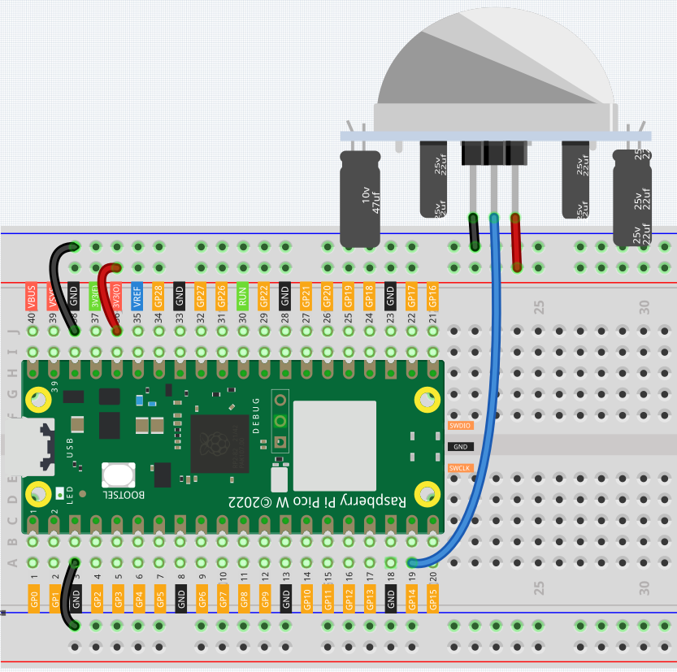
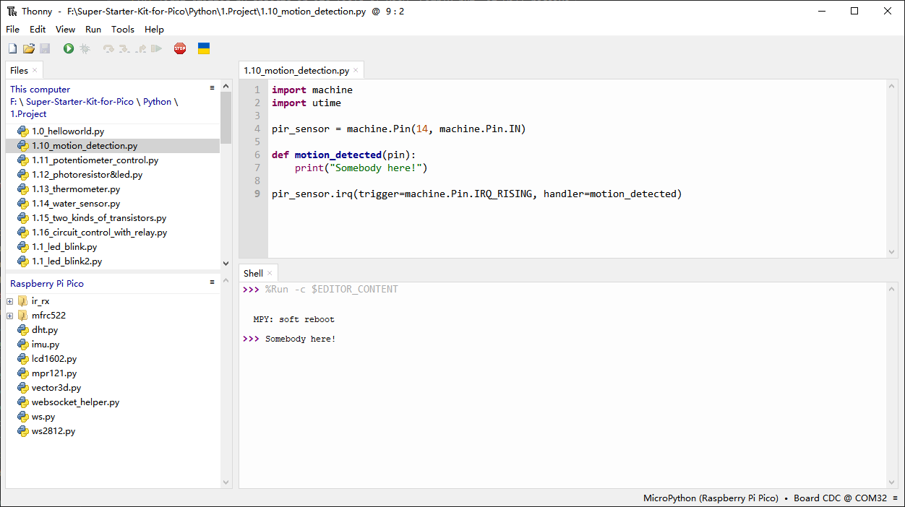
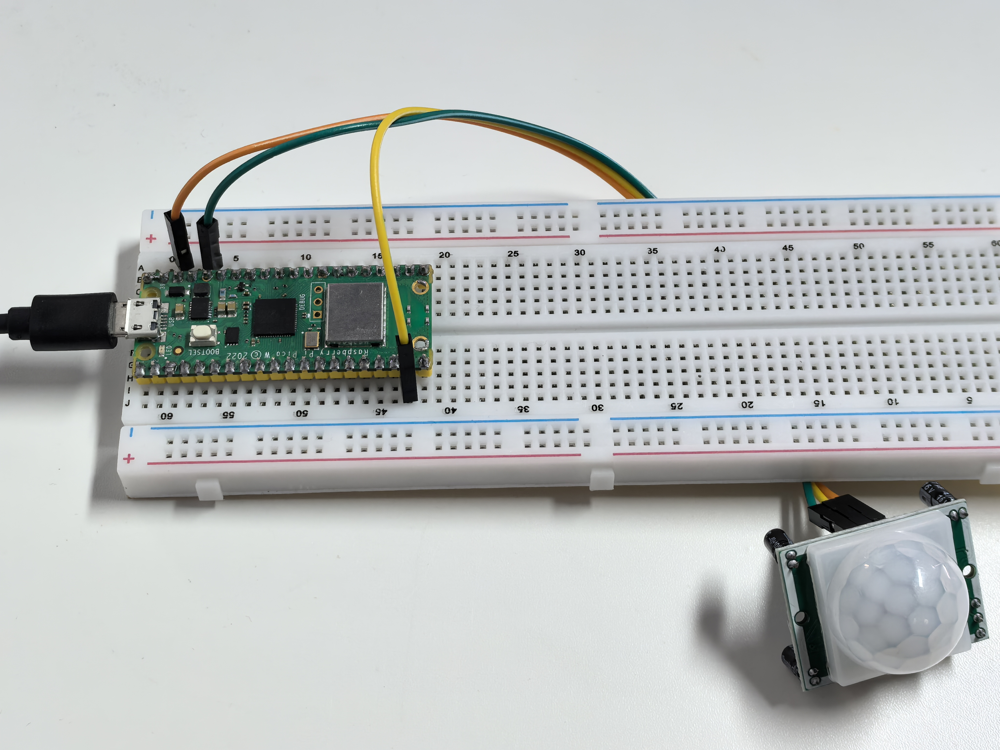

1.10 Motion Detection
=========================
The Passive Infrared Sensor (PIR sensor) is a widely used device that detects infrared 
(IR) radiation emitted by objects within its range. In simpler terms, it picks up the 
heat signatures from human or animal bodies, allowing it to sense motion. Specifically, 
it signals the main control board when someone or something enters the room.

Component List
^^^^^^^^^^^^^^^
- Raspberry Pi Pico W x1
- MicroUSB cable x1
- 830 Tie-Points Breadboard x1
- Jumper Wire Several
- PIR Motion Sensor Module x1

Component knowledge
^^^^^^^^^^^^^^^^^^^^
:ref:`PIR Motion Sensor Module <cpn_pir_module>`
"""""""""""""""""""""""""""""""""""""""""""""""""

Schematic
^^^^^^^^^^

When the PIR module detects someone passing by, GP14 will be high, otherwise it 
will be low.

.. 调整灵敏度的说明
.. note:: 
    The PIR module has two potentiometers: one adjusts sensitivity, the other 
    adjusts detection distance. To make the PIR module work better, you need to 
    turn both of them counterclockwise to the end.

Connect
^^^^^^^^^

Code
^^^^^^^
.. attention:: 
    PIR is a very sensitive sensor. In order to adapt it to the environment of use, 
    it needs to be adjusted. Let the side with the 2 potentiometers facing you, turn 
    both potentiometers counterclockwise to the end and insert the jumper cap on the 
    pin with L and the middle pin.

.. note::

    * Open the ``1.10_motion_detection.py`` file under the path of ``Ultimate-Starter-Kit-for-Pico\Python\1.Project`` or copy this code into Thonny, then click "Run Current Script" or simply press F5 to run it.

    * Don't forget to click on the "MicroPython (Raspberry Pi Pico)" interpreter in the bottom right corner. 

Click “Run current script”, if the PIR module detects someone nearby, the Shell will 
print out “Somebody here!”

The following is the program code:

.. code-block:: python

    import machine
    import utime

    pir_sensor = machine.Pin(14, machine.Pin.IN)

    def motion_detected(pin):
        print("Somebody here!")

    pir_sensor.irq(trigger=machine.Pin.IRQ_RISING, handler=motion_detected)

Phenomenon
^^^^^^^^^^^

