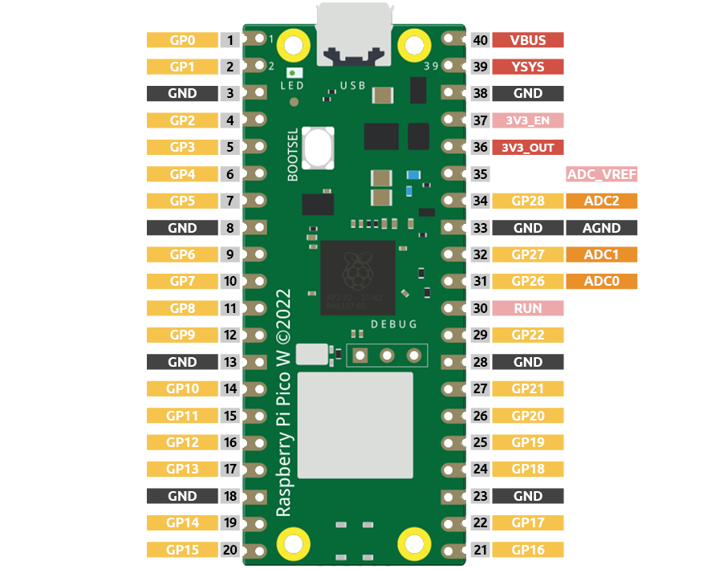
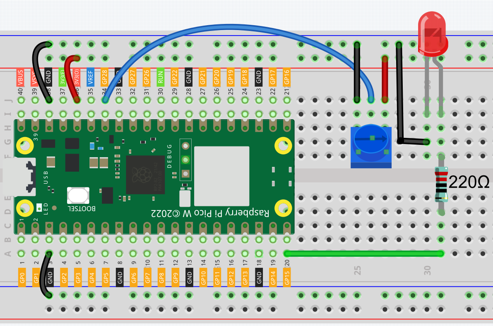
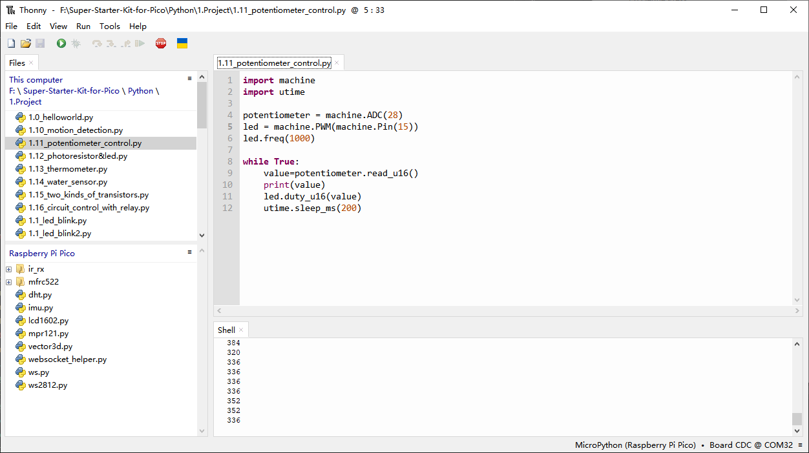

1.11 Potentiometer Control
===========================
In our earlier projects, we utilized digital inputs on the Pico W. For instance, 
pressing a button changes the pin state from low (off) to high (on), representing 
a binary operation.

However, the Pico W is also capable of handling another type of input: analog input. 
Unlike digital, analog signals can vary continuously between fully closed and fully 
open, offering a wide range of values. This feature enables the microcontroller to 
detect physical quantities such as light intensity, sound level, temperature, and 
humidity.

Typically, microcontrollers require additional hardware—an analog-to-digital converter 
(ADC)—to process analog inputs. Fortunately, the Pico W comes equipped with a built-in 
ADC, ready for direct use.

The Pico W features three GPIO pins capable of analog input: GP26, GP27, and GP28, 
corresponding to analog channels 0, 1, and 2. Additionally, there is a fourth analog 
channel connected to an internal temperature sensor, which we won't cover here.

In this project, we will focus on reading the analog value from a potentiometer.
    
Component List
^^^^^^^^^^^^^^^
- Raspberry Pi Pico W x1
- MicroUSB cable x1
- 830 Tie-Points Breadboard x1
- Jumper Wire Several
- Resistor 220Ω x1
- LED x1
- Potentiometer x1

Component knowledge
^^^^^^^^^^^^^^^^^^^^
:ref:`Potentiometer <cpn_potentiometer>`
"""""""""""""""""""""""""""""""""""""""""

Schematic
^^^^^^^^^^
.. image:: img/2.sch/1.11.png

The potentiometer is an analog device that outputs different voltage levels when turned in different directions.

Connect the middle pin of the potentiometer to the analog input pin GP28 on the 
Raspberry Pi Pico W. The Pico W has a multi-channel, 16-bit analog-to-digital 
converter (ADC), which converts the input voltage ranging from 0 to the supply 
voltage (3.3V) into an integer value between 0 and 65535. Therefore, the value 
read from GP28 will range from 0 to 65535.

The calculation formula is as follows:
(Vp/3.3V) x 65535 = Ap

Next, program the value read from GP28 (the potentiometer) to be the PWM (Pulse Width Modulation) 
value for GP15 (the LED). By doing this, you will notice that as you rotate the potentiometer, the brightness of the LED changes accordingly.

Connect
^^^^^^^^^

Code
^^^^^^^
.. note::

    * Open the ``1.11_potentiometer_control.py`` file under the path of ``Ultimate-Starter-Kit-for-Pico\Python\1.Project`` or copy this code into Thonny, then click "Run Current Script" or simply press F5 to run it.

    * Don't forget to click on the "MicroPython (Raspberry Pi Pico)" interpreter in the bottom right corner. 

Click “Run current script”, we can see the analog value currently read by the GP28 
pin in the shell. Turn the knob, and the value will change from 0 to 65535. At 
the same time, the brightness of the LED will increase as the analog value increases.

The following is the program code:

.. code-block:: python

    import machine
    import utime

    potentiometer = machine.ADC(28)
    led = machine.PWM(machine.Pin(15)) 
    led.freq(1000)

    while True:
        value=potentiometer.read_u16()
        print(value)
        led.duty_u16(value)
        utime.sleep_ms(200)

Phenomenon
^^^^^^^^^^^
.. video:: img/5.phenomenon/1.11.mp4
    :width: 100%