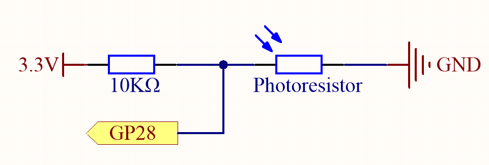
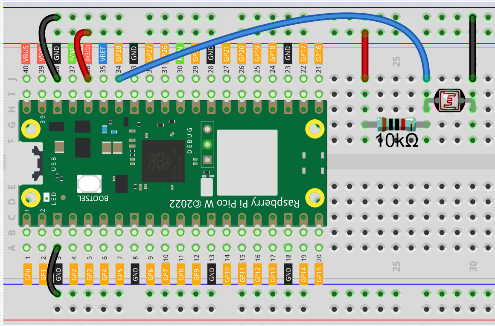
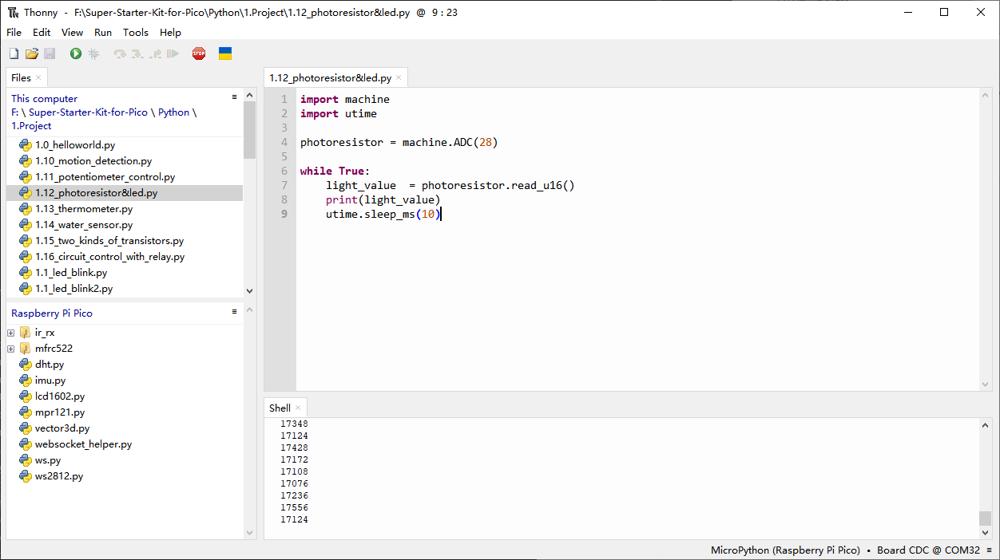
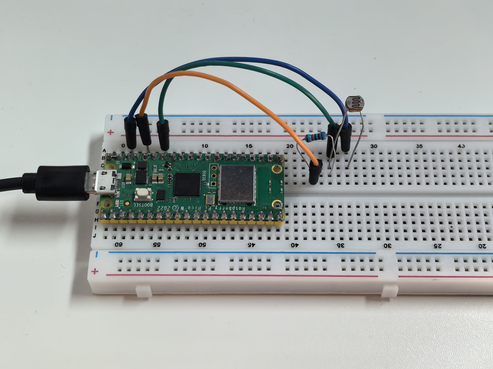

1.12 Photoresistor & LED
=========================
The photoresistor is a common analog input device that functions similarly to a 
potentiometer. Its resistance changes based on the light intensity: the stronger 
the light it receives, the lower its resistance becomes. Conversely, when the light 
is weaker, its resistance increases.

Component List
^^^^^^^^^^^^^^^
- Raspberry Pi Pico W x1
- MicroUSB cable x1
- 830 Tie-Points Breadboard x1
- Jumper Wire Several
- Resistor 10KΩ x1
- Photoresistor x1

Component knowledge
^^^^^^^^^^^^^^^^^^^^
:ref:`Photoresistor <cpn_photoresistor>`
"""""""""""""""""""""""""""""""""""""""""""

Schematic
^^^^^^^^^^

In this circuit, the 10K resistor and the photoresistor are connected in series, 
with the same current flowing through both. The 10K resistor serves as a protective 
element, while GP28 reads the value after the voltage division caused by the photoresistor.

When the light intensity increases, the resistance of the photoresistor decreases, 
leading to a lower voltage across it and a corresponding decrease in the value read 
by GP28. If the light is strong enough, the resistance of the photoresistor will be 
close to zero, and the value from GP28 will be close to zero. At this point, the 10K 
resistor ensures that 3.3V and GND are not directly short-circuited.

Conversely, if the photoresistor is placed in a dark environment, the value from 
GP28 will increase. In a very dark situation, the resistance of the photoresistor 
will be extremely high, and its voltage will be close to 3.3V (with the 10K resistor 
being negligible), causing the value from GP28 to approach the maximum of 65535.

The calculation formula is as follows:
(Vp/3.3V) x 65535 = Ap

where Vp is the voltage across the photoresistor, and Ap is the corresponding ADC value.

Connect
^^^^^^^^^

Code
^^^^^^^
.. note::

    * Open the ``1.12_photoresistor&led.py`` file under the path of ``Ultimate-Starter-Kit-for-Pico\Python\1.Project`` or copy this code into Thonny, then click "Run Current Script" or simply press F5 to run it.

    * Don't forget to click on the "MicroPython (Raspberry Pi Pico)" interpreter in the bottom right corner. 

After the program runs, the Shell prints out the photoresistor values. You can 
shine a flashlight on it or cover it up with your hand to see how the value will change.

The following is the program code:

.. code-block:: python

    import machine
    import utime

    photoresistor = machine.ADC(28)

    while True:
        light_value  = photoresistor.read_u16()
        print(light_value)
        utime.sleep_ms(10)

Phenomenon
^^^^^^^^^^^
