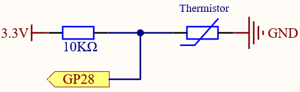
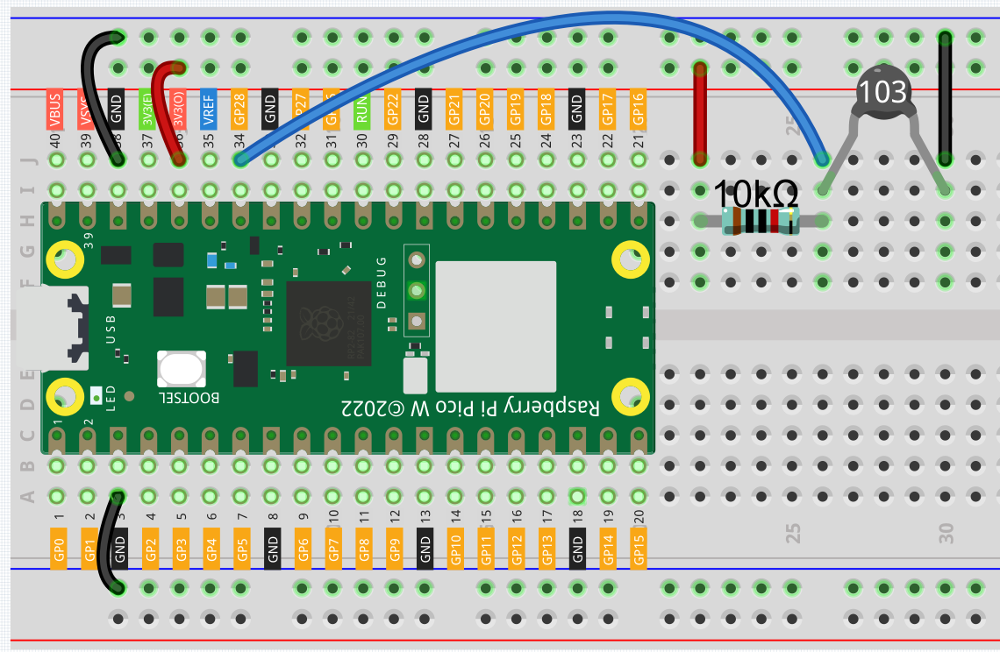
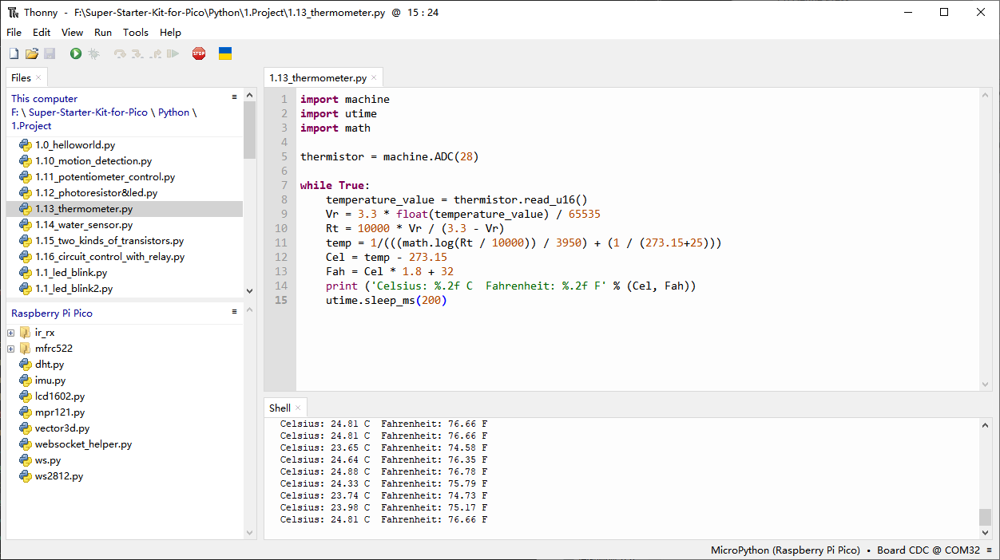

1.13 Thermometer
=========================
A thermometer is a tool used to measure temperature or the degree of warmth or 
coolness of an object. It consists of two key components: (1) a temperature sensor, 
such as the bulb in a mercury thermometer or the infrared sensor in a digital 
thermometer, which undergoes a change when the temperature varies; and (2) a mechanism 
to convert this change into a numerical value, like the scale on a mercury thermometer 
or the digital display on an electronic model. Thermometers are essential in various 
fields, including industrial processes, weather forecasting, medical diagnostics, 
and scientific research.

Thermistors are temperature sensors whose resistance changes significantly with 
temperature. They come in two main types: Negative Temperature Coefficient (NTC) 
and Positive Temperature Coefficient (PTC). In PTC thermistors, resistance increases 
as temperature rises, while in NTC thermistors, resistance decreases with increasing 
temperature.

In this experiment we use an NTC thermistor to make a thermometer.

Component List
^^^^^^^^^^^^^^^
- Raspberry Pi Pico W x1
- MicroUSB cable x1
- 830 Tie-Points Breadboard x1
- Jumper Wire Several
- Resistor 10KΩ x1
- Thermistor x1

Component knowledge
^^^^^^^^^^^^^^^^^^^^
:ref:`Thermistor <cpn_thermistor>`
"""""""""""""""""""""""""""""""""""""

Schematic
^^^^^^^^^^

In this setup, a 10K resistor and an NTC thermistor are wired in series, sharing 
the same current flow. The 10K resistor serves as a protective element, preventing 
potential short circuits. Meanwhile, GP28 reads the voltage value after it has been 
modified by the thermistor.

As the temperature rises, the resistance of the NTC thermistor decreases, leading 
to a drop in the voltage across it. Consequently, the value read by GP28 also 
decreases. If the temperature becomes sufficiently high, the thermistor's resistance 
approaches zero, and the GP28 value nears zero as well. The 10K resistor ensures 
that the 3.3V supply does not short directly to ground, avoiding a short circuit.

Conversely, when the temperature decreases, the GP28 value increases. In extremely 
low temperatures, the thermistor's resistance becomes very high, almost infinite. 
Its voltage then approaches 3.3V (with the 10K resistor being negligible), and the 
GP28 value gets close to the maximum of 65535.

The calculation formula is as follows:
(Vp/3.3V) x 65535 = Ap

where Vp is the voltage across the thermistor, and Ap is the corresponding ADC value.

Connect
^^^^^^^^^

.. note:: 
        
    The thermistor is black and marked 103.
    The color ring of the 10K ohm resistor is red, black, black, red and brown.

Code
^^^^^^^
.. note::

    * Open the ``1.13_thermometer.py`` file under the path of ``Ultimate-Starter-Kit-for-Pico\Python\1.Project`` or copy this code into Thonny, then click "Run Current Script" or simply press F5 to run it.

    * Don't forget to click on the "MicroPython (Raspberry Pi Pico)" interpreter in the bottom right corner. 

After the program runs, the Shell will print out the Celsius and Fahrenheit temperatures.

The following is the program code:

.. code-block:: python

    import machine
    import utime
    import math

    thermistor = machine.ADC(28)

    while True:
        temperature_value = thermistor.read_u16()
        Vr = 3.3 * float(temperature_value) / 65535
        Rt = 10000 * Vr / (3.3 - Vr)
        temp = 1/(((math.log(Rt / 10000)) / 3950) + (1 / (273.15+25)))
        Cel = temp - 273.15
        Fah = Cel * 1.8 + 32
        print ('Celsius: %.2f C  Fahrenheit: %.2f F' % (Cel, Fah))
        utime.sleep_ms(200)

.. image:: img/5.phenomenon/1.13.png
    :width: 100%