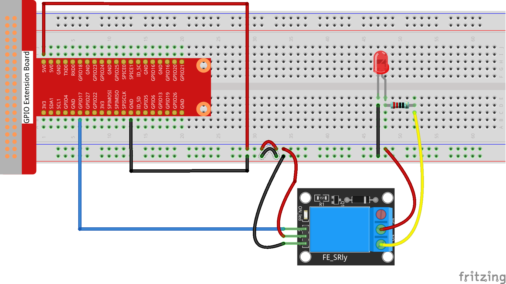
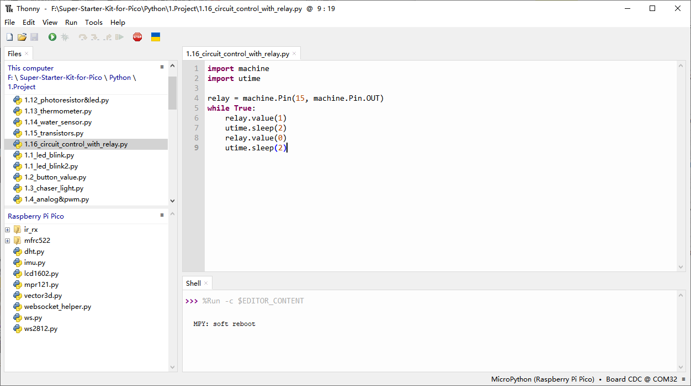

1.16 Circuit Control with Relay
==================================
In everyday life, we typically turn on or off a lamp by pressing a switch. But what 
if you want to control the lamp using the Pico W, so that it automatically turns off 
after ten minutes? A relay module can help you achieve this.

A relay module is essentially a special type of switch that is controlled by one 
side of the circuit—usually a low-voltage circuit—and used to control the other 
side of the circuit—typically a high-voltage circuit. This makes it practical to 
modify household appliances to be programmatically controlled, turning them into 
smart devices or even connecting them to the Internet.

The relay module we are using includes additional components like resistors, which 
help in safely controlling the relay and ensuring stable operation.

.. warning:: 
    
    Modification of electrical appliances comes with great danger, do not try it 
    lightly, please do it under the guidance of professionals.

Here we only use a simple circuit powered by a breadboard power module as an 
example to show how to control it using relay.

Component List
^^^^^^^^^^^^^^^
- Raspberry Pi Pico W x1
- MicroUSB cable x1
- 830 Tie-Points Breadboard x1
- Jumper Wire Several
- Relay Module x1

Component knowledge
^^^^^^^^^^^^^^^^^^^^
:ref:`Relay Module <cpn_relay_module>` 
"""""""""""""""""""""""""""""""""""""""
 
Connect
^^^^^^^^^

Code
^^^^^^^
.. note::

    * Open the ``1.16_circuit_control_with_relay.py`` file under the path of ``Ultimate-Starter-Kit-for-Pico\Python\1.Project`` or copy this code into Thonny, then click "Run Current Script" or simply press F5 to run it.

    * Don't forget to click on the "MicroPython (Raspberry Pi Pico)" interpreter in the bottom right corner. 

While the code is running, the LED lights up. In addition, you can hear a ticktock 
caused by breaking normally close contact and closing normally open contact.

The following is the program code:

.. code-block:: python

    import machine
    import utime

    # Initialize the relay connected to GPIO pin 15
    relay = machine.Pin(15, machine.Pin.OUT)

    while True:
        print('Relay open...')  # Inform that the relay is being activated
        relay.value(1)  # Turn on the relay (assuming active low configuration)
        utime.sleep(2)  # Maintain the relay in the on state for 2 second

        print('...Relay close')  # Inform that the relay is being deactivated
        relay.value(0)  # Turn off the relay
        utime.sleep(2)   # Maintain the relay in the off state for 1 second

    except KeyboardInterrupt:
        # Handle a keyboard interrupt (Ctrl+C) to exit the loop
        relay.value(0)  # Ensure the relay is turned off before exiting
        pass

Phenomenon
^^^^^^^^^^^
.. video:: img/5.phenomenon/1.16.mp4
    :width: 100%