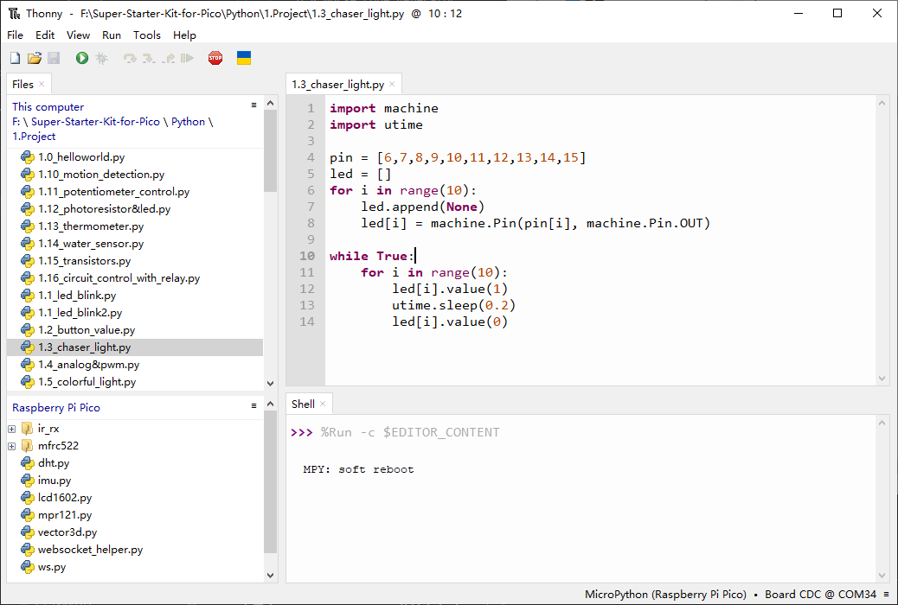

1.3 Chaser Light
====================
The initial project involves making an LED blink. For this purpose, we'll utilize 
the LED Bar Graph, which consists of 10 LEDs housed in a plastic case. This device 
is typically used to indicate power or volume levels.

.. image:: img/1.detail/1.3.png

.. image:: img/1.detail/1.3-1.png

Component List
^^^^^^^^^^^^^^^
- Raspberry Pi Pico W x1
- MicroUSB cable x1
- 830 Tie-Points Breadboard x1
- Resistor 220Ω x10
- Jumper Wire Several
- LED Bar Graph x1

Component knowledge
^^^^^^^^^^^^^^^^^^^^
:ref:`LED Bar Graph <cpn_led_bar_graph>`
""""""""""""""""""""""""""""""""""""""""""

Schematic
^^^^^^^^^^

In the LED Bar Graph, there are 10 individual LEDs, each capable of being controlled 
separately. The anode of each LED is connected to GP6 through GP15, while the cathode is linked to a 220-ohm resistor and subsequently to GND.

Connect
^^^^^^^^^^

Code
^^^^^^^
.. note::

    * Open the ``1.3_chaser_light.py.py`` file under the path of ``Ultimate-Starter-Kit-for-Pico\Python\1.Project`` or copy this code into Thonny, then click "Run Current Script" or simply press F5 to run it.

    * Don't forget to click on the "MicroPython (Raspberry Pi Pico)" interpreter in the bottom right corner. 
  
After running the code, the LED Bar Graph will display a running light effect.

The following is the program code:

.. code-block:: python
    
    import machine
    import utime

    pin = [6,7,8,9,10,11,12,13,14,15]
    led = []
    for i in range(10):
        led.append(None)
        led[i] = machine.Pin(pin[i], machine.Pin.OUT)

    while True:
        for i in range(10):
            led[i].value(1)  # Turn on the current LED
            utime.sleep(0.2)  # Pause for 0.2 seconds
            led[i].value(0)  # Turn off the current LED

Phenomenon
^^^^^^^^^^^
.. video:: img/5.phenomenon/1.3.mp4
    :width: 100%