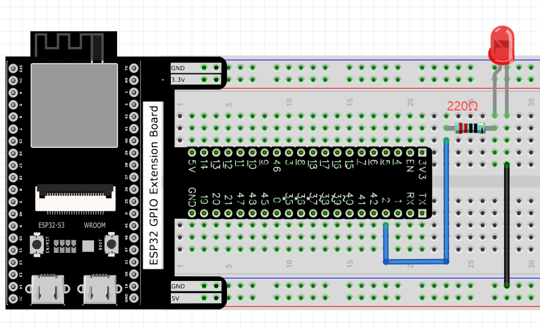
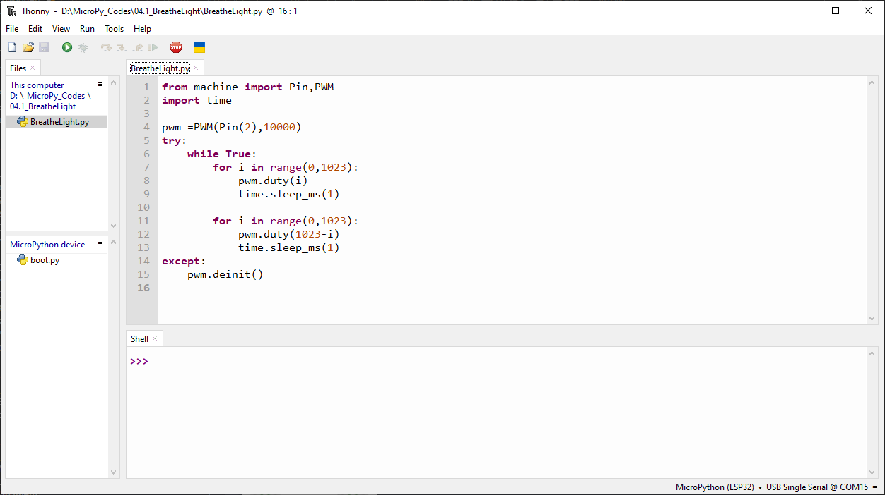
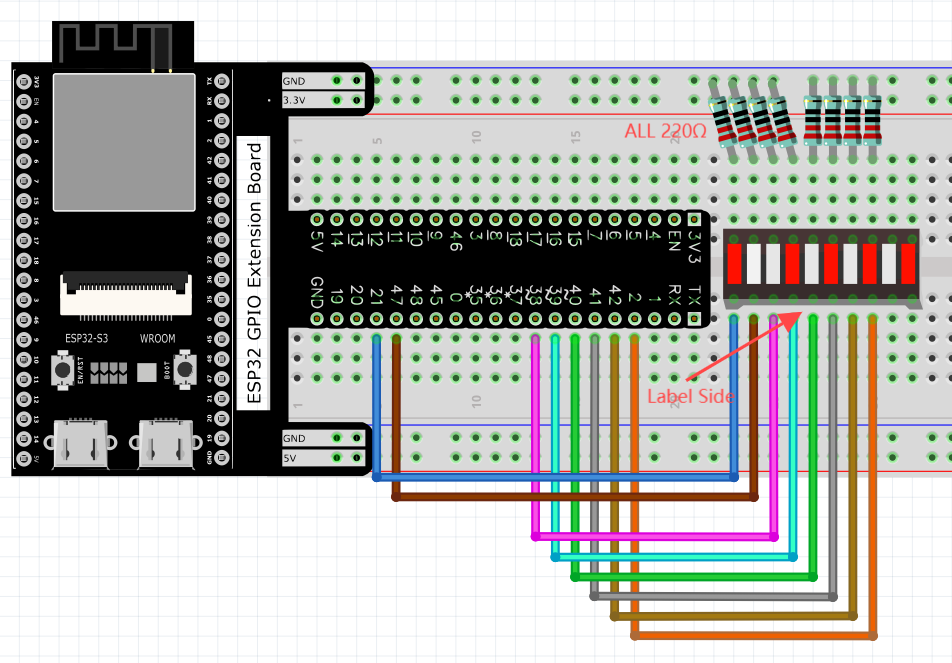
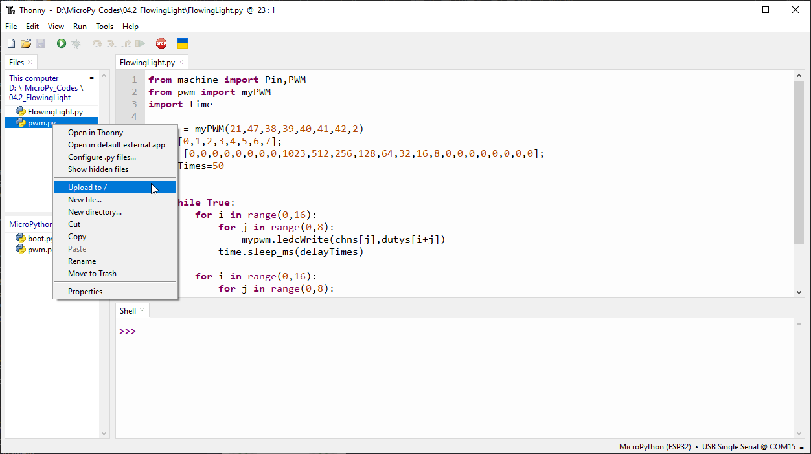

Chapter 4 Analog & PWM
=========================
In previous study, we have known that one button has two states: pressed and 
released, and LED has lighton/off state, then how to enter a middle state? How 
to output an intermediate state to let LED "semi bright"? That's what we're going 
to learn. First, let’s learn how to control the brightness of a LED.

Project 4.1 Breathing LED
----------------------------
Breathing light, that is, LED is turned from off to on gradually, and gradually 
from on to off, just like "breathing". So, how to control the brightness of a LED? 
We will use PWM to achieve this target.

Component List
^^^^^^^^^^^^^^^
- ESP32-S3-WROOM x1
- GPIO Extension Board x1
- 830 Tie-Points Breadboard x1
- LED x1
- Resistor 220Ω x1
- Jumper Wire x2

Connect
^^^^^^^^^^
This circuit is the same as the one in engineering Blink.

Code
^^^^^^^
This project is designed to make PWM output GPIO2 with pulse width increasing 
from 0% to 100%, and then reducing from 100% to 0% gradually. Move the program 
folder “Super_Starter_Kit_for_ESP32_S3/Python/Python_Codes” to disk(D) 
in advance with the path of “D:/Micropython_Codes”. Open “Thonny”，click“This 
computer” >> “D:” >> “Micropython_Codes” >> “04.1_BreatheLight” and double click 
“BreatheLight.py”.

**04.1_BreatheLight**

Click “Run current script”, and you'll see that LED is turned from ON to OFF and 
then back from OFF to ON gradually like breathing.

The following is the program code:

.. code-block:: python

    from machine import Pin,PWM
    import time

    pwm =PWM(Pin(2),10000)
    try:
        while True:
            for i in range(0,1023):
                pwm.duty(i)
                time.sleep_ms(1)
                
            for i in range(0,1023):
                pwm.duty(1023-i)
                time.sleep_ms(1)  
    except:
        pwm.deinit()

Project 4.2 Meteor Flowing Light
------------------------------------
After learning about PWM, we can use it to control LED bar graph and realize a 
cooler flowing light. The component list, circuit, and hardware are exactly cons
istent with the project Flowing Light.

Component List
^^^^^^^^^^^^^^^
- ESP32-S3-WROOM x1
- GPIO Extension Board x1
- 830 Tie-Points Breadboard x1
- LED Bar Graph x1
- Resistor 220Ω x8
- Jumper Wire x8

Connect
^^^^^^^

Code
^^^^^^^
Flowing Light with tail was implemented with PWM. Open “Thonny”, click “This 
computer” >> “D:” >> “Micropython_Codes” >> “04.2_FlowingLight”. Select “pwm.py”, 
right click to select “Upload to /”, wait for “pwm.py” to be uploaded to ESP32-S
3 and then double click “FlowingLight.py”.

**04.2_FlowingLight**

Click “Run current script”, and LED Bar Graph will gradually light up and out 
from left to right, then light up and out from right to left.

The following is the program code:

.. code-block:: python

    from machine import Pin,PWM
    from pwm import myPWM
    import time

    mypwm = myPWM(21,47,38,39,40,41,42,2)
    chns=[0,1,2,3,4,5,6,7];
    dutys=[0,0,0,0,0,0,0,0,1023,512,256,128,64,32,16,8,0,0,0,0,0,0,0,0];
    delayTimes=50

    try:
        while True:
            for i in range(0,16):
                for j in range(0,8):
                    mypwm.ledcWrite(chns[j],dutys[i+j])
                time.sleep_ms(delayTimes)
                
            for i in range(0,16):
                for j in range(0,8):
                    mypwm.ledcWrite(chns[7-j],dutys[i+j])
                time.sleep_ms(delayTimes)
    except:
        mypwm.deinit()
