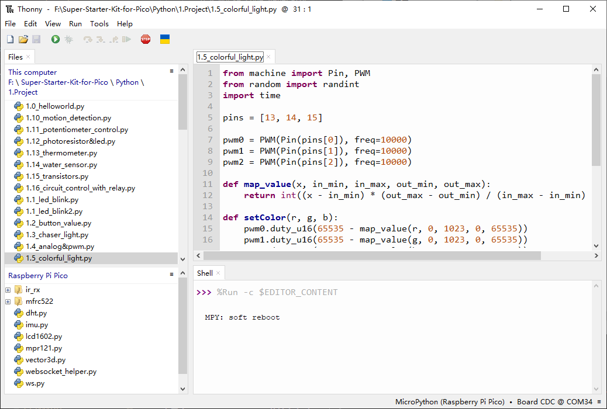
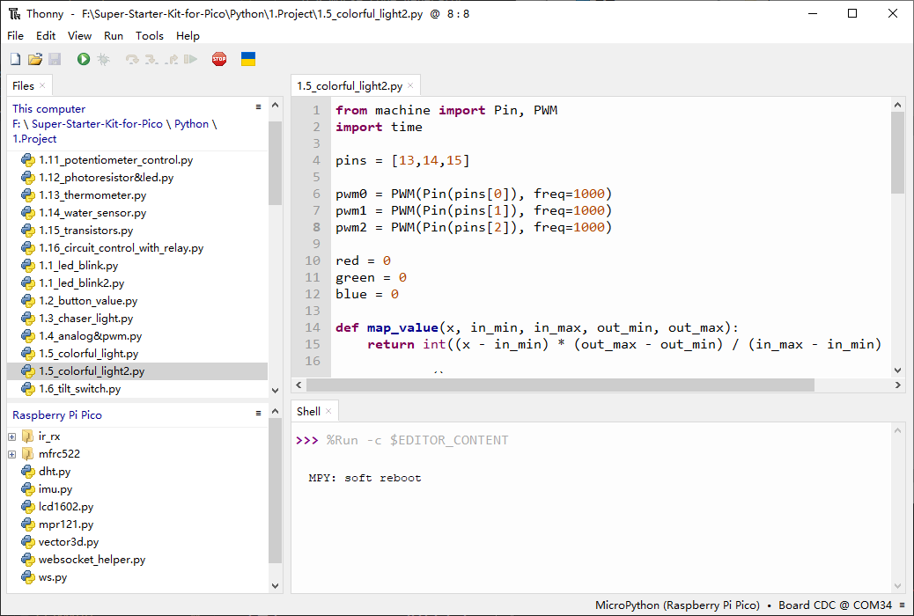

1.5 Colorful Light
=========================
In this chapter, we will learn how to control a RGB LED. It can emit different 
colors of light. Next, we will use RGB LED to make a multicolored light.

Random Color Light
-----------------------
In this project, we will make a multicolored LED. And we can control RGB LED to 
switch different colors automatically.

Component List
^^^^^^^^^^^^^^^
- Raspberry Pi Pico W x1
- 830 Tie-Points Breadboard x1
- LED-RGB x1
- Resistor 220Ω x3
- Jumper Wire Several

Schematic
^^^^^^^^^^

The PWM pins GP13, GP14 and GP15 control the Red, Green and Blue pins of the RGB 
LED respectively, and connect the common cathode pin to GND. This allows the RGB 
LED to display a specific color by superimposing light on these pins with differ
ent PWM values.

Component knowledge
^^^^^^^^^^^^^^^^^^^^
:ref:`RGB-LED <cpn_rgb_led>`
"""""""""""""""""""""""""""""""

Connect
^^^^^^^^^
.. image:: img/3.connect/1.5.png

Code
^^^^^^^
.. note::

    * Open the ``1.5_colorful_light.py`` file under the path of ``Ultimate-Starter-Kit-for-Pico\Python\1.Project`` or copy this code into Thonny, then click "Run Current Script" or simply press F5 to run it.

    * Don't forget to click on the "MicroPython (Raspberry Pi Pico)" interpreter in the bottom right corner. 
  

**RandomColorLight**

Click “Run current script”, RGBLED begins to display random colors.

The following is the program code:

.. code-block:: python

    from machine import Pin, PWM
    from random import randint
    import time

    pins = [13, 14, 15]

    pwm0 = PWM(Pin(pins[0]), freq=10000)
    pwm1 = PWM(Pin(pins[1]), freq=10000)
    pwm2 = PWM(Pin(pins[2]), freq=10000)

    def map_value(x, in_min, in_max, out_min, out_max):
        return int((x - in_min) * (out_max - out_min) / (in_max - in_min) + out_min)

    def setColor(r, g, b):
        pwm0.duty_u16(65535 - map_value(r, 0, 1023, 0, 65535))
        pwm1.duty_u16(65535 - map_value(g, 0, 1023, 0, 65535))
        pwm2.duty_u16(65535 - map_value(b, 0, 1023, 0, 65535))

    try:
        while True:
            red = randint(0, 1023)
            green = randint(0, 1023)
            blue = randint(0, 1023)
            setColor(red, green, blue)
            time.sleep_ms(200)
            
    except KeyboardInterrupt:
        pwm0.deinit()
        pwm1.deinit()
        pwm2.deinit()

Phenomenon
^^^^^^^^^^^
.. video:: img/5.phenomenon/1.5-1.mp4
    :width: 100%

Gradient Color Light
-----------------------
In the previous project, we have mastered the usage of RGB LEDs, but the random display of colors is rather stiff. This project will realize a fashionable light with soft color transitions.
The component list and circuit are exactly the same as in the random color light project.
Using a color model, the color transitions from 0 to 255 as illustrated below.

    
Click "Run current script", and the light of the RGB-LED will change gently.

Code
^^^^^^^
.. note::

    * Open the ``1.5_colorful_light2.py`` file under the path of ``Ultimate-Starter-Kit-for-Pico\Python\1.Project`` or copy this code into Thonny, then click "Run Current Script" or simply press F5 to run it.

    * Don't forget to click on the "MicroPython (Raspberry Pi Pico)" interpreter in the bottom right corner. 
  
**Gradient Color Light**

The following is the program code:

.. code-block:: python

    from machine import Pin, PWM
    import time

    pins = [13,14,15]

    pwm0 = PWM(Pin(pins[0]), freq=1000)
    pwm1 = PWM(Pin(pins[1]), freq=1000)
    pwm2 = PWM(Pin(pins[2]), freq=1000)

    red = 0
    green = 0
    blue = 0

    def map_value(x, in_min, in_max, out_min, out_max):
        return int((x - in_min) * (out_max - out_min) / (in_max - in_min) + out_min)

    def setColor():
        pwm0.duty_u16(map_value(red, 0, 255, 0, 65535))
        pwm1.duty_u16(map_value(green, 0, 255, 0, 65535))
        pwm2.duty_u16(map_value(blue, 0, 255, 0, 65535))

    def wheel(pos):
        global red, green, blue
        WheelPos = pos % 256
        
        if WheelPos < 85:
            red = 255 - WheelPos * 3
            green = WheelPos * 3
            blue = 0
        elif WheelPos < 170:
            WheelPos -= 85
            red = 0
            green = 255 - WheelPos * 3
            blue = WheelPos * 3
        else:
            WheelPos -= 170
            red = WheelPos * 3
            green = 0
            blue = 255 - WheelPos * 3
        
        red = max(0, min(255, red))
        green = max(0, min(255, green))
        blue = max(0, min(255, blue))

    try:
        while True:
            for i in range(0, 256):
                wheel(i)
                setColor()
                time.sleep_ms(15)

                
    except KeyboardInterrupt:
        pwm0.deinit()
        pwm1.deinit()
        pwm2.deinit()

Phenomenon
^^^^^^^^^^^
.. video:: img/5.phenomenon/1.5-2.mp4
    :width: 100%

