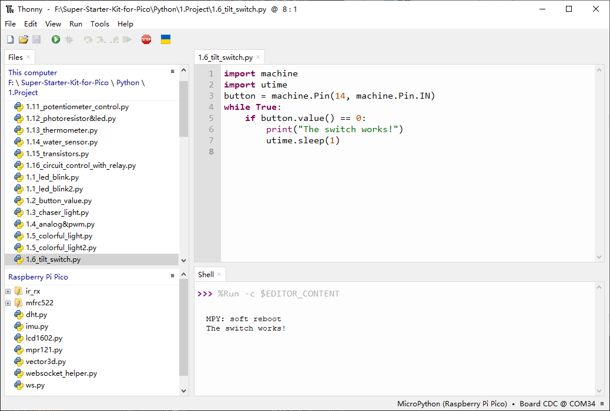

1.6 Tilt Switch
=================
The tilt switch is a simple 2-pin component that contains a metal ball inside.
 
When the switch is in an upright position, the two pins are connected. However, 
when it is tilted, the connection between the two pins is broken.

Component List
^^^^^^^^^^^^^^^
- Raspberry Pi Pico W x1
- MicroUSB cable x1
- 830 Tie-Points Breadboard x1
- Tilt Switch x1
- Resistor 10KΩ x1
- Jumper Wire Several 

Component knowledge
^^^^^^^^^^^^^^^^^^^^
:ref:`Tilt Switch <cpn_tilt_switch>`
"""""""""""""""""""""""""""""""""""""""

Schematic
^^^^^^^^^^
.. image:: img/2.sch/1.6.png

When the tilt switch is placed in an upright position, GP14 will be in a high state. 
Conversely, when the switch is tilted, GP14 will be in a low state.

The 10K resistor is used to ensure that GP14 remains in a stable low state when the tilt switch is tilted.

Connect
^^^^^^^^^

Code
^^^^^^^
.. note::

    * Open the ``1.6_tilt_switch.py`` file under the path of ``Ultimate-Starter-Kit-for-Pico\Python\1.Project`` or copy this code into Thonny, then click "Run Current Script" or simply press F5 to run it.

    * Don't forget to click on the "MicroPython (Raspberry Pi Pico)" interpreter in the bottom right corner. 
  

Click “Run current script”, when you tilt the breadboard (tilt switch), “The switch works!” will appear in the shell.

The following is the program code:

.. code-block:: python

    import machine
    import utime
    button = machine.Pin(14, machine.Pin.IN)
    while True:
        if button.value() == 0:
            print("The switch works!")
            utime.sleep(1)

Phenomenon
^^^^^^^^^^^
.. image:: img/5.phenomenon/1.6.png
    :width: 100%