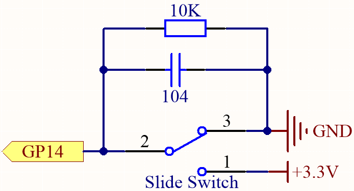
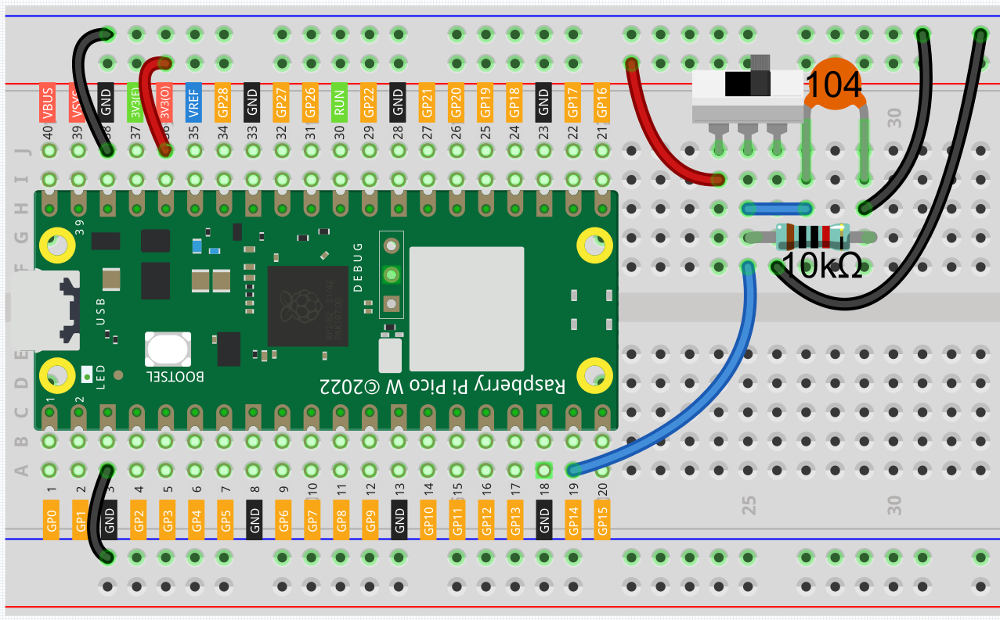
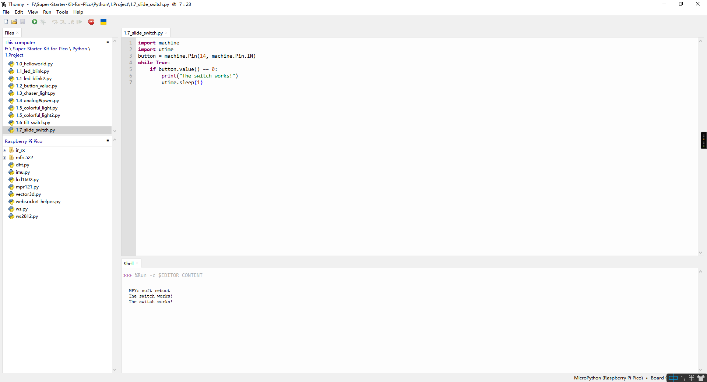
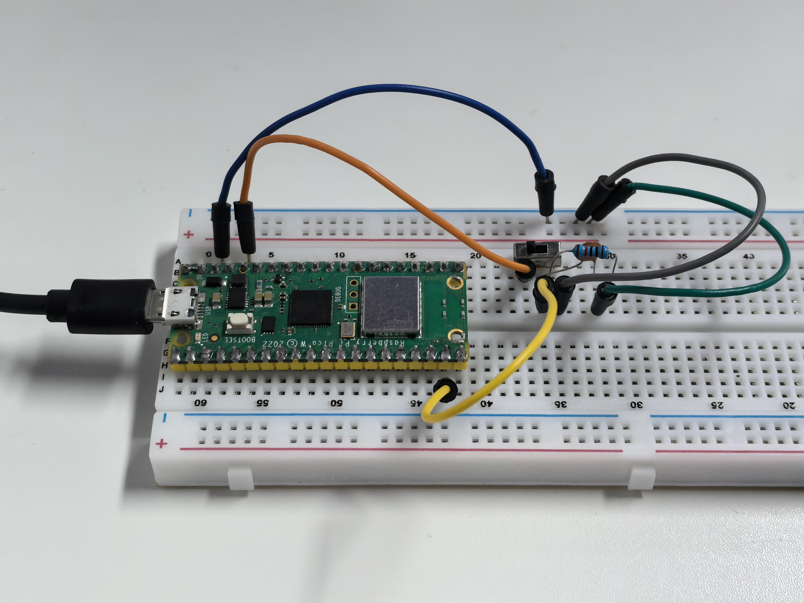

1.7 Slide_Switch
=========================
The slide switch is a 3-pin component, where pin 2 (the middle one) serves as the 
common pin. When the switch is moved to the left, the left two pins connect, and 
when moved to the right, the right two pins connect.

Component List
^^^^^^^^^^^^^^^
- Raspberry Pi Pico W x1
- MicroUSB cable x1
- 830 Tie-Points Breadboard x1
- Jumper Wire Several
- Slide Switch x1
- Resistor 10KΩ x1
- Capacitor 104 x1

Component knowledge
^^^^^^^^^^^^^^^^^^^^
:ref:`Slide Switch <cpn_slide_switch>`
"""""""""""""""""""""""""""""""""""""""

:ref:`Capacitor <cpn_capacitor>`
"""""""""""""""""""""""""""""""""

Schematic
^^^^^^^^^^

When you move the slide switch to the left or right, GP14 will receive different voltage levels.

The 10K resistor ensures that GP14 stays low when the switch is in the middle position (neither fully to the left nor fully to the right).

Additionally, the 104 ceramic capacitor is used to filter out any jitter.

Connect
^^^^^^^^^

Code
^^^^^^^
.. note::

    * Open the ``1.7_tilt_switch.py`` file under the path of ``Ultimate-Starter-Kit-for-Pico\Python\1.Project`` or copy this code into Thonny, then click "Run Current Script" or simply press F5 to run it.

    * Don't forget to click on the "MicroPython (Raspberry Pi Pico)" interpreter in the bottom right corner. 

Click “Run current script”, when you toggle the slide switch to the right, “The 
switch works!” will appear in the shell.

The following is the program code:

.. code-block:: python

    import machine
    import utime
    button = machine.Pin(14, machine.Pin.IN)
    while True:
        if button.value() == 0:
            print("The switch works!")
            utime.sleep(1)

Phenomenon
^^^^^^^^^^^

